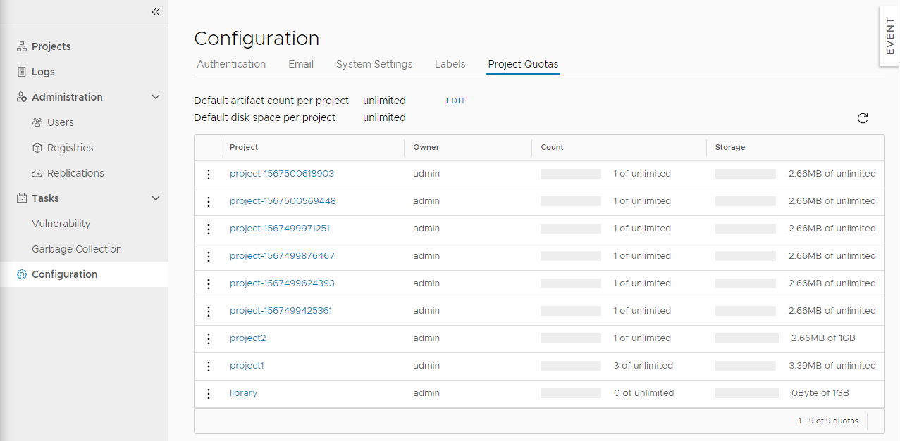

We are excited to announce the release of Harbor version 1.9, arguably one of our biggest releases packed with several long-awaited features that the open source community has asked for. Thanks to all the members of the community who made contributions to these features, and special thanks in particular to 360 Total Security, Hyland Software, NetEase Cloud, and VMware. With this release, Harbor introduces some key new features:
1. Tag retention and project quotas that strengthen image lifecycle management and security 
2. Webhook notifications that enable the integration of Harbor with CI/CD tools
3. Replication targets for the registry services of all the major cloud providers to let you replicate projects based on your business needs
4. CVE exception policies and syslog integration that bring an additional layer of management and security capabilities to Harbor operators  

Let’s deep dive into some of these features.   

## Webhooks
If you are a project administrator, you can connect a project in Harbor to the rest of your stack through the use of a webhook notification.  Simply put, if you configure webhooks, Harbor notifies the webhook endpoint of certain events that occur in a project, including push, pull, deletion of images and Helm charts, image scanning, and vulnerability discoveries. These webhook notifications allow you to integrate Harbor with other tools to streamline continuous integration and development processes.  The endpoint that receives the webhook should ideally have an action listener that is capable of interpreting the JSON payload and acting upon the information it contains.  For example, by configuring Harbor to send a POST request to a webhook listener upon a successful image push, you can trigger a deployment of the application to Kubernetes to execute your test suite, or you can simply update your Configuration Management Database (CMDB).  

## Quotas
The introduction of quotas allows project administrators to exercise control over resource use.  Specifically, you can limit the number of tags that a project can contain and limit the amount of storage capacity that a project can consume. You can set default quotas that apply to all projects globally or set quotas on individual projects to override system settings.  The image capacity is calculated based on its true size and takes into account the sharing of layers across all the involved images when multiple images are pushed concurrently.   Quotas work seamlessly with other mechanisms such as retagging, online garbage collection, and retention policies so artifacts are always properly curated and space is never wasted. 

## Tag Retention
In addition to project quotas, version 1.9 also includes a complementary feature called tag retention to better manage image lifecycle and optimize storage allocation.  A repository can rapidly accumulate a large number of image tags, especially if Harbor is hooked into a continuous integration system generating automatic builds. Many of the builds become obsolete or insecure after a given time or after they have been superseded by a subsequent build.  To free up space taken up by these images in order to adhere to regulatory and compliance requirements, project administrators can define retention policies on selective repos that will retain images with certain matching image tags while the rest of the tags and their associated blobs are deleted.  Image tags, which can be  manually generated or automatically generated from CI/CD pipelines, contain rich metadata information about the environment and usage of images and are sufficient as criteria for defining retention policies. 

## CVE Exception Policy
Harbor currently limits the ability to run certain images that have been scanned positive for Common Vulnerabilities and Exposures (CVE) based on the security policy that you set.  To address certain exceptions that need to be made to these system-wide policies, such as ignoring CVEs of low severity or CVEs that currently have no resolution, Harbor 1.9 introduces the ability for administrators to create a CVE whitelist, permitting these images to run for a time-bounded period despite having certain CVEs.  System administrators can create a system-wide whitelist of CVEs effective across all projects while project administrators can further fine-tune this whitelist at the individual project level.

## Replication Improvements
Following the announcement in version 1.8 of cross-registry artifact replication between Harbor and registries such as Docker Hub and Huawei Cloud, version 1.9 expands these capabilities to most major cloud provider registries, such as Amazon Elastic Container Registry, Azure Container Registry, Google Container Registry, and Alibaba Container Registry.  Harbor enables seamless two-way replication to third-party registries to meet a multitude of needs and use cases.  

## Community Call to Action
The 1.9 release saw more input and contributions from the community than ever before whether they be feature testing and bug reporting, sharing requirements and best practices needed for an enterprise registry, or putting forth quality code contributions in a timely fashion.  As of this posting, we’re already hard at work on the 1.10 release. Key features include creating a plug-n-play experience for third-party image scanners including supporting Aqua and Anchore, creating a Harbor operator for smarter deployments, and creating image tag immutability.  Hop over to the [Harbor project board](http://github.com/orgs/goharbor/projects/1) for the most up-to-date status of the ongoing release and identify areas of interest for contribution. Contributions can be in the form of providing scenario requirements, testing, documentation, bug fixing, or introducing new features to Harbor.

## About Harbor
[Harbor](http://github.com/goharbor/harbor) is an open source trusted cloud native registry project that stores, signs, and scans container images and Helm charts. Harbor extends the open source Docker Distribution by adding key enterprise-level features in authentication and access control (LDAP/AD as well as OIDC support with RBAC), two-way replication to other third-party registries, advanced online garbage collection, and authenticity and provenance capabilities through image scanning and signing.  Harbor deploys in under 30 minutes, can be fully managed through a single web console, and comes with a rich set of APIs.

## Collaborate with the Harbor Community!
Get updates on Twitter ([@project_harbor](https://twitter.com/project_harbor))  
Chat with us on Slack ([#harbor](https://cloud-native.slack.com/messages/harbor) on the [CNCF Slack](https://slack.cncf.io/))  
Collaborate with us on GitHub: [github.com/goharbor/harbor](https://github.com/goharbor/harbor)

Alex Xu
Harbor Contributor
Product Manager, VMware
[github.com/xaleeks](http://github.com/xaleeks)
