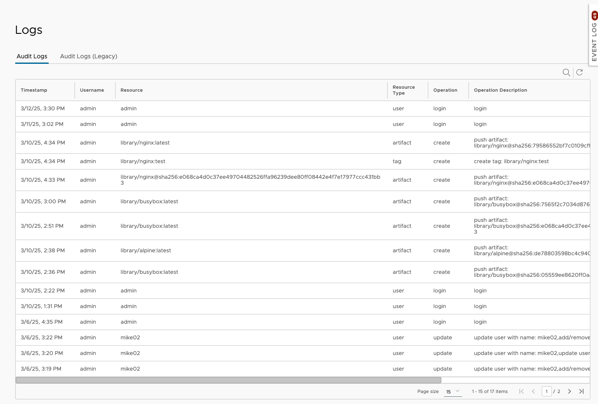
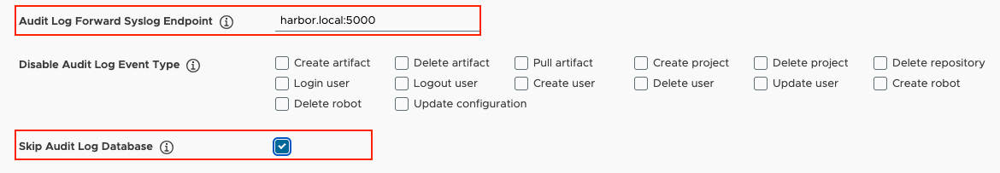
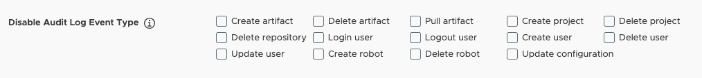

Harbor tracks various types of operations and keeps a record of these actions in audit log. Administrators can view the audit log in the Harbor interface. there are two tabs in the audit log panel: the `Audit Logs` tab, which shows the latest audit log information after Harbor v2.13.0, and the `Audit Logs(Legacy)` tab, which displays legacy audit log information prior to Harbor v2.13.0. Users can query audit logs in these two tabs by specifying the operation type, the username, operation, resource, and resource type.

Current supported event types in audit log include:

- `pull artifact`
- `push artifact`
- `delete artifact`
- `create user`
- `update user`
- `delete user`
- `login user`
- `logout user`
- `change configuration`
- `create project`
- `delete project`
- `create robot`
- `delete robot`
- `delete repository`

## Audit Log table columns:

The audit log table displays the following columns:

- `Timestamp`: The time when the operation was performed.
- `Username`: The user who performed the operation.
- `Resource`: The resource that the operation was performed on.
- `Resource Type`: The type of the resource.
- `Operation`: The operation type.
- `Operation Description` : The detail description of the operation.

## Skip Audit Log Database

If you have configured an endpoint to forward audit logs, select the checkbox to **Skip Audit Log Database**. When selected, Harbor will not keep any records of audit logs in its database, but will forward all logs to your configured endpoint immediately.

## Skip Audit Log Database for some specific event types

If you want to skip audit log database for some specific event types, go to the `Administration` -> `Configuration` -> `System Settings` -> `Disable Audit Log Event Type` and check the event types you want to skip. when the event type is checked and configuration changed, the audit log of these event types will not be saved in the database. this configuration doesn't require audit log forwarding to be enabled.

