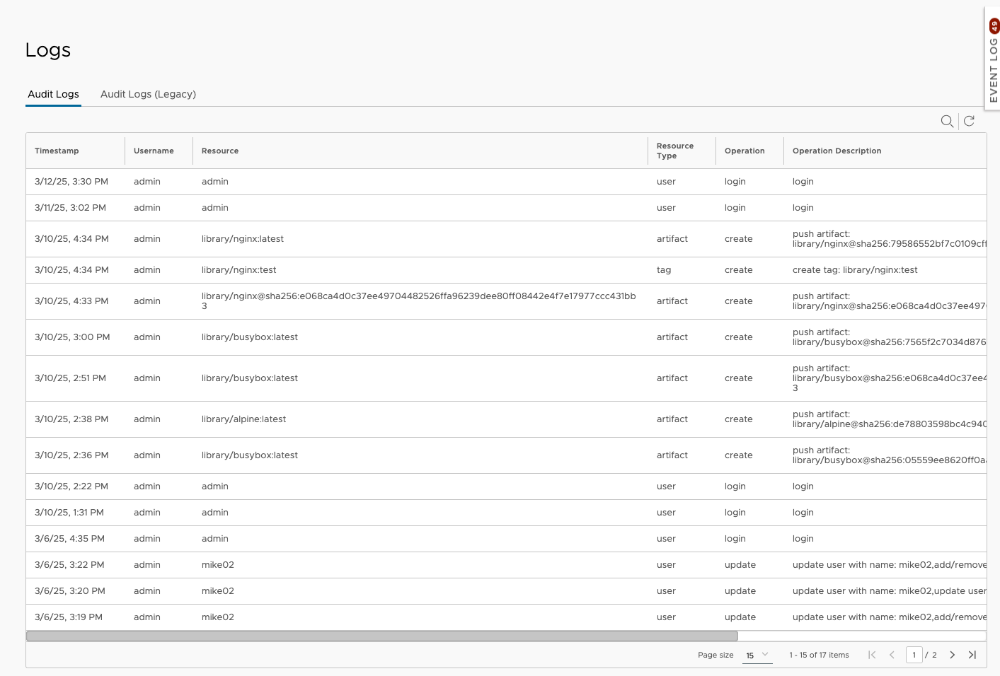
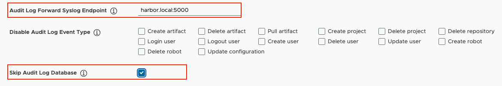
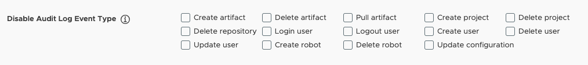

Harbor tiene traccia di vari tipi di operazioni e conserva un registro di queste azioni nel registro di controllo. Gli amministratori possono visualizzare il registro di controllo nell'interfaccia Harbor. sono presenti due schede nel pannello del registro di controllo: la scheda `Audit Logs`, che mostra le informazioni del registro di controllo più recenti dopo Harbor v2.13.0, e la scheda `Audit Logs(Legacy)`, che visualizza le informazioni del registro di controllo legacy precedenti a Harbor v2.13.0. Gli utenti possono eseguire query sui log di controllo in queste due schede specificando il tipo di operazione, il nome utente, l'operazione, la risorsa e il tipo di risorsa.

Gli attuali tipi di eventi supportati nel registro di controllo includono:

-`pull artifact`
-`push artifact`
-`delete artifact`
-`create user`
-`update user`
-`delete user`
-`login user`
-`logout user`
-`change configuration`
-`create project`
-`delete project`
-`create robot`
-`delete robot`
-`delete repository`

## Colonne della tabella del registro di controllo:

La tabella del registro di controllo visualizza le seguenti colonne:

- `Timestamp`: L'ora in cui è stata eseguita l'operazione.
- `Username`: L'utente che ha eseguito l'operazione.
- `Resource`: la risorsa su cui è stata eseguita l'operazione.
- `Resource Type`: Il tipo della risorsa.
- `Operation`: Il tipo di operazione.
- `Operation Description` : La descrizione dettagliata dell'operazione.

## Ignora il database del registro di controllo

Se hai configurato un endpoint per inoltrare i log di controllo, seleziona la casella di controllo **Ignora database dei log di controllo**. Se selezionato, Harbor non conserverà alcun record di registri di controllo nel suo database, ma inoltrerà immediatamente tutti i registri all'endpoint configurato.

## Ignora il database del registro di controllo per alcuni tipi di eventi specifici

Se desideri ignorare il database del registro di controllo per alcuni tipi di eventi specifici, vai a `Administration` -> `Configuration` -> `System Settings` -> `Disable Audit Log Event Type` e seleziona i tipi di eventi che desideri ignorare. quando il tipo di evento viene controllato e la configurazione modificata, il registro di controllo di questi tipi di eventi non verrà salvato nel database. questa configurazione non richiede l'abilitazione dell'inoltro del log di controllo.

