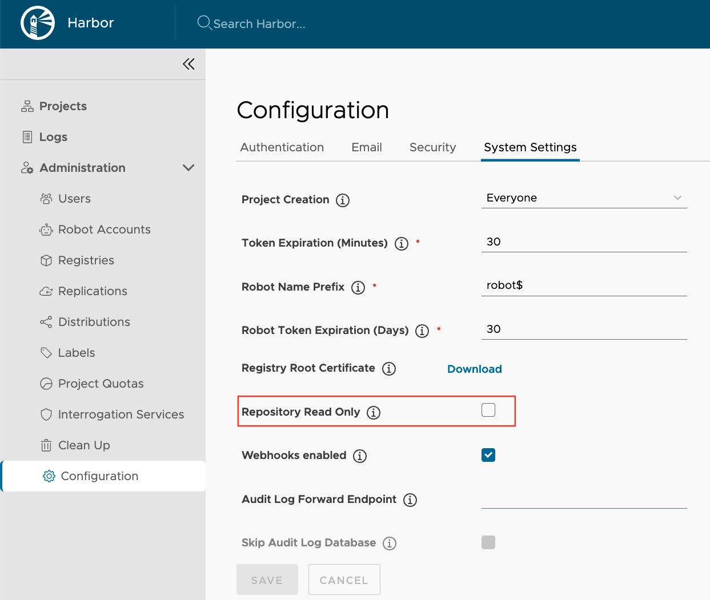

Backup and restore is important for disaster recovery and data migration scenarios. With a tool like [Velero](https://velero.io/), you can backup and restore your Harbor instances and avoid disruptions in service in the event of a disaster. Velero is an open source tool you can use to safely backup and restore, perform disaster recovery, and migrate Kubernetes cluster resources and persistent volumes.

The following tutorial shows how to use Velero to backup and restore a Harbor instance that has been deployed in a Kubernetes cluster using the Harbor helm chart. See more details about [How Velero Works](https://velero.io/docs/latest/how-velero-works/).



This tutorial only backs up a subset of Harbor's resources and data, including all Harbor related Kubernetes resources (Deployments, StatefulSets, Services, ConfigMaps, etc.) and data in the PersistentVolumes of Harbor's internal database, registry, chartmuseum, jobservice and Trivy.

Harbor's Redis data is not backed up, see the [Limitations](#limitations) section for more details of the potential impact to your Harbor instance.

The backup taken in this tutorial is crash consistent, not application consistent. This means that some data will be lost after restore, see the [Limitations](#limitations) part for more information.


## Install Velero
Install the Velero CLI and server according to the [official Velero documentation](https://velero.io/docs/latest/basic-install/).


Depending on the size of your data, you may need to increase the CPU or memory resources available to Velero. Refer to the [doc](https://velero.io/docs/latest/customize-installation/#customize-resource-requests-and-limits) for more information.


## Backup Harbor Instance
### Set Harbor to ReadOnly
1. Log in to the Harbor portal with an account that has Harbor system administrator privileges.
1. Expand **Administration**, and select **Configuration**.
1. Select the **System Settings** tab.

   

1. Select the check box **Repository Read Only** and click the **Save** button to save the configurations.

### Label Resources to Exclude Redis Data from Backup
In order to exclude the volume of Redis in backup, we need to label the Redis pod, PVC and PV with specific label:
```shell
# label the Pod of Redis, replace the namespace and Pod name with yours
kubectl -n harbor label pod/harbor-redis-0 velero.io/exclude-from-backup=true
# label the PVC of Redis, replace the namespace and PVC name with yours
kubectl -n harbor label pvc/data-harbor-redis-0 velero.io/exclude-from-backup=true
# label the PV of Redis, replace the namespace and PVC name with yours
kubectl label pv/$(kubectl -n harbor get pvc data-harbor-redis-0 --template={{.spec.volumeName}}) velero.io/exclude-from-backup=true
```

### Backup Harbor Instance
According to the capability of the platform where Harbor is deployed, you can choose back up the PersistentVolumes with Snapshot or File System Backup:
* Snapshot  
  Depends on how Velero is installed, you can use the [CSI Snapshot](https://velero.io/docs/latest/csi/), [CSI Snapshot with Data Move](https://velero.io/docs/latest/csi-snapshot-data-movement/) or [Native Snapshot](https://velero.io/docs/latest/supported-providers/) to backup the PersistentVolumes:
  1. Back up Harbor with CSI Snapshot or Native Snapshot
      ```shell
      # replace the namespace and backup name with yours
      velero backup create harbor-backup --include-namespaces harbor --snapshot-volumes --wait
      ```
  1. Back up Harbor with CSI Snapshot with Data Move
      ```shell
      # replace the namespace and backup name with yours
      velero backup create harbor-backup --include-namespaces harbor --snapshot-volumes --snapshot-move-data --wait
      ```

* File System Backup  
  Before using File System Backup, you should review the Velero [File System Backup](https://velero.io/docs/latest/file-system-backup/) page, and especially understand the [limitations](https://velero.io/docs/latest/file-system-backup/#limitations).
  1. Back up Harbor
      ```shell
      # replace the namespace and backup name with yours
      velero backup create harbor-backup --include-namespaces harbor --default-volumes-to-fs-backup --wait
      ```

### Unset ReadOnly
Follow the same steps in [Set Harbor to ReadOnly](#set-harbor-to-readonly), uncheck the **Repository Read Only** check box and click the **Save** button to save the configurations.

## Restore Harbor Instance
### Restore from the Backup
```shell
# replace the backup and restore names with yours
velero restore create harbor-restore --from-backup harbor-backup --wait
```

### Unset ReadOnly
As we set Harbor to ReadOnly when doing the backup, the instance is still in ReadOnly mode after the restoring, follow [Unset ReadOnly](#unset-readonly) to unset ReadOnly.


## Troubleshooting
If you have any issue while backing up or restoring, please refer to Velero's [troubleshooting](https://velero.io/docs/latest/troubleshooting/) documentation.

## Limitations
* **The upload purging process may cause backup failure**  
  A purging process starts in the `registry` pod by default, it removes the unused files under the upload directory periodically and cannot be deactivated without restarting. This may impact the backup when using Restic and cause failures.  
  It's better to increase the [interval](https://github.com/goharbor/harbor-helm/blob/v1.9.2/values.yaml#L581) of the purging operation(the default value is 168h) and do the backup in the middle of two rounds of purging to avoid files being removed.
* **The data in memory is lost during the backup**  
  Harbor stores repository pull and artifact pull times in memory and syncs them periodically into Harbor's database. This means that any data that isn't synced into the database when you take a backup is lost. This data loss should be low impact to your restored Harbor instance.
* **Tasks may hang in the in-progress status after restore**  
  Harbor tasks, such as replication, garbage collection, or security scans may hang in the in-progress status after restore. You can manually stop them on the portal.
* **Sessions of logged users will lose after restore**  
  As we don't back up the persistent volume of Redis, the sessions of logged used will is lost after restore.
* **Backups of external databases are not supported**  
Only backups of the Harbor internal database is supported.
