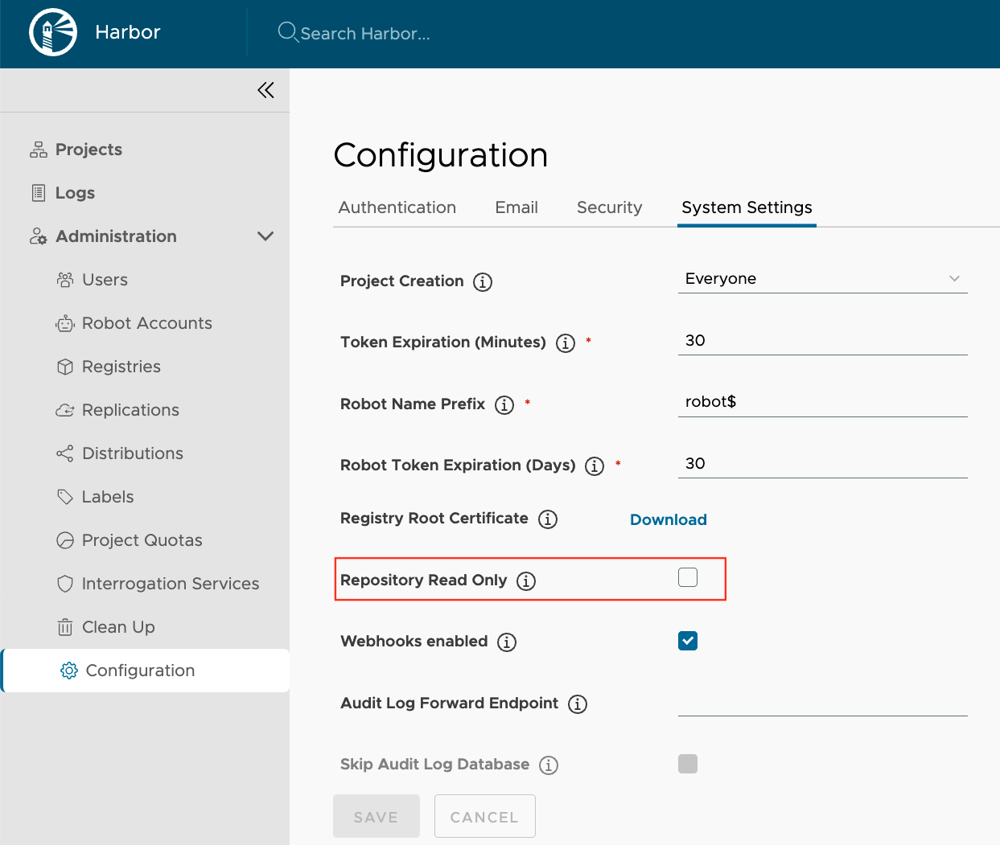

Il backup e il ripristino sono importanti per gli scenari di ripristino di emergenza e migrazione dei dati. Con uno strumento come [Velero](https://velero.io/), puoi eseguire il backup e ripristinare le tue istanze Harbor ed evitare interruzioni del servizio in caso di disastro. Velero è uno strumento open source che puoi utilizzare per eseguire il backup e il ripristino in modo sicuro, eseguire il ripristino di emergenza e migrare le risorse del cluster Kubernetes e i volumi persistenti.

Il seguente tutorial mostra come utilizzare Velero per eseguire il backup e ripristinare un'istanza Harbor che è stata distribuita in un cluster Kubernetes utilizzando il grafico helm Harbor. Visualizza ulteriori dettagli su [Come funziona Velero](https://velero.io/docs/latest/how-velero-works/).



Questo tutorial esegue il backup solo di un sottoinsieme di risorse e dati di Harbor, incluse tutte le risorse Kubernetes correlate a Harbor (distribuzioni, StatefulSet, servizi, ConfigMap, ecc.) e i dati nei PersistentVolume del database interno di Harbor, registry, jobservice e Trivy.

Non viene eseguito il backup dei dati Redis di Harbor, consulta la sezione [Limitazioni](#limitations) per maggiori dettagli sul potenziale impatto sulla tua istanza Harbor.

Il backup eseguito in questo tutorial è coerente con l'arresto anomalo del sistema, non coerente con l'applicazione. Ciò significa che alcuni dati andranno persi dopo il ripristino, vedere la parte [Limitazioni](#limitations) per ulteriori informazioni.


## Installa Velero
Installare Velero CLI e il server secondo [documentazione ufficiale Velero](https://velero.io/docs/latest/basic-install/).


A seconda della dimensione dei tuoi dati, potrebbe essere necessario aumentare la CPU o le risorse di memoria disponibili per Velero. Fare riferimento a [doc](https://velero.io/docs/latest/customize-installation/#customize-resource-requests-and-limits) per ulteriori informazioni.


## Backup dell'istanza Harbor
### Imposta Harbor su Sola lettura
1. Accedi al portale Harbor con un account che disponga dei privilegi di amministratore di sistema Harbor.
1. Espandi **Amministrazione** e seleziona **Configurazione**.
1. Seleziona la scheda **Impostazioni di sistema**.

   

1. Selezionare la casella di controllo **Sola lettura repository** e fare clic sul pulsante **Salva** per salvare le configurazioni.

### Etichetta le risorse per escludere i dati Redis dal backup
Per escludere il volume di Redis dal backup, dobbiamo etichettare il pod Redis, PVC e PV con un'etichetta specifica:
```shell
# label the Pod of Redis, replace the namespace and Pod name with yours
kubectl -n harbor label pod/harbor-redis-0 velero.io/exclude-from-backup=true
# label the PVC of Redis, replace the namespace and PVC name with yours
kubectl -n harbor label pvc/data-harbor-redis-0 velero.io/exclude-from-backup=true
# label the PV of Redis, replace the namespace and PVC name with yours
kubectl label pv/$(kubectl -n harbor get pvc data-harbor-redis-0 --template={{.spec.volumeName}}) velero.io/exclude-from-backup=true
```

### Backup dell'istanza Harbor
In base alla capacità della piattaforma su cui è distribuito Harbor, è possibile scegliere di eseguire il backup dei volumi persistenti con snapshot o backup del file system:
*Istantanea  
  A seconda di come è installato Velero, puoi utilizzare [Istantanea CSI](https://velero.io/docs/latest/csi/), [Istantanea CSI con spostamento dati](https://velero.io/docs/latest/csi-snapshot-data-movement/) o [Istantanea nativa](https://velero.io/docs/latest/supported-providers/) per eseguire il backup dei PersistentVolume:
  1. Eseguire il backup di Harbor con istantanea CSI o istantanea nativa
      ```shell
      # replace the namespace and backup name with yours
      velero backup create harbor-backup --include-namespaces harbor --snapshot-volumes --wait
      ```
  1. Eseguire il backup di Harbor con istantanea CSI con spostamento dati
      ```shell
      # replace the namespace and backup name with yours
      velero backup create harbor-backup --include-namespaces harbor --snapshot-volumes --snapshot-move-data --wait
      ```

* Backup del file system  
  Prima di utilizzare il backup del file system, è necessario rivedere la pagina Velero [Backup del file system](https://velero.io/docs/latest/file-system-backup/) e in particolare comprendere [limitazioni](https://velero.io/docs/latest/file-system-backup/#limitations).
  1. Eseguire il backup di Harbor
      ```shell
      # replace the namespace and backup name with yours
      velero backup create harbor-backup --include-namespaces harbor --default-volumes-to-fs-backup --wait
      ```

### Disattiva Sola lettura
Segui gli stessi passaggi in [Imposta Harbor su Sola lettura](#set-harbor-to-readonly), deseleziona la casella di controllo **Sola lettura repository** e fai clic sul pulsante **Salva** per salvare le configurazioni.

## Ripristina l'istanza Harbor
### Ripristina dal backup
```shell
# replace the backup and restore names with yours
velero restore create harbor-restore --from-backup harbor-backup --wait
```

### Disattiva Sola lettura
Poiché impostiamo Harbor su ReadOnly durante il backup, l'istanza è ancora in modalità ReadOnly dopo il ripristino, segui [Disattiva Sola lettura](#unset-readonly) per disattivare ReadOnly.


## Risoluzione dei problemi
In caso di problemi durante il backup o il ripristino, fare riferimento alla documentazione [Risoluzione dei problemi](https://velero.io/docs/latest/troubleshooting/) di Velero.

## Limitazioni
* **Il processo di eliminazione del caricamento potrebbe causare un errore di backup**  
  Per impostazione predefinita, nel pod `registry` viene avviato un processo di eliminazione, che rimuove periodicamente i file inutilizzati nella directory di caricamento e non può essere disattivato senza riavviare. Ciò potrebbe avere un impatto sul backup quando si utilizza Restic e causare errori.  
  È meglio aumentare [intervallo](https://github.com/goharbor/harbor-helm/blob/v1.9.2/values.yaml#L581) dell'operazione di eliminazione (il valore predefinito è 168h) ed eseguire il backup nel mezzo di due cicli di eliminazione per evitare che i file vengano rimossi.
* **I dati in memoria vengono persi durante il backup**  
  Harbor memorizza i tempi di pull del repository e degli artefatti in memoria e li sincronizza periodicamente nel database di Harbor. Ciò significa che tutti i dati che non vengono sincronizzati nel database quando si esegue un backup andranno persi. Questa perdita di dati dovrebbe avere un impatto minimo sull'istanza Harbor ripristinata.
* **Le attività potrebbero bloccarsi nello stato in corso dopo il ripristino**  
  Le attività Harbor, come la replica, la garbage collection o le scansioni di sicurezza, potrebbero bloccarsi nello stato in corso dopo il ripristino. Puoi fermarli manualmente sul portale.
* **Le sessioni degli utenti registrati andranno perse dopo il ripristino**  
  Poiché non eseguiamo il backup del volume persistente di Redis, le sessioni utilizzate registrate andranno perse dopo il ripristino.
* **I backup di database esterni non sono supportati**  
Sono supportati solo i backup del database interno Harbor.
