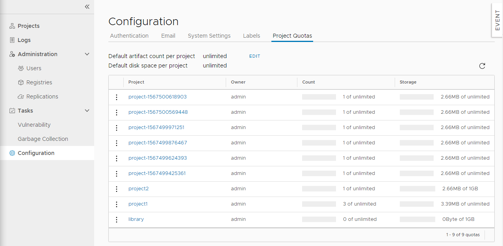
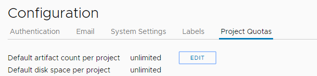
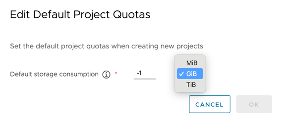
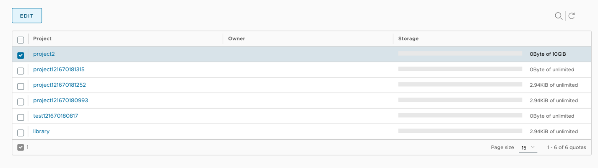
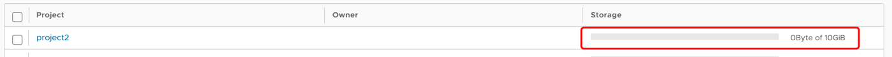

Per esercitare il controllo sull'utilizzo delle risorse, in qualità di amministratore di sistema Harbor puoi impostare quote sui progetti. È possibile limitare la quantità di capacità di archiviazione che un progetto può consumare. Puoi impostare quote predefinite che si applicano a tutti i progetti a livello globale.


Le quote predefinite si applicano ai progetti creati dopo aver impostato o modificato la quota predefinita. La quota predefinita non viene applicata ai progetti già esistenti prima della sua impostazione.


Puoi anche impostare quote su singoli progetti. Se imposti una quota predefinita globale e imposti quote diverse su singoli progetti, verranno applicate le quote per progetto.

Per impostazione predefinita, tutti i progetti hanno quote illimitate per l'utilizzo dello spazio di archiviazione. 

1. Selezionare la visualizzazione **Quote progetto**.

    
1. Per impostare quote predefinite globali su tutti i progetti, fare clic su **Modifica**.

    

    1. Per **Consumo di spazio di archiviazione predefinito**, immettere la quantità massima di spazio di archiviazione che qualsiasi progetto può consumare, selezionando `MiB`, `GiB` o `TiB` dal menu a discesa oppure immettere `-1` per impostare l'impostazione predefinita su illimitato.  
    

    1. Fare clic su **OK**.
1. Per impostare le quote su un singolo progetto, selezionare il progetto e quindi fare clic su **Modifica**.
    
    1. Per **Consumo di spazio di archiviazione predefinito**, inserisci la quantità massima di spazio di archiviazione che questo singolo progetto può consumare, selezionando `MiB`, `GiB` o `TiB` dal menu a discesa.

Dopo aver impostato le quote, puoi vedere la quantità di quote consumate da ciascun progetto.

### Come Harbor calcola l'utilizzo delle risorse

Quando si impostano le quote del progetto, è utile sapere come Harbor calcola l'utilizzo dello spazio di archiviazione, in particolare in relazione al push delle immagini, alla ricodifica e alla raccolta dei rifiuti.

- Harbor calcola la dimensione dell'immagine quando BLOB e manifest vengono inviati dal client Docker.

  
  Quando gli utenti inviano un'immagine, il manifest viene inviato per ultimo, dopo che tutti i BLOB associati sono stati inviati correttamente a registry. Se vengono inviate più immagini contemporaneamente e se nella quota rimane un numero insufficiente di tag per tutte, le immagini vengono accettate nell'ordine in cui arrivano i relativi manifest. Di conseguenza, un tentativo di pubblicare un'immagine potrebbe non essere immediatamente rifiutato per aver superato la quota. Questo perché la quota di tag era disponibile quando è stato avviato il push, ma quando è arrivato il manifest la quota era stata esaurita.
  
- I BLOB condivisi vengono calcolati solo una volta per progetto. In Docker, la condivisione BLOB è definita a livello globale. In Harbor, la condivisione BLOB è definita a livello di progetto. Di conseguenza, l'utilizzo complessivo dello spazio di archiviazione può essere maggiore della capacità effettiva del disco.
- La ricodifica delle immagini riserva e rilascia risorse: 
  - Se ricodifica un'immagine all'interno di un progetto, l'utilizzo dello spazio di archiviazione non cambia perché non sono presenti nuovi BLOB o manifest.
  - Se ricodifica un'immagine da un progetto a un altro, l'utilizzo dello spazio di archiviazione aumenterà.
- Durante la Garbage Collection, Harbor libera lo spazio di archiviazione utilizzato dai BLOB senza tag nel progetto.
- La dimensione del grafico Helm non viene calcolata.
