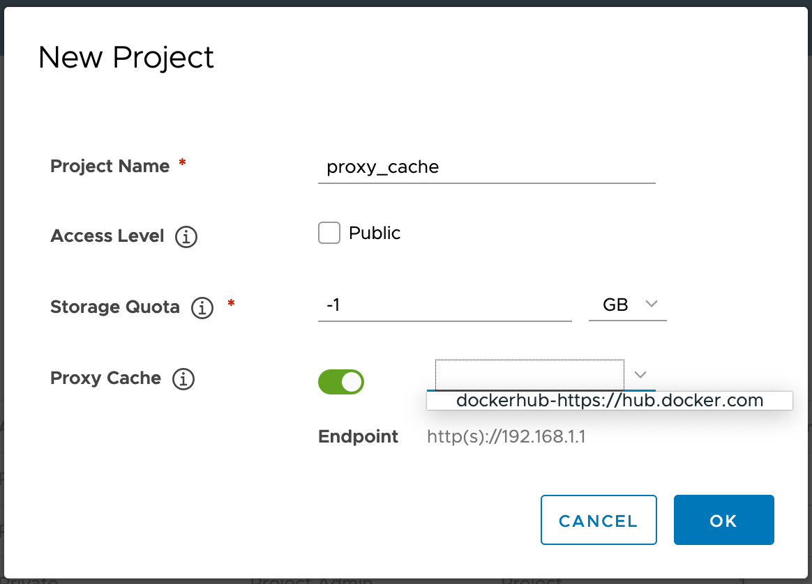

La cache proxy consente di utilizzare Harbor per eseguire il proxy e memorizzare nella cache le immagini da un registry pubblico o privato di destinazione. A partire da Harbor v2.1.1, la funzione cache proxy è stata aggiornata per allinearsi con [Docker Politica sui limiti tariffari dell'hub](https://www.docker.com/blog/scaling-docker-to-serve-millions-more-developers-network-egress/). Se prevedi di utilizzare la cache proxy con la tua istanza Harbor, ti consigliamo vivamente di utilizzare la versione 2.1.1 o successiva per evitare limitazioni di velocità.

È possibile utilizzare una cache proxy per estrarre immagini da un Harbor o non Harbor registry di destinazione in un ambiente con accesso limitato o assente a Internet. Puoi anche utilizzare una cache proxy per limitare la quantità di richieste effettuate a un registry pubblico, evitando di consumare troppa larghezza di banda o di essere limitato dal server registry.


Harbor supporta la memorizzazione nella cache proxy per i seguenti registri:
   -Harbor
   -Mozzo Docker
   -Dockerregistry
   - Registro dei contenitori elastici AWS
   - Registro contenitori di Azure
   - Registro dei contenitori di Google
   - Banchina
   - Registro dei contenitori GitHub
   - Registro Artifactory JFrog



Un amministratore di sistema Harbor configura una cache proxy creando un progetto cache proxy, che si connette a un registry di destinazione utilizzando un endpoint registry configurato. Un progetto di cache proxy funziona in modo simile a un normale progetto Harbor, tranne per il fatto che non è possibile inviare immagini a un progetto di cache proxy.

Per utilizzare una cache proxy Harbor, configura i comandi pull del docker e i manifest dei pod per estrarre le immagini dal progetto della cache proxy anziché dallo registry di destinazione.

## Come funziona la cache proxy Harbor

Quando una richiesta pull arriva a un progetto cache proxy, se l'immagine non è memorizzata nella cache, Harbor estrae l'immagine dal progetto registry di destinazione e fornisce il comando pull come se fosse un'immagine locale dal progetto cache proxy. Il progetto cache proxy memorizza quindi l'immagine nella cache per una richiesta futura.

La prossima volta che un utente richiede quell'immagine, Harbor controlla l'ultimo manifest dell'immagine nello registry di destinazione e fornisce l'immagine in base ai seguenti scenari:

* Se l'immagine non è stata aggiornata nel registry di destinazione, l'immagine memorizzata nella cache viene fornita dal progetto cache proxy.
* Se l'immagine è stata aggiornata nel target registry, la nuova immagine viene estratta dal target registry, quindi servita e memorizzata nella cache del progetto proxy cache.
* Se la destinazione registry non è raggiungibile, il progetto cache proxy fornisce l'immagine memorizzata nella cache.
* Se l'immagine non è più nella destinazione registry, non viene fornita alcuna immagine.

A partire da Harbor v2.1.1, la cache proxy Harbor attiva una richiesta HEAD per determinare se qualsiasi livello di un'immagine memorizzata nella cache è stato aggiornato nell'hub Docker registry. Utilizzando questo metodo per controllare il target registry non si attiverà [Docker Limitatore di velocità dell'hub](https://www.docker.com/blog/scaling-docker-to-serve-millions-more-developers-network-egress/). Se un livello di immagine è stato aggiornato, la cache del proxy estrarrà la nuova immagine, che verrà conteggiata ai fini del limitatore di velocità dell'hub Docker.


La cache proxy segue le sfide di autenticazione registry upstream (ad esempio, `WWW-Authenticate: Bearer realm="..."`) per ottenere i token.
L'endpoint del servizio token può essere diverso dall'host registry (ad esempio, Docker Hub).
Configura solo gli endpoint della cache proxy che rientrano nei limiti di attendibilità e utilizza le credenziali con privilegi minimi per l'account di accesso upstream.


## Crea progetto proxy cache

Per impostare una cache proxy, gli amministratori di sistema Harbor possono creare un progetto cache proxy che si connette a un registry di destinazione utilizzando un endpoint registry.

Un progetto cache proxy è in grado di utilizzare le stesse funzionalità disponibili per un normale progetto Harbor, tranne per il fatto che non è possibile inviare immagini a un progetto cache proxy. Per ulteriori informazioni sui progetti, consultare la documentazione [Lavorare con i progetti](../../working-with-projects/).

1. Prima di creare un progetto cache proxy, creare un endpoint registry da utilizzare per il progetto cache proxy. Scopri come eseguire [creare un endpoint registry](../configuring-replication/create-replication-endpoints.md).

    Proxy cache projects can pull every image from the target registry that the access account you configure in the registry endpoint has access to. This means that Harbor users with access to the proxy cache project are able to pull any image available to the access account in the target repository.
    

1. Nella pagina Progetti, fai clic su **Nuovo progetto** e configura le informazioni sul nuovo progetto. Consulta la documentazione di [Crea progetti](../../working-with-projects/create-projects/) per maggiori dettagli.

1. Fare clic sul dispositivo di scorrimento **Proxy Cache** e quindi selezionare l'endpoint registry dal menu a discesa visualizzato. La larghezza di banda è il limite di velocità dell'immagine pull per registry upstream, -1 significa nessun limite.

    

1. Fare clic su **OK**.

È possibile visualizzare tutti i progetti di cache proxy disponibili dalla pagina Progetti.

Per impostazione predefinita, Harbor crea una politica di conservazione di 7 giorni per ogni nuovo progetto di cache proxy. Scopri di più su [Politiche di conservazione dei tag](../../working-with-projects/working-with-images/create-tag-retention-rules.md).

Per iniziare a utilizzare la cache del proxy, configura i comandi pull del docker o i manifest dei pod per fare riferimento al progetto della cache del proxy aggiungendo `<harbor_servername>/<proxy_project_name>/` come prefisso al tag dell'immagine. Per esempio:

```bash
> docker pull <harbor_server_name>/<proxy_project_name>/goharbor/harbor-core:dev
```
