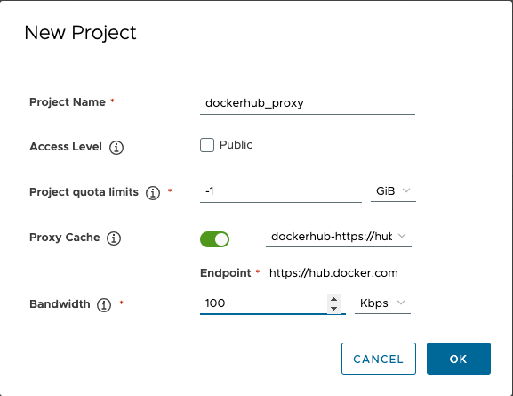

Proxy cache allows you to use Harbor to proxy and cache images from a target public or private registry.

You can use a proxy cache to pull images from a target Harbor or non-Harbor registry in an environment with limited or no access to the internet. You can also use a proxy cache to limit the amount of requests made to a public registry, avoiding consuming too much bandwidth or being throttled by the registry server.


Harbor only supports proxy caching for Docker Hub and Harbor registries.


A Harbor system administrator configures a proxy cache by creating a proxy cache project, which connects to a target registry using a registry endpoint you have configured. A proxy cache project works similarly to a normal Harbor project, except that you are not able to push images to a proxy cache project.

To use a Harbor proxy cache, configure your docker pull commands and pod manifests to pull images from the proxy cache project instead of the target registry.

## How Harbor proxy cache works

When a pull request comes to a proxy cache project, if the image is not cached, Harbor pulls the image from the target registry and serves the pull command as if it is a local image from the proxy cache project. The proxy cache project then caches the image for a future request.

The next time a user requests that image, Harbor checks the image's latest manifest in the target registry and serves the image based on the following scenarios:

* If the image has not been updated in the target registry, the cached image is served from the proxy cache project.
* If the image has been updated in the target registry, the new image is pulled from the target registry, then served and cached in the proxy cache project.
* If the target registry is not reachable, the proxy cache project serves the cached image.
* If the image is no longer in the target registry, no image is served.

## Create Proxy Cache Project

To set up a proxy cache, a Harbor system administrators can create a proxy cache project that connects to a target registry using a registry endpoint.

A proxy cache project is able to use the same features available to a normal Harbor project, except that you are not able to push images to a proxy cache project. For more information on projects, see the [Working with Projects](../../working-with-projects/) documentation.

1. Before creating a proxy cache project, create a Docker Hub or Harbor registry endpoint for the proxy cache project to use. See how to [create a registry endpoint](../configuring-replication/create-replication-endpoints.md).

    Proxy cache projects can pull every image from the target registry that the access account you configure in the registry endpoint has access to. This means that Harbor users with access to the proxy cache project are able to pull any image available to the access account in the target repository.
    

1. On the Projects page, click **New Project** and configure the new project information. See the [Create Projects](../../working-with-projects/create-projects/) documentation for more details.

1. Click the **Proxy Cache** slider and then select your registry endpoint from the drop-down that appears.

    

1. Click **OK**.

You can view all available proxy cache projects from the Projects page.

By default, Harbor creates a 7 day retention policy for each new proxy cache project. See more about [Tag Retention Policies](../../working-with-projects/working-with-images/create-tag-retention-rules.md).

To start using the proxy cache, configure your docker pull commands or pod manifests to reference the proxy cache project by adding `<harbor_servername>/<proxy_project_name>/` as a prefix to the image tag. For example:

```bash
> docker pull <harbor_server_name>/<proxy_project_name>/goharbor/harbor-core:dev

# To pull offcial images, use the 'library' namespace
> docker pull <harbor_server_name>/<proxy_project_name>/library/hello-world:latest
```
