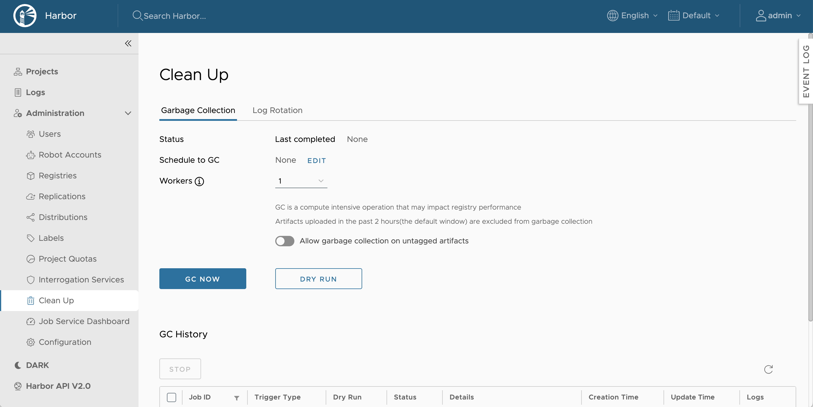
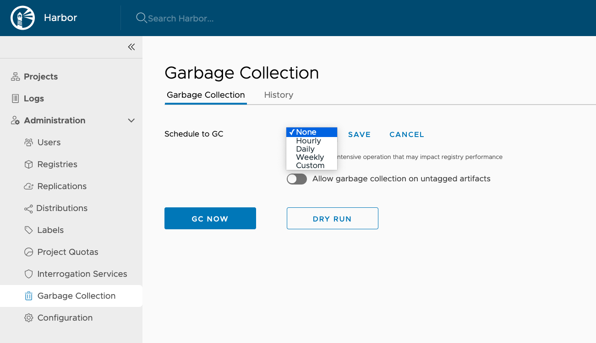
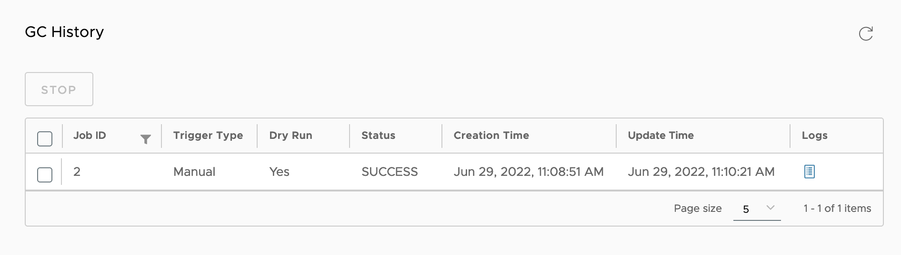
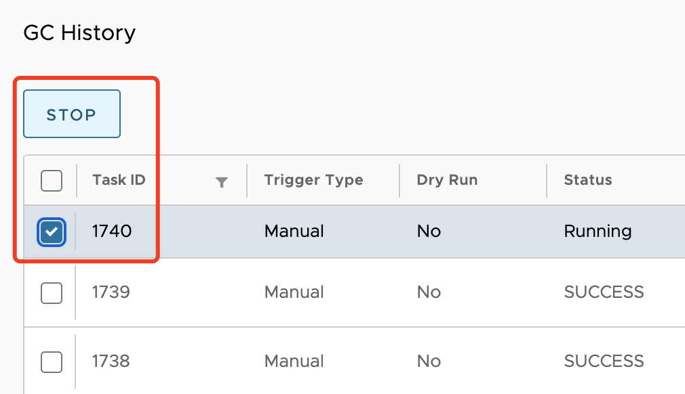

Quando si eliminano immagini da Harbor, lo spazio non viene liberato automaticamente. È necessario eseguire la Garbage Collection per liberare spazio rimuovendo dal file system i BLOB a cui non fa più riferimento un manifesto.

## Esegui la Garbage Collection

1. Accedere all'interfaccia Harbor con un account che disponga dei privilegi di amministratore di sistema Harbor.
1. Espandi **Amministrazione** e seleziona **Pulizia**.
1. Seleziona la scheda **'Raccolta rifiuti'**.

    

1. Per la voce **Lavoratori**, è possibile selezionare il numero di lavoratori che possono eseguire attività GC in parallelo.
1. Per **Consentire la garbage collection sugli artefatti senza tag**, selezionare l'opzione. Se questa opzione è attivata, la prossima volta che Garbage Collect verrà eseguito sull'istanza Harbor, Harbor eliminerà gli artefatti senza tag e quindi eseguirà la Garbage Collection su di essi.
1. Per eseguire la garbage collection in prova, fare clic su **DRY RUN**.
1. Per eseguire immediatamente la garbage collection, fare clic su **GC Now**.

**DRY RUN** stampa i BLOB idonei per l'eliminazione e una stima approssimativa dello spazio liberato senza rimuovere alcun dato.

Per evitare di danneggiare l'artefatto in caricamento, la garbage collection introduce una finestra temporale (2 ore) per riservare i layer caricati di recente. La Garbage Collection non elimina i file manifest e BLOB che hanno un timestamp nella finestra temporale. Harbor esegue la garbage collection senza interrompere la possibilità di continuare a utilizzare Harbor, ad esempio è possibile eseguire il push, il pull o eliminare gli artefatti mentre è in esecuzione la garbage collection.

Per evitare di attivare troppo frequentemente il processo di Garbage Collection, la disponibilità del pulsante **GC Now** è limitata. La raccolta dei rifiuti può essere eseguita solo una volta al minuto.

## Pianifica la raccolta dei rifiuti

È possibile pianificare la raccolta dei rifiuti sull'interfaccia Harbor dalla scheda **'Raccolta dei rifiuti'** nella pagina **Amministrazione** > **Pulizia** dell'interfaccia Harbor.

1. Utilizzare il menu a discesa per selezionare la frequenza con cui eseguire la garbage collection.

    

    * **Nessuno**: non è pianificata alcuna raccolta dei rifiuti.
    * **Ogni ora**: esegue la raccolta dei rifiuti all'inizio di ogni ora.
    * **Giornaliero**: esegui la raccolta dei rifiuti ogni giorno a mezzanotte.
    * **Settimanale**: esegui la raccolta dei rifiuti ogni sabato a mezzanotte.
    * **Personalizzato**: esegue la raccolta dei rifiuti in base a un'attività `cron`.

1. Per la voce **Lavoratori**, è possibile selezionare il numero di lavoratori che possono eseguire attività GC in parallelo.
1. Per **Consentire la garbage collection sugli artefatti senza tag**, selezionare l'opzione. Se questa opzione è attivata, la prossima volta che Garbage Collect verrà eseguito sull'istanza Harbor, Harbor eliminerà gli artefatti senza tag e quindi eseguirà la Garbage Collection su di essi.
1. Fare clic su **Salva**.

## Visualizza la cronologia della Garbage Collection
Visualizza le esecuzioni della Garbage Collection nella tabella **Cronologia Garbage Collection** nella scheda **'Garbage Collection'** nella pagina **Amministrazione** > **Pulisci** dell'interfaccia Harbor.

Ogni volta che esegui la garbage collection sull'istanza Harbor, Harbor terrà traccia di alcune informazioni sull'esecuzione, tra cui:

  * **ID attività:** Valore numerico univoco assegnato da Harbor quando viene avviata un'esecuzione.
  * **Tipo di attivazione:** modalità di avvio della corsa, manuale o pianificata.
  * **Prova a secco:** Se la corsa è stata una prova a secco oppure no.
  * **Stato:** Stato attuale della corsa.
  * **Dettagli:** Dettagli sulla raccolta dei rifiuti.
  * **Ora di creazione:** Ora di inizio della corsa.
  * **Ora di aggiornamento:** L'ultima volta che la corsa è stata aggiornata.
  * **Log:** un collegamento ai log generati dalla corsa. Se stai eseguendo un'esecuzione di prova, questa includerà una stima degli artefatti che verranno sottoposti a Garbage Collection.

  

## Arresto della Garbage Collection in corso

È possibile interrompere qualsiasi attività di Garbage Collection in esecuzione dalla tabella Cronologia Garbage Collection.

1. Vai alla pagina **Amministrazione** > **Pulizia** e seleziona la scheda **'Raccolta rifiuti'**.
1. Nella tabella **Cronologia Garbage Collection**, fai clic sulla casella di controllo accanto all'ID attività della Garbage Collection in esecuzione. È possibile interrompere contemporaneamente una o più attività di Garbage Collection in esecuzione.
1. Fai clic su **Interrompi** e poi su **Conferma** che desideri interrompere la raccolta dei rifiuti nella modalità modale.

    

Ciò impedirà solo all'attività di Garbage Collection di elaborare più artefatti. Harbor non ripristinerà alcun artefatto che sia già stato sottoposto a garbage collection.
