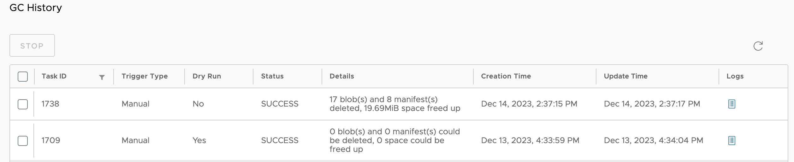

When you delete images from Harbor, space is not automatically freed up. You must run garbage collection to free up space by removing blobs that are no longer referenced by a manifest from the file system.  

## Run Garbage Collection

1. Log in to the Harbor interface with an account that has Harbor system administrator privileges.
1. Expand **Administration**, and select **Clean Up**.
1. Select the **'Garbage Collection'** tab.

    

1. To **Allow garbage collection on untagged artifacts**, select the option. If you have this option turned on, the next time Garbage collect runs on your Harbor instance, Harbor will delete untagged artifacts and then perform garbage collection on them.
1. To dry run garbage collection, click **DRY RUN**.
1. To run garbage collection immediately, click **GC Now**.

**DRY RUN** prints the blobs eligible for deletion and a rough estimation of free up space without removing any data.

To avoid damaging the uploading artifact, the garbage collection introduces a time windows(2 hours) to reserve the recent uploaded layers. Garbage collection does not sweep the manifest & blob files that have a timestamp in the time window. Harbor runs garbage collection without interrupting your ability to continue use Harbor, for example you are able to push, pull, or delete artifacts while garbage collection is running.

To avoid triggering the garbage collection process too frequently, the availability of the **GC Now** button is restricted. Garbage collection can be only run once per minute.

## Schedule Garbage Collection

You are able to schedule garbage colleciton on your Harbor interface from the **'Garbage Collection'** tab on the **Administration** > **Clean Up** page of the Harbor interface.

1. Use the drop down-menu to select how often to run garbage collection.

    

    * **None**: No garbage collection is scheduled.
    * **Hourly**: Run garbage collection at the beginning of every hour.
    * **Daily**: Run garbage collection at midnight every day.
    * **Weekly**: Run garbage collection at midnight every Saturday.
    * **Custom**: Run garbage collection according to a `cron` job.

1. To **Allow garbage collection on untagged artifacts**, select the option. If you have this option turned on, the next time Garbage collect runs on your Harbor instance, Harbor will delete untagged artifacts and then perform garbage collection on them.     
1. Click **Save**.

## View Garbage Collection History
View garbage collection runs in the **Garbage Collection History** table on the **'Garbage Collection'** tab on the **Administration** > **Clean Up** page of the Harbor interface.

Each time you run garbage collection on your Harbor instance, Harbor will track some information about the run including:

  * **Job ID:** Unique numerical value assigned by Harbor when a run is initiated.
  * **Trigger Type:** How the run was initiated, either Manual or by Schedule.
  * **Dry Run:** If the run was a dry run or not.
  * **Status:** Current status of the run.  
  * **Creation Time:** Time the run started.
  * **Update time:** The last time the run was updated.  
  * **Logs:** A link to the logs generated by the run. If you are performing a Dry Run, this will include an estimate of the artifacts that will be garbage collected.

  

## Stop in Progress Garbage Collection

You are able to stop any running garbage collection job from the Garbage Collection History table.

1. Navigate to **Administration** > **Clean Up** page and select the **'Garbage Collection'** tab.
1. In the **Garbage Collection History** table, click on the checkbox next to the Job Id of the running garbage collection. You can stop one or more running garbage collection jobs at one time.
1. Click **Stop** and then **Confirm** that you want to stop the garbage collection in the modal.

    

This will only stop the garbage collection job from processing more artifacts. Harbor will not restore any artifact that has already been garbage collected.
