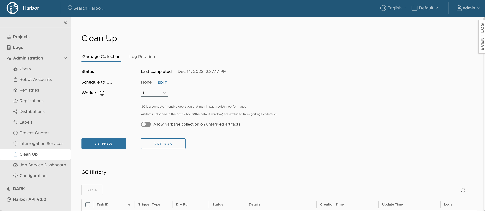

When you delete images from Harbor, space is not automatically freed up. You must run garbage collection to free up space by removing blobs that are no longer referenced by a manifest from the file system.  

## Run Garbage Collection

1. Log in to the Harbor interface with an account that has Harbor system administrator privileges.
1. Expand **Administration**, and select **Clean Up**.
1. Select the **'Garbage Collection'** tab.

    

1. To **Allow garbage collection on untagged artifacts**, select the option. If you have this option turned on, the next time Garbage collect runs on your Harbor instance, Harbor will delete untagged artifacts and then perform garbage collection on them.
1. To dry run garbage collection, click **DRY RUN**.
1. To run garbage collection immediately, click **GC Now**.

**DRY RUN** prints the blobs eligible for deletion and a rough estimation of free up space without removing any data.

To avoid damaging the uploading artifact, the garbage collection introduces a time windows(2 hours) to reserve the recent uploaded layers. Garbage collection does not sweep the manifest & blob files that have a timestamp in the time window. Harbor runs garbage collection without interrupting your ability to continue use Harbor, for example you are able to push, pull, or delete artifacts while garbage collection is running.

To avoid triggering the garbage collection process too frequently, the availability of the **GC Now** button is restricted. Garbage collection can be only run once per minute.

## Schedule Garbage Collection

1. Expand **Administration**, and select **Garbage Collection**.
1. Select the **'Garbage Collection'** tab.
1. Use the drop down-menu to select how often to run garbage collection.

    

    * **None**: No garbage collection is scheduled.
    * **Hourly**: Run garbage collection at the beginning of every hour.
    * **Daily**: Run garbage collection at midnight every day.
    * **Weekly**: Run garbage collection at midnight every Saturday.
    * **Custom**: Run garbage collection according to a `cron` job.

1. To **Allow garbage collection on untagged artifacts**, select the option. If you have this option turned on, the next time Garbage collect runs on your Harbor instance, Harbor will delete untagged artifacts and then perform garbage collection on them.     
1. Click **Save**.
1. View the 10 most recent garbage collection runs in the **GC History** table.

    

1. Click on the **Logs** link to view the related logs.
