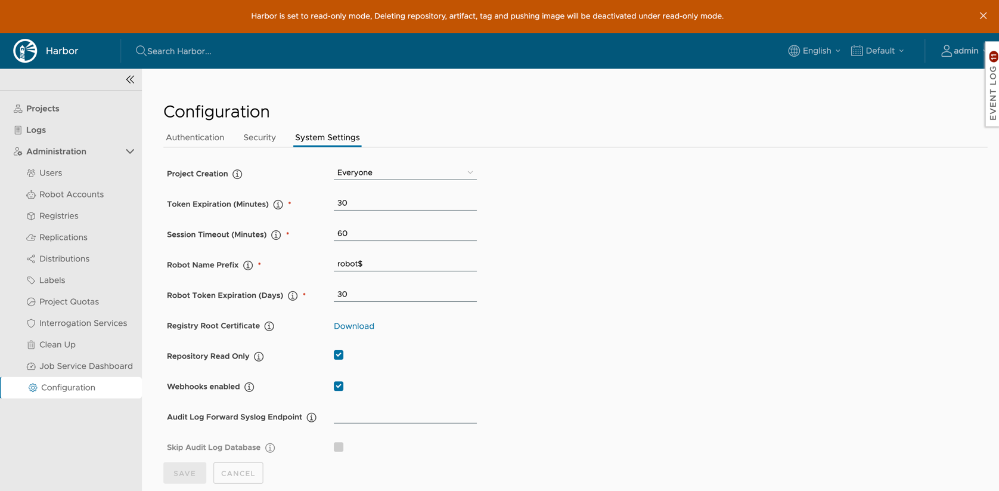
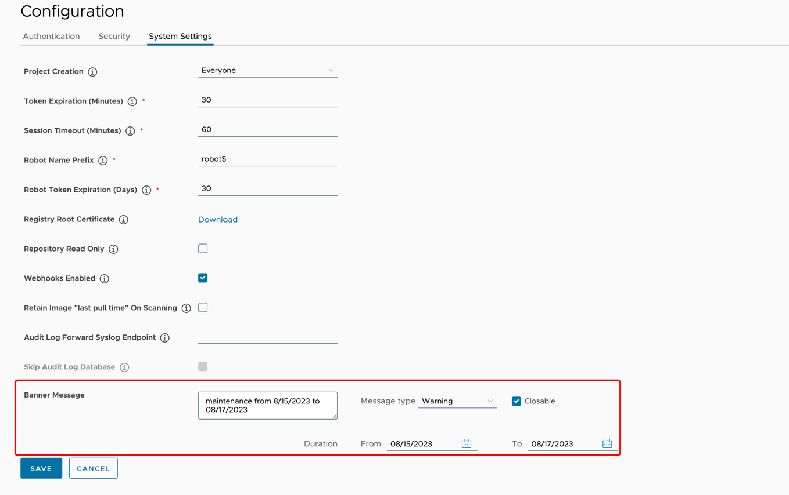

You can configure Harbor to set the registry in read-only mode, and configure Harbor so that only system administrators can create projects.

## Make the Registry Read Only

You can set Harbor to read-only mode. In read-only mode, Harbor allows `docker pull` but prevents `docker push` and the deletion of repositories and tags.


If it set to true, deleting repositories, tags and pushing images are not permitted.



```sh
docker push 10.117.169.182/demo/ubuntu:14.04
The push refers to a repository [10.117.169.182/demo/ubuntu]
0271b8eebde3: Preparing 
denied: The system is in read only mode. Any modification is prohibited.
```

## Set Who Can Create Projects

Use the **Project Creation** drop-down menu to set which users can create projects. Select **Everyone** to allow all users to create projects. Select **Admin Only** to allow only users with the Harbor system administrator role to create projects.


## Retain image last pull time on scanning

By default, a vulnerability scanner(e.g. Trivy) will update the image's last `pull time` when the image is scanned. This affects the **Tag Retention Rules** based on pull time. If you want to eliminate this effect, you can enable this option to avoid updating the pull time on scanning. 


## Set a banner message on the Harbor UI

Set a custom banner message that will be displayed on the top of the Harbor UI， then every user including anonymous users can see the banner message.

- **Message Content**: Enter your message content in the text area. This field is required.
- **Message Type**: Select a message type, each message type has its corresponding style.
- **Closable**: Decide whether the banner message can be closed temporarily.
- **Duration**: Set the display time period of the banner message, which is from 0:00 of the start date to 0:00 of the end date. This field is required.


