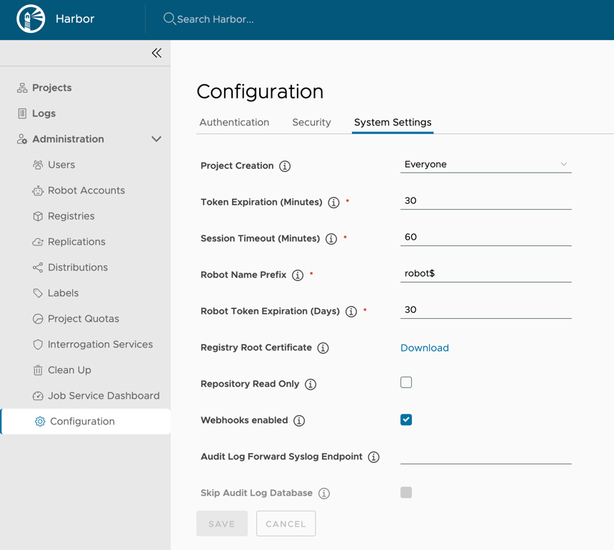
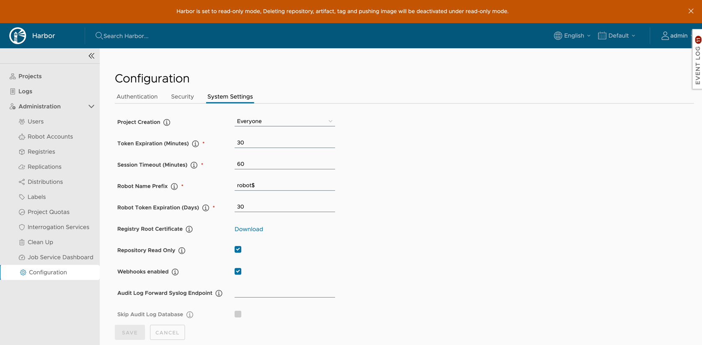
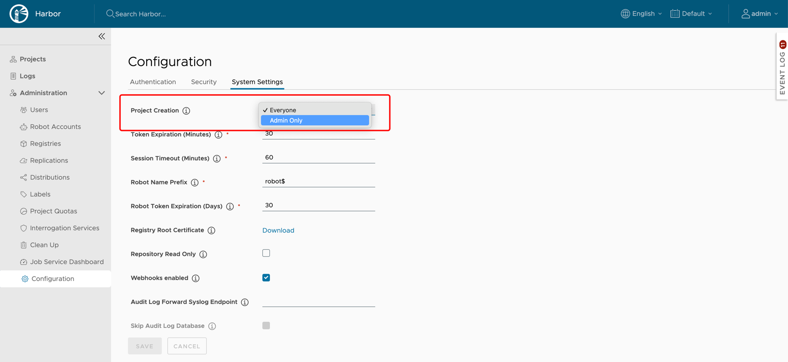
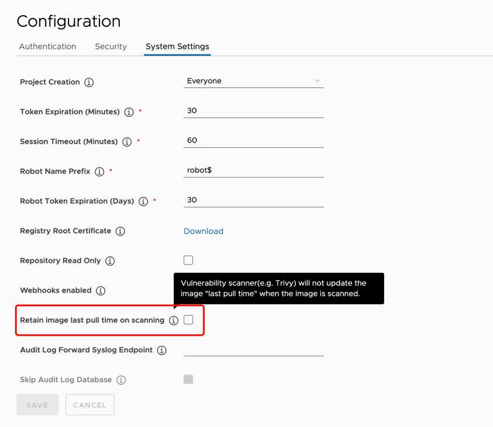
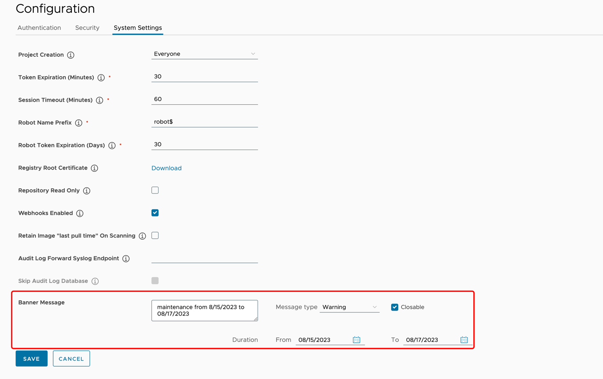

È possibile configurare Harbor per impostare registry in modalità di sola lettura e configurare Harbor in modo che solo gli amministratori di sistema possano creare progetti.

## Rendi il registro di sola lettura

È possibile impostare Harbor in modalità di sola lettura. In modalità di sola lettura, Harbor consente `docker pull` ma impedisce `docker push` e l'eliminazione di repository e tag.



Se impostato su true, non è consentito eliminare repository, tag e inviare immagini.



```sh
docker push 10.117.169.182/demo/ubuntu:14.04
The push refers to a repository [10.117.169.182/demo/ubuntu]
0271b8eebde3: Preparing 
denied: The system is in read only mode. Any modification is prohibited.
```

## Imposta chi può creare progetti

Utilizza il menu a discesa **Creazione progetto** per impostare quali utenti possono creare progetti. Seleziona **Tutti** per consentire a tutti gli utenti di creare progetti. Selezionare **Solo amministratore** per consentire solo agli utenti con il ruolo di amministratore di sistema Harbor di creare progetti.



## Conserva l'ora dell'ultima estrazione dell'immagine durante la scansione

Per impostazione predefinita, uno scanner di vulnerabilità (ad esempio Trivy) aggiornerà l'ultimo `pull time` dell'immagine quando l'immagine viene scansionata. Ciò influisce sulle **Regole di conservazione dei tag** in base al tempo di pull. Se desideri eliminare questo effetto, puoi abilitare questa opzione per evitare di aggiornare il tempo di pull durante la scansione. 



## Imposta un messaggio banner su Harbor UI

Imposta un messaggio banner personalizzato che verrà visualizzato nella parte superiore di Harbor UI, quindi ogni utente, inclusi gli utenti anonimi, potrà vedere il messaggio banner.

- **Contenuto del messaggio**: inserisci il contenuto del messaggio nell'area di testo. Questo campo è obbligatorio.
- **Tipo di messaggio**: seleziona un tipo di messaggio, ogni tipo di messaggio ha il suo stile corrispondente.
- **Chiudibile**: Decidi se il messaggio banner può essere chiuso temporaneamente.
- **Durata**: imposta il periodo di tempo di visualizzazione del messaggio banner, ovvero dalle 0:00 della data di inizio alle 0:00 della data di fine. Questo campo è obbligatorio.


