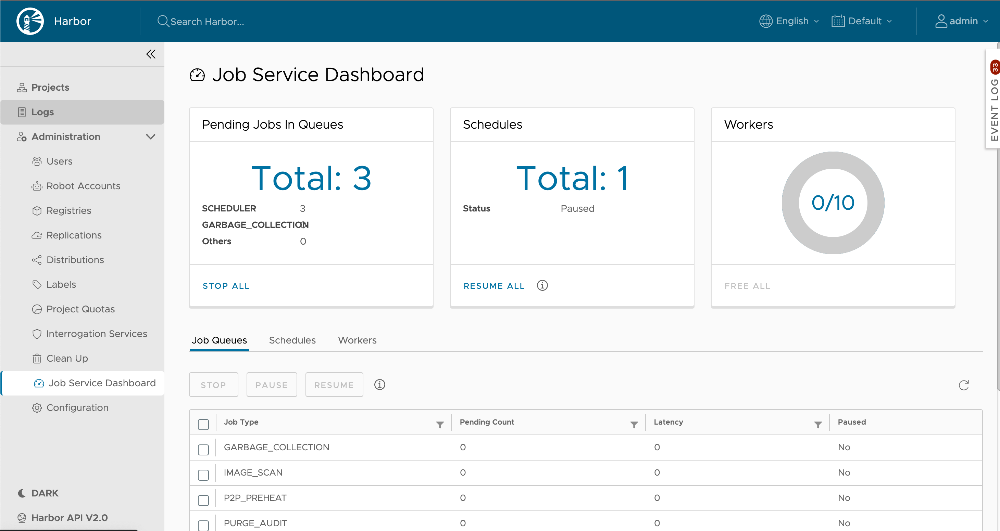
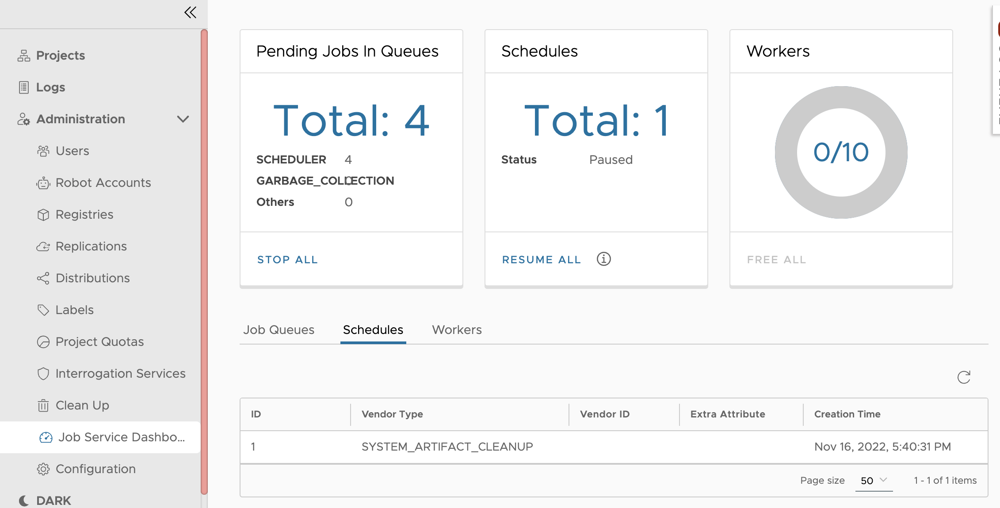
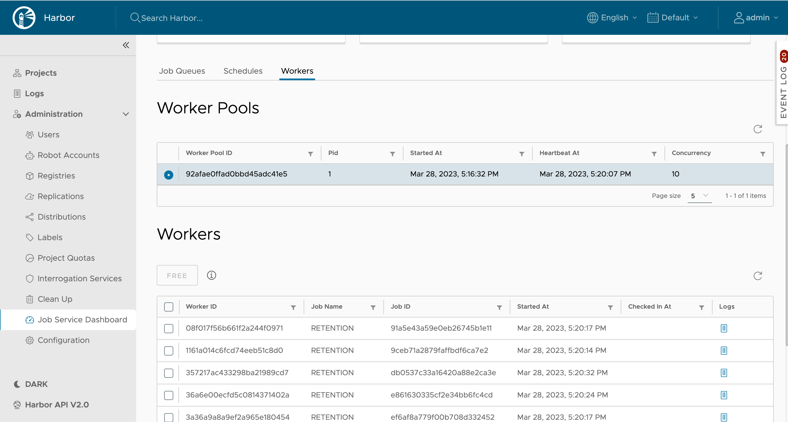

The job service dashboard is a web-based interface that allows you to view and manage jobs that are running in the Harbor job service. It is available at `https://<harbor_url>/harbor/job-service-dashboard/`. You can use the dashboard to view the status of job queues, the schedule of jobs, and the status of the job service pools and workers. you can also use it to stop pending or running jobs, or pause or resume the job service queue.

## View Job Service Queue Status

1. Log in to the Harbor Web interface with an account that has Harbor system administrator privileges.
1. Expand **Administration**, and select **Job Service Dashboard**.

In the job service dashboard, you can view the status of the job service queue, the job service pools, and the job service workers.

The following table describes the information that is displayed in the dashboard.

|Field|Description|Actions|
|:---|:---|:---|
|**Pending Jobs In Queues**|The job service queue is a FIFO queue that stores jobs to be executed. Total displays the count of queue type, and the top 2 queues| **Stop All**: stop all jobs in all queues |
|**Schedules**|The job service pool is a pool of workers that execute jobs, display the total count of schedules and show its status | **Pause All**: Pause all running job schedule, **Resume All**: Resume all paused job schedule |
|**Workers**| The job service worker is a goroutine that executes jobs, it displays the free/total workers| **Free All**: stop the execution of running jobs to free all workers |

## View Job Queue Details

In the job service dashboard, click the **Job Queues** tab.

The **Job Queues** tab displays the detail of job queues. The following table describes the information that is displayed in the **Job Queues** tab.

|Field|Description|
|:---|:---|
|**Job Type**|The name of the job queue.|
|**Pending Count**|The number of jobs that are waiting to be executed in the queue.|
|**Latency**|The waiting time of the current queue, it indicate how long tasks in the queue have already waited.|
|**Paused**|The paused status of job queue.|

Actions for each job queue:

- Click the **Stop** button to stop all jobs in the queue. it will remove all jobs from the queue and mark their status as "Stopped".
- Click the **Pause** button to pause the job queue.
- Click the **Resume** button to resume the job queue.

Job Types

  | Type Name | Description |
  |:---|:---|
  | `GARBAGE_COLLECTION` | Job queue for garbage collection. |
  | `IMAGE_SCAN` | Job queue for image scan. |
  | `P2P_PREHEAT` | Job queue for p2p preheat related task. |
  | `PURGE_AUDIT` | Job queue for purge audit log. |
  | `REPLICATION` | Job queue for image replication. |
  | `RETENTION` | Job queue for tag retention. |
  | `SCAN_DATA_EXPORT` | Job queue for export CVE data. |
  | `SCHEDULER` | Job queue for all periodical tasks, if it is paused, all periodical schedule will not be triggered. |
  | `SLACK` | Job queue for sending slack message. |
  | `SYSTEM_ARTIFACT_CLEANUP` | Job queue for cleanup system artifact, used by export CVE feature. |
  | `WEBHOOK` | Job queue for web hook task. |

**NOTE** The **Pause** and **Resume** operation just stop the worker from consuming jobs in the job queue, it does not stop the job task submission, neither change job status in the job queue.

## View Schedule Details

In the job service dashboard, click the **Schedules** tab.
   
   

The **Schedules** tab displays the details of the job schedules. The following table describes the information that is displayed in the Schedules tab.

|Field|Description|
|:---|:---|
|**ID**|The ID of the job schedule.|
|**Vendor Type**|The vendor type of the job service schedule.|
|**Vendor ID**|The vendor id of the job schedule. empty if there is no vendor id.|
|**Cron**|The cron expression of the schedule.|
|**Create Time**|The created time of the job schedule.|

## View Worker Details

  In the job service dashboard, click the **Workers** tab.

  

  The worker pools table displays the details of the worker pools. The following table describes the information that is displayed in the Workers tab. When you click a worker pool in the table, workes of this pool is displayed in the worker's table.

|Field|Description|
|:---|:---|
|**Worker Pool ID**|The ID of the worker pool.|
|**PID**|The process the worker pool.|
|**Start At**|The start time of the worker pool.|
|**Heartbeat At**|The heartbeat time of the worker pool.|
|**Concurrency**|The concurrency of worker pool.|

The worker's table displays the details of the workers. The following table describes the information that is displayed in the Workers tab.

|Field|Description|
|:---|:---|
|**Worker ID**|The ID of the worker.|
|**Job Name**| The job name of the current job that the worker is executing.|
|**Job ID**|The ID of the current job that the worker is executing.|
|**Started At**|The start time of the current job that the worker is executing.|
|**Checked In At**|The check in time of the current job that the worker is executing.|

Actions for workers:

-- Click the **Free** button to stop the execution of the current job that the worker is executing to free the worker. The stop operation takes several minutes to complete, it depends on the job type.
  

  ## Steps to Withdraw an Execution

  Because an execution might contains one or many tasks, some of then might be in pending state, some of them might be in running state. Stop running tasks might not stop whole the execution. You can use the following steps to stop the overall execution.

  1. Go to the Harbor job service dashboard with an account that has Harbor system administrator privileges.
  2. Click the **Job Queues** tab, and click the **Stop** button to stop all jobs in the queue.
  3. Click the **Workers** tab, and click the **Free** button to stop the execution of the current job which the worker is working on to free the worker.
  4. Wait and check the execution status to become **Stopped**.

  Sometimes, you don't want to remove this scheduled task from job queue. To let workers to work on other types of jobs, you can pause/resume the job queue.
  
  1. Go to the Harbor job service dashboard with an account that has Harbor system administrator privileges.
  2. Click the **Job Queues** tab, and click the **Pause** button to pause all jobs in the queue.
  3. Wait the job service workers to work on other type of jobs.
  4. Click the **Resume** button to resume the job queue.
