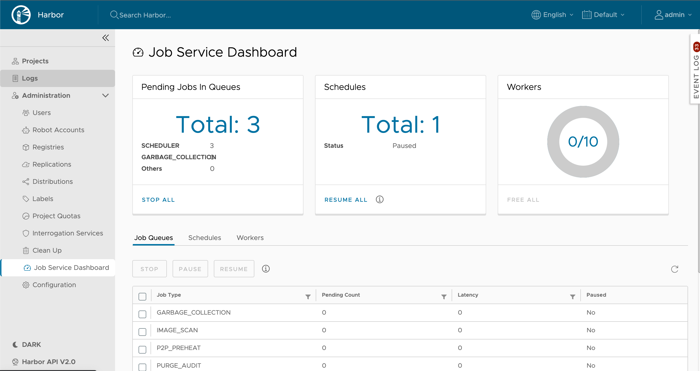
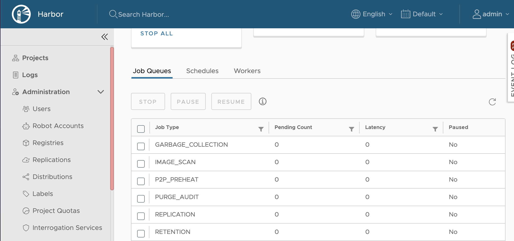
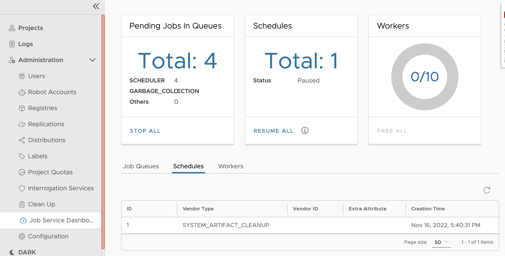
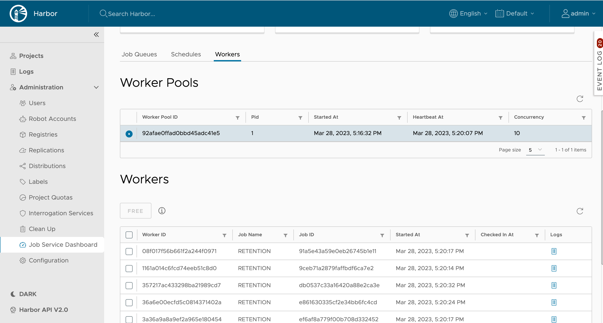

Il dashboard del servizio lavori è un'interfaccia basata sul Web che consente di visualizzare e gestire i lavori in esecuzione nel servizio lavori Harbor. È disponibile presso `https://<harbor_url>/harbor/job-service-dashboard/`. È possibile utilizzare il dashboard per visualizzare lo stato delle code di lavoro, la pianificazione dei lavori e lo stato dei pool e dei lavoratori dei servizi di lavoro. puoi anche usarlo per interrompere i lavori in sospeso o in esecuzione oppure per mettere in pausa o riprendere la coda del servizio lavori.

## Visualizza lo stato della coda del servizio lavori

1. Accedere all'interfaccia Web Harbor con un account che disponga dei privilegi di amministratore di sistema Harbor.
1. Espandere **Amministrazione** e selezionare **Dashboard servizio lavori**.

Nel dashboard del servizio di lavoro è possibile visualizzare lo stato della coda del servizio di lavoro, dei pool di servizi di lavoro e degli addetti ai servizi di lavoro.

La tabella seguente descrive le informazioni visualizzate nel dashboard.

|Campo|Descrizione|Azioni|
|:---|:---|:---|
|**Lavori in sospeso nelle code**|La coda del servizio lavori è una coda FIFO che memorizza i lavori da eseguire. Totale visualizza il conteggio del tipo di coda e le prime 2 code| **Interrompi tutto**: interrompe tutti i lavori in tutte le code |
|**Pianificazioni**|Il pool di servizi di lavoro è un pool di lavoratori che eseguono lavori, visualizzano il conteggio totale delle pianificazioni e ne mostrano lo stato | **Pausa tutto**: sospende tutta la pianificazione dei lavori in esecuzione, **Riprendi tutto**: riprendi tutta la pianificazione dei lavori in pausa |
|**Lavoratori**| L'addetto al servizio di lavoro è una goroutine che esegue lavori, visualizza i lavoratori liberi/totali| **Liberi tutti**: interrompe l'esecuzione dei lavori in corso per liberare tutti i lavoratori |

## Visualizza i dettagli della coda dei lavori

Nel dashboard del servizio di lavoro, fai clic sulla scheda **Code di lavori**.

La scheda **Code di lavori** visualizza i dettagli delle code di lavori. La seguente tabella descrive le informazioni visualizzate nella scheda **Code di lavori**.

|Campo|Descrizione|
|:---|:---|
|**Tipo di lavoro**|Il nome della coda di lavori.|
|**Conteggio in attesa**|Il numero di lavori in attesa di essere eseguiti nella coda.|
|**Latenza**|Il tempo di attesa della coda corrente, indica per quanto tempo le attività nella coda hanno già aspettato.|
|**In pausa**|Lo stato in pausa della coda dei lavori.|

Azioni per ciascuna coda di lavoro:

- Fare clic sul pulsante **Stop** per interrompere tutti i lavori in coda. rimuoverà tutti i lavori dalla coda e contrassegnerà il loro stato come "Stopped".
- Fare clic sul pulsante **Pausa** per mettere in pausa la coda dei lavori.
- Fare clic sul pulsante **Riprendi** per riprendere la coda dei lavori.

Tipi di lavoro

  | Digitare Nome | Descrizione |
  |:---|:---|
  | `GARBAGE_COLLECTION` | Coda di lavori per la garbage collection. |
  | `IMAGE_SCAN` | Coda di lavori per la scansione delle immagini. |
  | `P2P_PREHEAT` | Coda di lavori per attività relativa al preriscaldamento p2p. |
  | `PURGE_AUDIT` | Coda di processi per l'eliminazione del registro di controllo. |
  | `REPLICATION` | Coda di processi per la replica dell'immagine. |
  | `RETENTION` | Coda di lavori per la conservazione dei tag. |
  | `SCAN_DATA_EXPORT` | Coda di lavori per l'esportazione dei dati CVE. |
  | `SCHEDULER` | Coda di lavori per tutte le attività periodiche, se è in pausa, tutta la pianificazione periodica non verrà attivata. |
  | `SLACK` | Coda di lavori per l'invio di messaggi slack. |
  | `SYSTEM_ARTIFACT_CLEANUP` | Coda di processi per l'artefatto del sistema di pulizia, utilizzata dalla funzione di esportazione CVE. |
  | `WEBHOOK` | Coda di processi per l'attività hook web. |

**NOTA** L'operazione **Pausa** e **Riprendi** impedisce semplicemente al lavoratore di consumare lavori nella coda dei lavori, non interrompe l'invio dell'attività del lavoro, né modifica lo stato del lavoro nella coda dei lavori.

## Visualizza i dettagli del programma

Nel dashboard del servizio di lavoro, fai clic sulla scheda **Programmazioni**.
   
   

La scheda **Pianificazioni** visualizza i dettagli delle pianificazioni dei lavori. La seguente tabella descrive le informazioni visualizzate nella scheda Pianificazioni.

|Campo|Descrizione|
|:---|:---|
|**ID**|L'ID della pianificazione del lavoro.|
|**Tipo fornitore**|Il tipo di fornitore della pianificazione del servizio lavoro.|
|**ID fornitore**|L'ID fornitore della pianificazione del lavoro. vuoto se non è presente alcun ID fornitore.|
|**Cron**|L'espressione cron della pianificazione.|
|**Ora di creazione**|L'ora di creazione della pianificazione del lavoro.|

## Visualizza i dettagli del lavoratore

  Nel dashboard dei servizi per il lavoro, fai clic sulla scheda **Lavoratori**.

  

  La tabella dei pool di lavoratori mostra i dettagli dei pool di lavoratori. La seguente tabella descrive le informazioni visualizzate nella scheda Lavoratori. Quando fai clic su un pool di lavoratori nella tabella, i lavori di questo pool vengono visualizzati nella tabella dei lavoratori.

|Campo|Descrizione|
|:---|:---|
|**ID pool di nodi di lavoro**|L'ID del pool di nodi di lavoro.|
|**PID**|Il processo del pool di nodi di lavoro.|
|**Inizia alle**|L'ora di inizio del pool di nodi di lavoro.|
|**Heartbeat a**|L'ora dell'heartbeat del pool di nodi di lavoro.|
|**Concorrenza**|La concorrenza del pool di nodi di lavoro.|

La tabella dei lavoratori visualizza i dettagli dei lavoratori. La seguente tabella descrive le informazioni visualizzate nella scheda Lavoratori.

|Campo|Descrizione|
|:---|:---|
|**ID lavoratore**|L'ID del lavoratore.|
|**Nome lavoro**| Il nome del lavoro corrente che il lavoratore sta eseguendo.|
|**ID lavoro**|L'ID del lavoro corrente che il lavoratore sta eseguendo.|
|**Iniziato alle**|L'ora di inizio del lavoro corrente che il lavoratore sta eseguendo.|
|**Check-in alle**|L'ora di check-in del lavoro corrente che il lavoratore sta eseguendo.|
|**Log**|Il log del lavoro corrente che il lavoratore sta eseguendo.|

Azioni per i lavoratori:

-- Fare clic sul pulsante **Libero** per interrompere l'esecuzione del lavoro corrente che il lavoratore sta eseguendo per liberare il lavoratore. Il completamento dell'operazione di arresto richiede diversi minuti, a seconda del tipo di lavoro.
-- Fare clic sul collegamento nella colonna **Registri** per visualizzare il registro del lavoro corrente che l'operatore sta eseguendo.
  

  ## Passaggi per ritirare un'esecuzione

  Poiché un'esecuzione potrebbe contenere una o più attività, alcune di esse potrebbero essere in stato di attesa, altre potrebbero essere in stato di esecuzione. L'interruzione delle attività in esecuzione potrebbe non interrompere l'intera esecuzione. È possibile utilizzare i seguenti passaggi per interrompere l'esecuzione complessiva.

  1. Vai al dashboard del servizio di lavoro Harbor con un account che dispone dei privilegi di amministratore di sistema Harbor.
  2. Fare clic sulla scheda **Code di lavori**, quindi fare clic sul pulsante **Stop** per interrompere tutti i lavori in coda.
  3. Fare clic sulla scheda **Lavoratori** e fare clic sul pulsante **Libero** per interrompere l'esecuzione del lavoro corrente su cui sta lavorando il lavoratore per liberare il lavoratore.
  4. Attendere e verificare che lo stato dell'esecuzione diventi **Stopped**.

  A volte, non vuoi rimuovere questa attività pianificata dalla coda dei lavori. Per consentire ai lavoratori di lavorare su altri tipi di lavori, puoi mettere in pausa/riprendere la coda dei lavori.
  
  1. Vai al dashboard del servizio di lavoro Harbor con un account che dispone dei privilegi di amministratore di sistema Harbor.
  2. Fare clic sulla scheda **Code di lavori**, quindi fare clic sul pulsante **Pausa** per mettere in pausa tutti i lavori nella coda.
  3. Attendere che gli addetti ai servizi per il lavoro lavorino su altri tipi di lavori.
  4. Fare clic sul pulsante **Riprendi** per riprendere la coda dei lavori.
