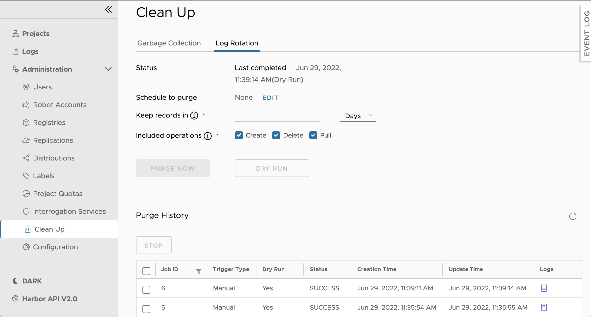
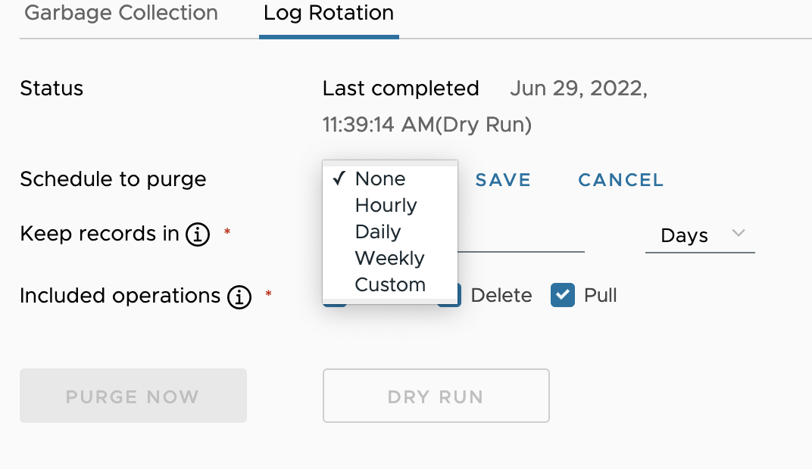
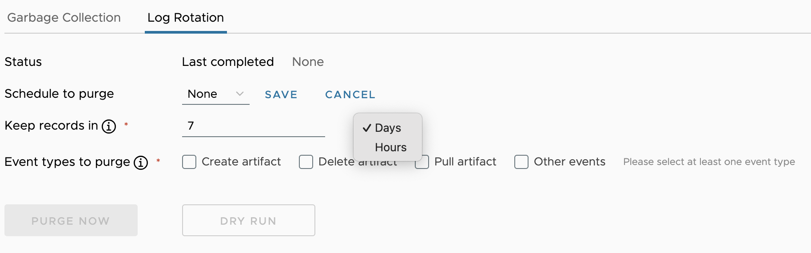
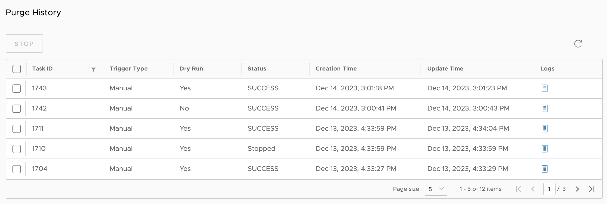
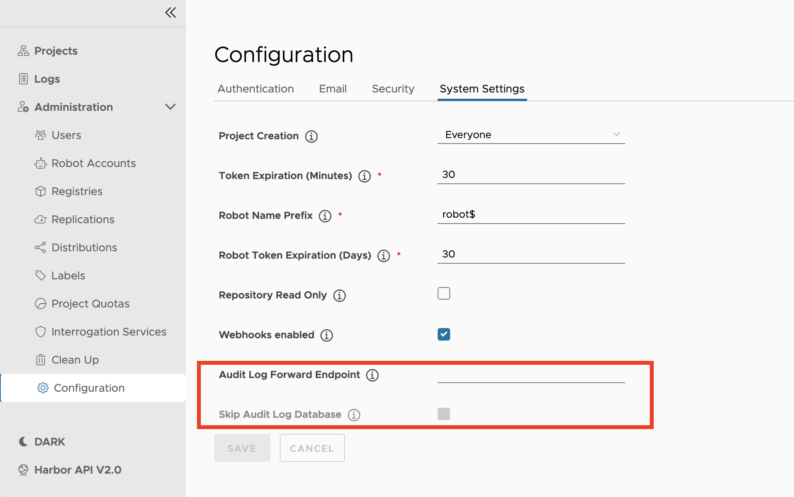
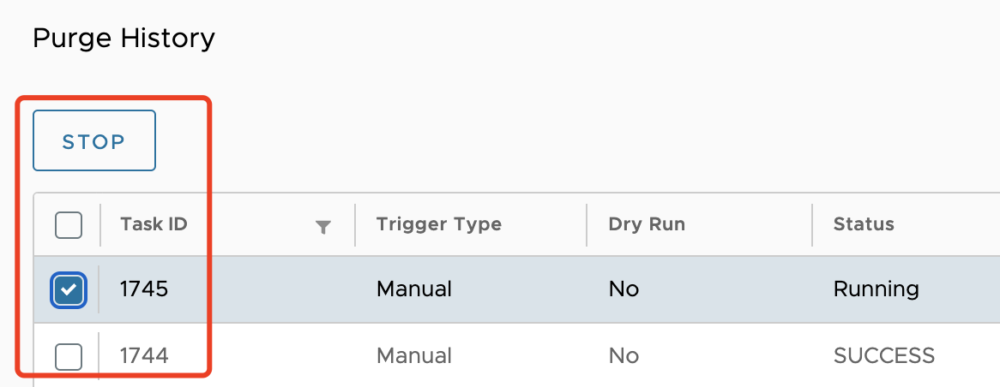

Harbor offre la possibilità di gestire i log di controllo configurando una finestra di conservazione dei log di controllo e impostando un endpoint syslog per inoltrare i log di controllo.

## Pianifica l'eliminazione del registro

1. Accedere all'interfaccia Harbor con un account che disponga dei privilegi di amministratore di sistema Harbor.
1. Espandi **Amministrazione** e seleziona **Pulizia**.
1. Seleziona la scheda **Rotazione log**.

    

1. Utilizzare il menu a discesa per selezionare la frequenza con cui eseguire la rotazione dei registri.

    

    * **Nessuno**: non è pianificata alcuna rotazione del registro.
    * **Ogni ora**: esegue la rotazione del registro all'inizio di ogni ora.
    * **Giornaliero**: esegue la rotazione del registro ogni giorno a mezzanotte.
    * **Settimanale**: esegue la rotazione del registro a mezzanotte ogni sabato.
    * **Personalizzato**: esegue la rotazione del registro in base a un'attività `cron`.
1. Utilizzare **Conserva i record in** per configurare la durata della conservazione dei registri di controllo. Utilizza il menu a discesa per selezionare **Ore** o **Giorni**. Ad esempio, se lo imposti su 7 giorni, Harbor eliminerà solo i log di controllo risalenti a 8 o più giorni.

    

1. Selezionare i **Tipi di eventi da eliminare** per l'eliminazione. Quando è selezionato **Crea artefatto**, **Elimina artefatto** o **Pull artefatto**, Harbor includerà i log di controllo per tali tipi di eventi nell'eliminazione.
1. Fare clic su **Salva** per salvare la pianificazione della rotazione dei registri.

Utilizza l'opzione **DRY RUN** per testare le impostazioni di eliminazione. Quando si esegue un'esecuzione di prova, Harbor creerà un registro con la quantità stimata di registri di controllo che verranno eliminati. È possibile visualizzare i registri di un'esecuzione di prova nella tabella **Cronologia eliminazioni**.

Utilizza l'opzione **ELIMINA ORA** per eseguire manualmente un'eliminazione immediata, senza attendere l'eliminazione successiva pianificata.

## Visualizza la cronologia della rotazione dei registri
Visualizza le esecuzioni di eliminazione nella tabella **Cronologia eliminazioni**. Harbor tiene traccia delle informazioni su ciascuna esecuzione di spurgo, tra cui:

* **ID attività:** Valore numerico univoco assegnato da Harbor quando viene avviata un'esecuzione.
* **Tipo di attivazione:** modalità di avvio della corsa, manuale o pianificata.
* **Prova a secco:** Se la corsa è stata una prova a secco oppure no.
* **Stato:** Stato attuale della corsa.
* **Ora di creazione:** Ora di inizio della corsa.
* **Ora di aggiornamento:** L'ultima volta che la corsa è stata aggiornata.
* **Log:** un collegamento ai log generati dalla corsa. Se stai eseguendo un'esecuzione di prova, questa includerà una stima degli artefatti che verranno eliminati.

## Configura l'endpoint di inoltro del registro di controllo

1. Accedere all'interfaccia Harbor con un account che disponga dei privilegi di amministratore di sistema Harbor.
1. Vai su **Configurazione** e seleziona **Impostazioni di sistema**.
1. Nella riga **Audit Log Forward Syslog Endpoint**, aggiungi il tuo endpoint syslog. Se hai installato Harbor con docker-compose, l'endpoint syslog locale è `harbor-log:10514`.
1. Se hai configurato un endpoint per inoltrare i log di controllo, puoi selezionare la casella di controllo **Ignora database dei log di controllo**. Se selezionato, Harbor non conserverà alcun record di registri di controllo nel suo database, ma inoltrerà immediatamente tutti i registri all'endpoint configurato.

Harbor inoltrerà tutti i record eliminati all'endpoint syslog del log di controllo specificato.

## Interruzione della rotazione del registro in corso

È possibile interrompere qualsiasi attività di eliminazione del registro in esecuzione dalla tabella Cronologia eliminazione.

1. Passare alla pagina **Amministrazione** > **Pulizia** e selezionare la scheda **Rotazione registri**.
1. Nella tabella **Cronologia eliminazioni**, fare clic sulla casella di controllo accanto all'ID attività dell'attività di eliminazione del registro in esecuzione. È possibile interrompere contemporaneamente una o più attività di eliminazione dei log in esecuzione.
1. Fai clic su **Interrompi** e poi su **Conferma** che desideri interrompere la raccolta dei rifiuti nella modalità modale.

    

Ciò impedirà solo all'attività di eliminazione dei log di elaborare più log. Harbor non ripristinerà alcun registro che sia già stato eliminato.
