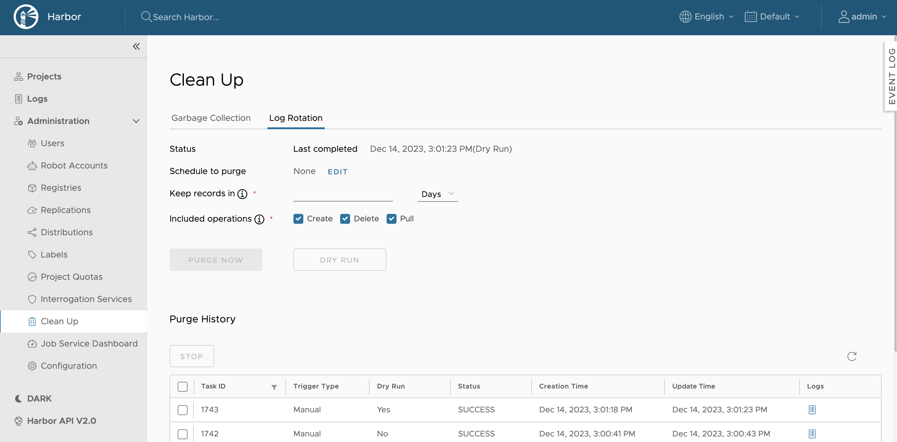
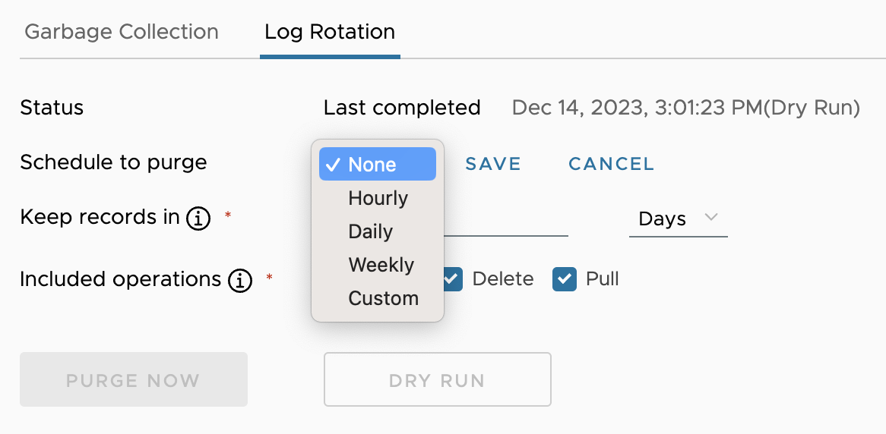
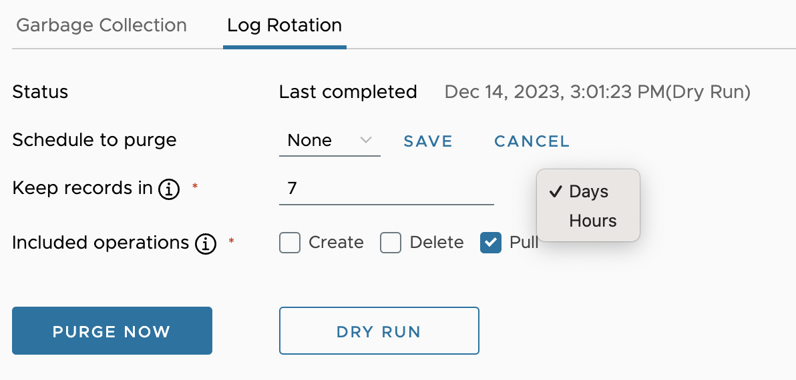
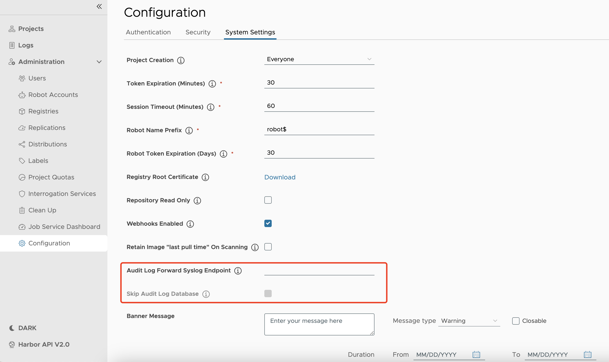

By default, Harbor tracks all image pull, push, and delete operations performed and keeps a record of these actions in a database. Harbor offers the ability to manage audit logs by configuring an audit log retention window and setting a syslog endpoint to forward audit logs.

## Schedule Log Purge

1. Log in to the Harbor interface with an account that has Harbor system administrator privileges.
1. Expand **Administration**, and select **Clean Up**.
1. Select the **Log Rotation** tab.

    

1. Use the drop down-menu to select how often to run log rotation.

    

    * **None**: No log rotation is scheduled.
    * **Hourly**: Run log rotation at the beginning of every hour.
    * **Daily**: Run log rotation at midnight every day.
    * **Weekly**: Run log rotation at midnight every Saturday.
    * **Custom**: Run log rotation according to a `cron` task.
1. Use the **Keep records in** to configure how long audit logs should be kept. Use the drop down-menu to select **Hours** or **Days**. For example, if you set this to 7 days, Harbor will only purge audit logs that are 8 or more days old.

    

1. Select the **Included Operations** for the purge. When **Create**, **Delete**, or **Pull** is selected, Harbor will include audit logs for those operations in the purge.
1. Click **Save** to save your log rotation schedule.

Use the **DRY RUN** option to test your purge settings. When you perform a dry run, Harbor will create a log with the estimated amount of audit logs that will be purged. You can view a dry run logs in the **Purge History** table.

Use the **PURGE NOW** option to manually run a purge immediately, without waiting for the next scheduled purge.

## View Log Rotation History
View the purge runs in the **Purge History** table. Harbor tracks information about each purge run, including:

* **Task ID:** Unique numerical value assigned by Harbor when a run is initiated.
* **Trigger Type:** How the run was initiated, either Manual or by Schedule.
* **Dry Run:** If the run was a dry run or not.
* **Status:** Current status of the run.
* **Creation Time:** Time the run started.
* **Update time:** The last time the run was updated.
* **Logs:** A link to the logs generated by the run. If you are performing a Dry Run, this will include an estimate of the artifacts that will be purged.

## Configure Audit Log Forward Endpoint

1. Log in to the Harbor interface with an account that has Harbor system administrator privileges.
1. Go to **Configuration** and select **System Settings**.
1. In the **Audit Log Forward Syslog Endpoint** row, add your syslog endpoint. If you installed Harbor with docker-compose, the local syslog endpoint is `harbor-log:10514`.
1. If you have configured an endpoint to forward audit logs, you can select the checkbox to **Skip Audit Log Database**. When selected, Harbor will not keep any records of audit logs in its database, but will forward all logs to your configured endpoint immediately.

Harbor will forward all purged records to the audit log forward syslog endpoint you specify.

## Stop in Progress Log Rotation

You are able to stop any running log purge task from the Purge History table.

1. Navigate to **Administration** > **Clean Up** page and select the **Log Rotation** tab.
1. In the **Purge History** table, click on the checkbox next to the Task Id of the running log purge task. You can stop one or more running log purge tasks at one time.
1. Click **Stop** and then **Confirm** that you want to stop the garbage collection in the modal.

    

This will only stop the log purge task from processing more logs. Harbor will not restore any logs that has already been purged.
