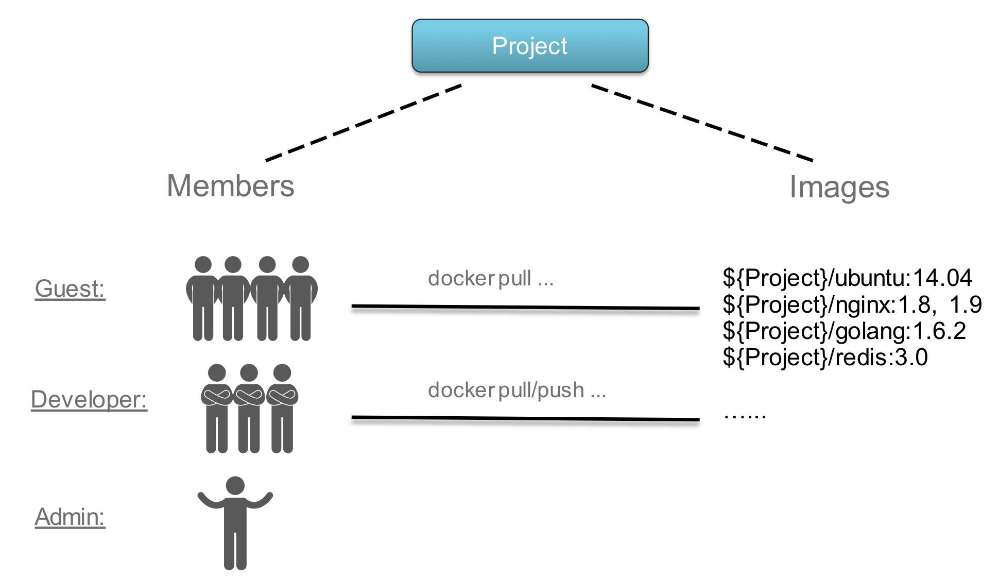
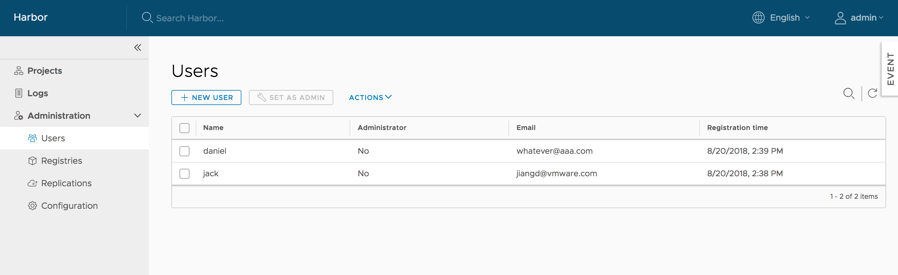

Harbor gestisce le immagini attraverso progetti. Fornisci l'accesso a queste immagini agli utenti includendo gli utenti nei progetti e assegnando loro uno dei seguenti ruoli.

* **Ospite limitato**: un ospite limitato non dispone dei privilegi di lettura completi per un progetto. Possono estrarre immagini ma non possono inviarle e non possono vedere i registri o gli altri membri di un progetto. Ad esempio, puoi creare ospiti limitati per utenti di diverse organizzazioni che condividono l'accesso a un progetto.
* **Ospite**: l'ospite ha privilegi di sola lettura per un progetto specifico. Possono estrarre e ricodificare le immagini, ma non possono spingere.
* **Sviluppatore**: lo sviluppatore dispone dei privilegi di lettura e scrittura per un progetto.
* **Manutentore**: il manutentore dispone di autorizzazioni elevate oltre a quelle dello "Sviluppatore", inclusa la possibilità di scansionare immagini, visualizzare lavori di replica ed eliminare immagini e grafici helm.
* **ProjectAdmin**: quando crei un nuovo progetto, ti verrà assegnato il ruolo "ProjectAdmin" al progetto. Oltre ai privilegi di lettura e scrittura, il "ProjectAdmin" ha anche alcuni privilegi di gestione, come aggiungere e rimuovere membri, avviare una scansione di vulnerabilità.

Oltre ai ruoli di cui sopra, esistono due ruoli a livello di sistema:

* **Amministratore di sistema Harbor**: "Amministratore di sistema Harbor" ha il maggior numero di privilegi. Oltre ai privilegi sopra menzionati, "l'amministratore di sistema Harbor" può anche elencare tutti i progetti, impostare un utente normale come amministratore, eliminare utenti e impostare criteri di scansione delle vulnerabilità per tutte le immagini. Anche la "biblioteca" del progetto pubblico è di proprietà dell'amministratore.
* **Anonimo**: quando un utente non ha effettuato l'accesso, viene considerato un utente "Anonimo". Un utente anonimo non ha accesso ai progetti privati ​​e ha accesso di sola lettura ai progetti pubblici.

Per i dettagli completi sulle autorizzazioni dei diversi ruoli, vedere [Autorizzazioni utente per ruolo](user-permissions-by-role.md).

Se esegui Harbor in modalità di autenticazione del database, crei account utente direttamente nell'interfaccia Harbor. Per informazioni su come creare account utente locali, vedere [Crea account utente in modalità database](create-users-db.md).

Se esegui Harbor in modalità di autenticazione LDAP/AD o OIDC, crei e gestisci gli account utente nel tuo provider LDAP/AD o OIDC. Harbor ottiene gli utenti dal server LDAP/AD o OIDC e li visualizza nella scheda **Utenti** dell'interfaccia Harbor.

## Assegnazione del ruolo di amministratore di sistema Harbor

Gli amministratori di sistema Harbor possono assegnare il ruolo di amministratore di sistema Harbor ad altri utenti selezionando i nomi utente e facendo clic su **Imposta come amministratore** nella scheda **Utenti**.

Per eliminare utenti, selezionare un utente e fare clic su `DELETE`. Quando si elimina l'utente, i suoi privilegi verranno rimossi. per la modalità di autenticazione LDAP/AD o OIDC, elimina semplicemente i dati utente in Harbor, non in LDAP/AD o OIDC.
