Harbor incorpora il concetto di account robot a livello di sistema. Un amministratore può creare uno robot account a livello di sistema che copra più progetti.
Gli account robot di sistema vengono utilizzati per creare credenziali senza ambito utente per eseguire operazioni e chiamate API su più progetti.

Ogni sistema robot account può avere più autorizzazioni di sistema e più autorizzazioni a livello di progetto su più progetti.

[**Riferimenti permessi**](#permission-references) contiene un elenco di permessi e le relative operazioni.
Queste autorizzazioni possono essere combinate e assegnate a un sistema robot account, consentendogli di eseguire le attività desiderate tramite un client OCI o Harbor API. Gli account robot non possono essere utilizzati per accedere all'interfaccia utente.

Puoi anche creare account robot con ambito di progetto con accesso limitato a un singolo progetto. Ulteriori informazioni su [account robot di progetto](../../working-with-projects/project-configuration/create-robot-accounts/).

## Visualizza gli account del robot di sistema

1. Accedi alla tua istanza Harbor come amministratore.
1. Nella barra laterale seleziona **Account robot** nella **sezione Amministrazione**.

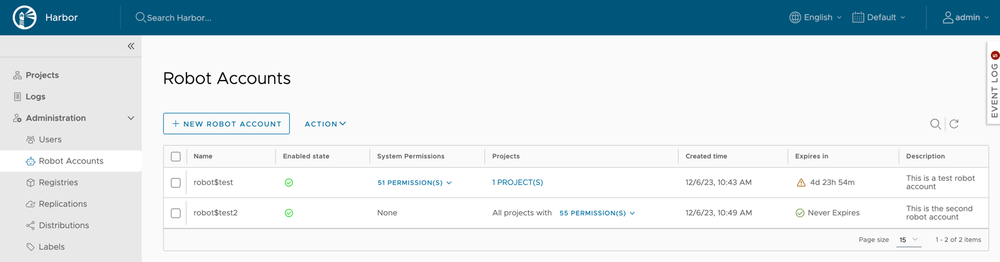

Questa pagina contiene gli elenchi di tutti gli account robot di sistema esistenti nella tua istanza Harbor. La tabella contiene le seguenti informazioni per ciascun sistema robot account:

* Il nome di un account di sistema. Deriva dal prefisso robot account configurato per l'istanza Harbor e dal nome assegnato all'account al momento della creazione. Un nome robot account segue il formato `<prefix><account_name>`. Se utilizzi la funzione di ricerca in questa pagina, devi solo cercare il nome dell'account senza prefisso.
* Lo stato abilitato indica se un account è attivo o disattivato.
* Il conteggio delle autorizzazioni di sistema a cui è assegnato un account. Per visualizzare una serie completa delle autorizzazioni di sistema assegnate, fare clic sul collegamento **PERMISSIONI**.

    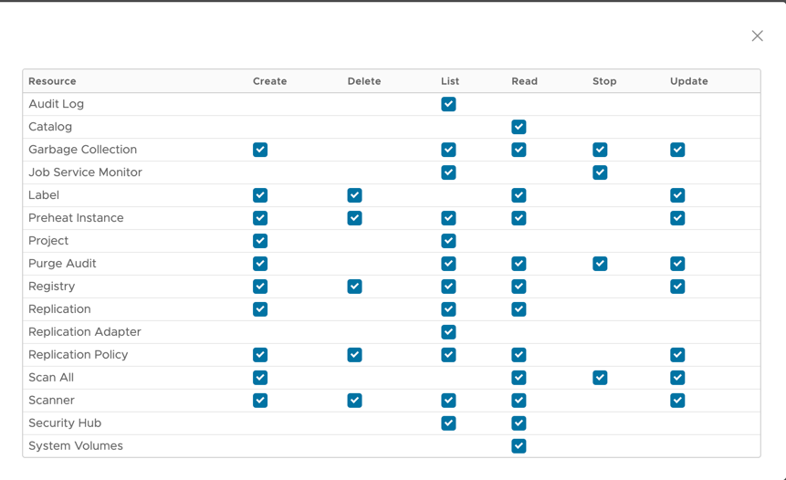
*Il numero di progetti a cui è associato un account. Fai clic sul collegamento **PROGETTO(I)** per visualizzare un elenco completo dei progetti associati a un account.

    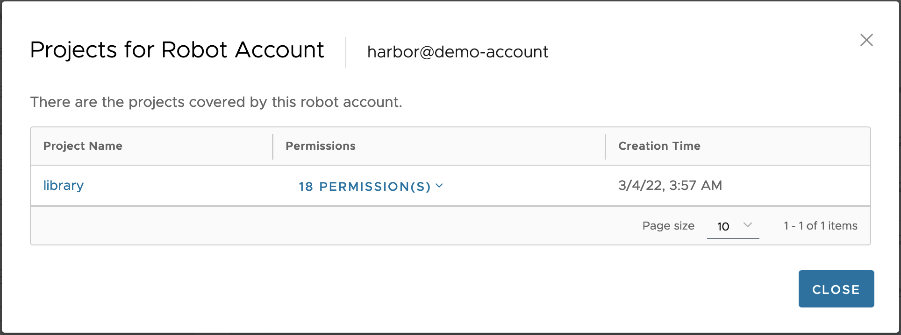

* L'ora creata mostra quando è stato creato robot account.
* Il tempo di scadenza dell'account. Calcolato in base al tempo creato e al tempo di scadenza impostato durante la creazione di robot account.
* La descrizione aggiunta manualmente per il sistema robot account.


## Aggiungi un account Robot di sistema

1. Accedere all'interfaccia Harbor, con privilegi di amministratore di sistema.
1. Vai su **Amministrazione**, seleziona un progetto e seleziona **Account robot**.
1. Fare clic su **Nuovo account robot**.

    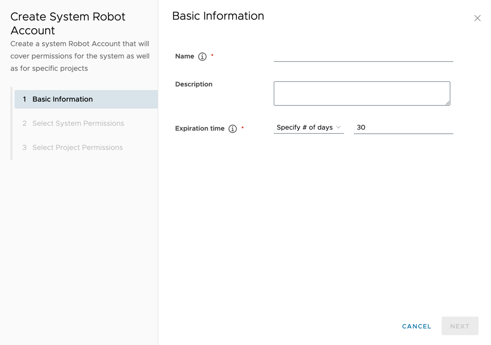

1. Immettere un nome e una descrizione opzionale per questo robot account.
1. Impostare l'ora di scadenza per questo robot account. Per impostazione predefinita viene utilizzata la scadenza configurata dal sistema. Puoi anche selezionare **Never Expired** dal menu a discesa se desideri creare un robot account senza scadenza.
1. Selezionare le autorizzazioni di sistema per questo robot account.
1. Selezionare **Copri tutti i progetti** se si desidera utilizzare questo sistema robot account in tutti i progetti. L'utilizzo di questa opzione significa che questo sistema robot account sarà in grado di accedere a tutti i progetti esistenti e futuri nella tua istanza Harbor. È possibile selezionare quale autorizzazione concedere a robot account.   
    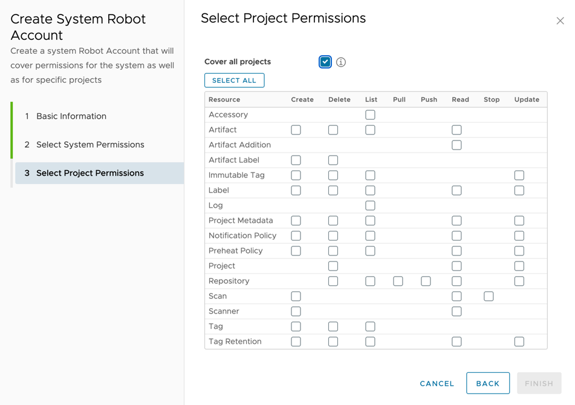
1. Se si desidera che questo robot account copra solo determinati progetti o riceva determinate autorizzazioni, utilizzare la tabella dei progetti per selezionare i progetti e le autorizzazioni che si desidera assegnare al sistema robot account. Questa tabella mostra il nome di ciascun progetto, l'ora di creazione del progetto e un elenco a discesa delle autorizzazioni per assegnare il sistema robot account per quel progetto.

    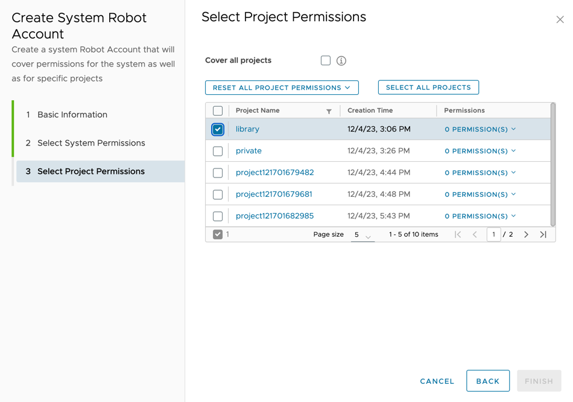

    Fare clic sulla casella di controllo accanto al nome del progetto per associare questo robot account.

    Per impostazione predefinita, la tabella mostra tutti i progetti nell'istanza Harbor. Puoi filtrare i progetti utilizzando l'**icona del filtro** a destra dell'intestazione Nome progetto. Tieni presente che la tabella dei progetti potrebbe essere suddivisa in pagine e visualizzare solo un sottoinsieme di progetti alla volta a seconda di quanti progetti hai nella tua istanza Harbor e quanti progetti corrispondono ai tuoi criteri di filtro.

      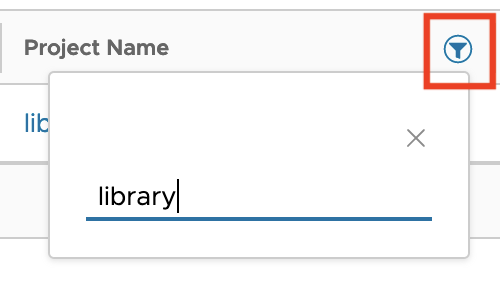

    Utilizza il menu a discesa **Autorizzazioni** per scegliere quali autorizzazioni assegnare a un particolare progetto. È possibile controllare quali autorizzazioni assegnare a un singolo robot account per progetto, consentendo un controllo capillare su ciascun robot account. È possibile selezionare **Seleziona tutto** o **Deseleziona tutto** per aggiungere o rimuovere rapidamente tutte le autorizzazioni da un robot account.

      The **Push Repository** permission must be assigned with the **Pull Repository** permission. You are not able to assign the Push Repository permission by itself.
      


    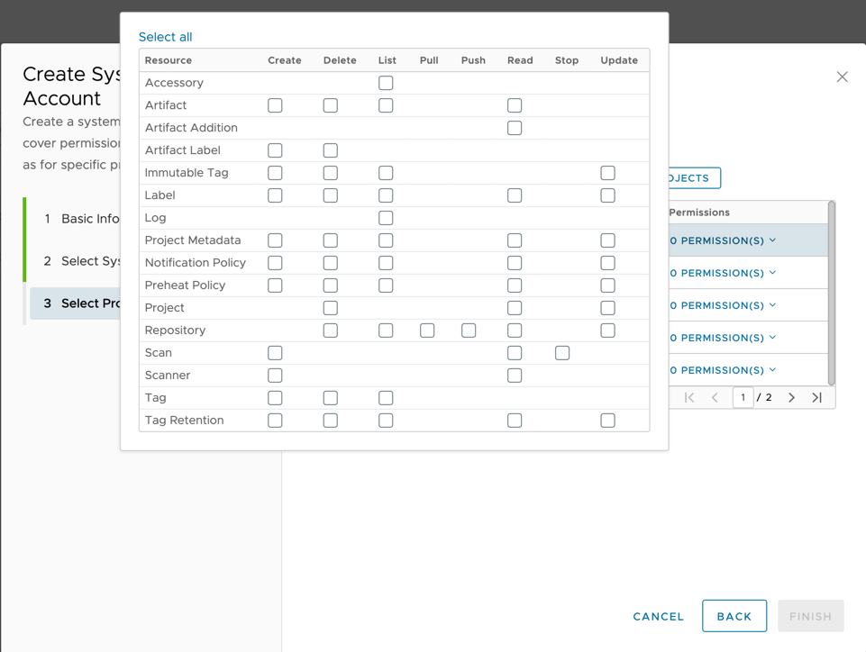

    Fai clic sul menu a discesa **Reimposta tutte le autorizzazioni del progetto** per controllare quali autorizzazioni sono disponibili per ciascun progetto. Selezionare o deselezionare un'autorizzazione aggiungerà o rimuoverà l'autorizzazione per ogni progetto. L'utilizzo di questa opzione modificherà le autorizzazioni per tutti i progetti, non solo per i progetti mostrati se hai filtrato per un nome di progetto specifico.

    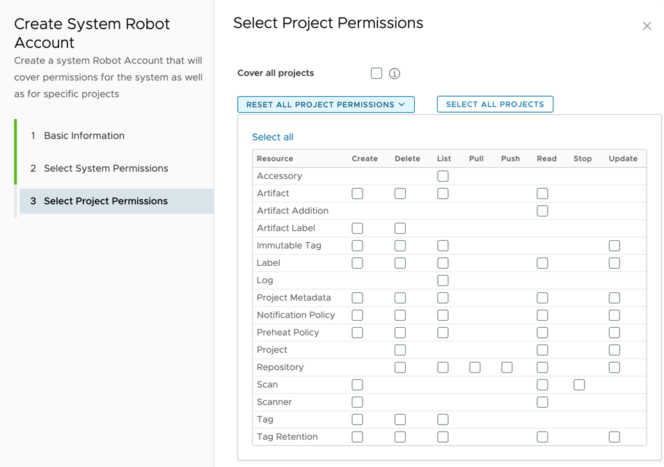

    Fare clic su **Seleziona tutti i progetti** per associare il sistema robot account a tutti i progetti riportati in tabella. Se stai filtrando per nome del progetto, questa opzione selezionerà solo i progetti filtrati.


1. Fare clic su **FINE**.

1. Nella finestra di conferma, fare clic su **Esporta su file** per scaricare il segreto come file JSON oppure fare clic sull'icona degli appunti per copiarne il contenuto negli appunti.

   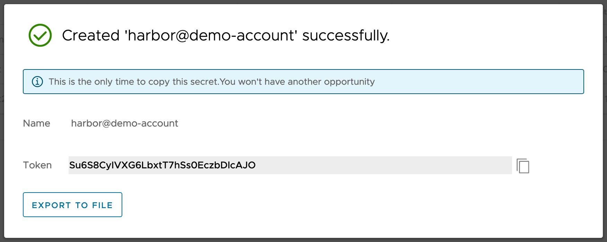

   
   Harbor non memorizza i segreti robot account, quindi è necessario scaricare il segreto oppure copiarne e incollarne il contenuto in un file di testo. Non c'è modo di ottenere il segreto da Harbor dopo aver creato robot account.
   

   Il nuovo robot account appare come `<prefix>account_name` nell'elenco degli account robot. Ulteriori informazioni su [Prefissi robot account](#configure-robot-account-prefix).

## Account robot del sistema di amministrazione

È possibile modificare, disattivare o eliminare un sistema robot account.

1. Dalla pagina dell'amministratore **Account robot**, seleziona la casella di controllo accanto allo robot account che stai aggiornando.
1. Seleziona **Azione**, quindi **Modifica**, **Disattiva** o **Elimina**.

  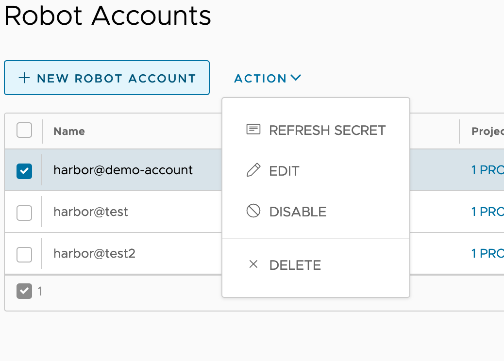

## Aggiorna il segreto dell'account del robot di sistema

È possibile aggiornare il segreto di un robot account dopo averlo creato nel caso in cui ne sia necessario uno nuovo.

1. Dalla pagina dell'amministratore **Account robot**, seleziona la casella di controllo accanto allo robot account che stai aggiornando.
1. Seleziona **Azione** e poi **Aggiorna segreto**.
1. Per impostazione predefinita, Harbor genererà un nuovo segreto in modo casuale oppure è possibile scegliere di abilitare la reimpostazione manuale del segreto e l'immissione di **Nuovo segreto**, quindi **Conferma segreto**. Facoltativamente, è possibile visualizzare il segreto facendo clic sull'icona a forma di occhio.

    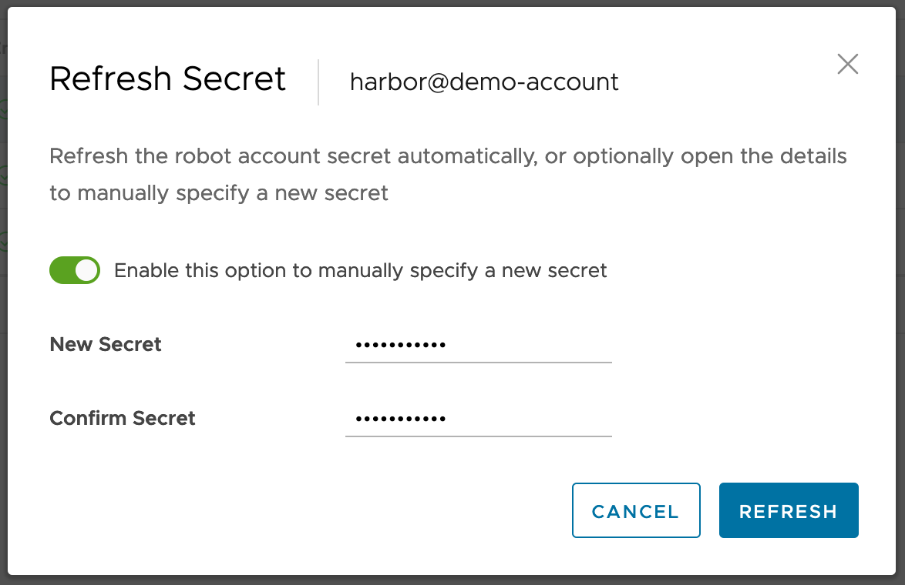

1. Fare clic su **Aggiorna**. Se hai creato un segreto in modo casuale, scarica il file segreto JSON o copia e incolla il suo contenuto.

## Configura il periodo di scadenza degli account robot

Per impostazione predefinita, gli account robot scadono dopo 30 giorni. Puoi impostare una durata più lunga o più breve per gli account robot modificando il periodo di scadenza per i token robot account. Il periodo di scadenza si applica a tutti gli account robot in tutti i progetti.

1. Accedere all'interfaccia Harbor con un account che disponga dei privilegi di amministratore di sistema Harbor.
1. Vai su **Configurazione** e seleziona **Impostazioni di sistema**.
1. Nella riga **Scadenza token robot (giorni)**, modificare il numero di giorni dopo i quali scadono i token robot account.

    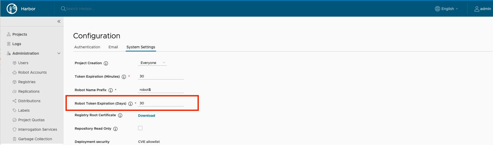

## Configura il prefisso dell'account robot

Per impostazione predefinita, i nomi robot account utilizzano il prefisso `robot$`. Harbor utilizza questo prefisso per distinguere uno robot account da un account utente. Il nome completo di un sistema robot account è il prefisso e il nome fornito durante la creazione di robot account. Ad esempio, se crei un nuovo account del sistema robotico con il nome `test`, il nome completo sarà `robot$test`.

Lo stesso prefisso viene utilizzato per tutti gli account robot, inclusi gli account robot di sistema e di progetto. Quando aggiorni questo valore, verrà applicato a tutti gli account robot di sistema e di progetto esistenti e futuri, ad eccezione degli account robot creati in Harbor v2.1 e versioni precedenti che continueranno a utilizzare il prefisso `robot$`.

1. Accedere all'interfaccia Harbor con un account che disponga dei privilegi di amministratore di sistema Harbor.
1. Vai su **Configurazione** e seleziona **Impostazioni di sistema**.
1. Nella riga **Prefisso nome robot**, modificare il prefisso.

    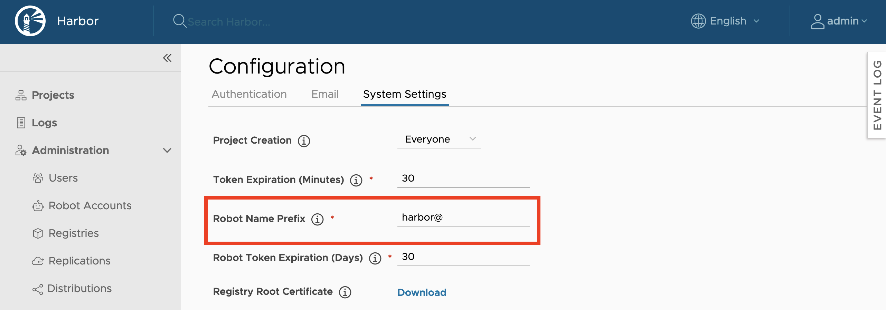

## Autenticazione con un account del robot di sistema

Per utilizzare un robot account in un processo automatizzato, ad esempio uno script, utilizzare `docker login` e fornire le credenziali di robot account.

```
docker login <harbor_address>
Username: <prefix><account_name>
Password: <secret>
```


## Riferimenti di autorizzazione <a name="permission-references"></a>

Le tabelle seguenti spiegano cosa può fare un robot account con un permesso specificato.

#### Autorizzazioni di sistema

| Autorizzazione (un'azione + una risorsa) | Abilità |
|:-----------------------------------------------|:---------------------------------------------------------------------------------------------------------------------------------------------------------------------------------------------------------------------------------------------------------------------------------------------------------------------------------------------------------------------------------------------------------------------------------------------------------------------------------------------------------------------------------------------------------------------------------------------------------------|
| Elenco registro di controllo (registro di controllo) | 1. OTTIENI [/log-di-controllo](https://github.com/goharbor/harbor/blob/323e11fefba181fd982b9773dacefa44b2ef0ca0/api/v2.0/swagger.yaml#L1611) |
| Leggi il catalogo (catalogo) | 1. OTTIENI /v2/_catalog |
| Leggi Garbage Collection (raccolta dei rifiuti) | 1. OTTIENI [/system/gc/{gc_id}/log](https://github.com/goharbor/harbor/blob/323e11fefba181fd982b9773dacefa44b2ef0ca0/api/v2.0/swagger.yaml#L4216)<br/>2. OTTIENI [/system/gc/schedule](https://github.com/goharbor/harbor/blob/323e11fefba181fd982b9773dacefa44b2ef0ca0/api/v2.0/swagger.yaml#L4244) |
| Elenco Garbage Collection (garbage-collection) | 1. OTTIENI [/sistema/gc](https://github.com/goharbor/harbor/blob/323e11fefba181fd982b9773dacefa44b2ef0ca0/api/v2.0/swagger.yaml#L4141) |
| Crea Garbage Collection (garbage collection) | 1. POST [/system/gc/schedule](https://github.com/goharbor/harbor/blob/323e11fefba181fd982b9773dacefa44b2ef0ca0/api/v2.0/swagger.yaml#L4263) |
| Stop Garbage Collection (raccolta dei rifiuti) | 1. METTI [/system/gc/{gc_id}](https://github.com/goharbor/harbor/blob/323e11fefba181fd982b9773dacefa44b2ef0ca0/api/v2.0/swagger.yaml#L4196) |
| Aggiorna Garbage Collection (garbage-collection) | 1. METTI [/system/gc/schedule](https://github.com/goharbor/harbor/blob/323e11fefba181fd982b9773dacefa44b2ef0ca0/api/v2.0/swagger.yaml#L4291) |
| Elenco Job Service Monitor (jobservice-monitor) | 1. OTTIENI [/jobservice/pool](https://github.com/goharbor/harbor/blob/323e11fefba181fd982b9773dacefa44b2ef0ca0/api/v2.0/swagger.yaml#L4641)<br/>2. OTTIENI [/jobservice/pools/{pool_id}/workers](https://github.com/goharbor/harbor/blob/323e11fefba181fd982b9773dacefa44b2ef0ca0/api/v2.0/swagger.yaml#L466)<br/>3. OTTIENI [/jobservice/jobs/{job_id}/log](https://github.com/goharbor/harbor/blob/323e11fefba181fd982b9773dacefa44b2ef0ca0/api/v2.0/swagger.yaml#L4717) <br/>4. OTTIENI [/jobservice/queue](https://github.com/goharbor/harbor/blob/323e11fefba181fd982b9773dacefa44b2ef0ca0/api/v2.0/swagger.yaml#L4750) |
| Arresta Job Service Monitor (jobservice-monitor) | 1. METTERE [/jobservice/lavori/{job_id}](https://github.com/goharbor/harbor/blob/323e11fefba181fd982b9773dacefa44b2ef0ca0/api/v2.0/swagger.yaml#L4692) <br/>2. METTI [/jobservice/queues/{job_type}](https://github.com/goharbor/harbor/blob/323e11fefba181fd982b9773dacefa44b2ef0ca0/api/v2.0/swagger.yaml#L4774) |
| Leggi Etichetta (etichetta) | 1. OTTIENI [/labels/{global_label_id}](https://github.com/goharbor/harbor/blob/323e11fefba181fd982b9773dacefa44b2ef0ca0/api/v2.0/swagger.yaml#L5869) |
| Crea etichetta (etichetta) | 1. POST [/etichette?ambito=g](https://github.com/goharbor/harbor/blob/323e11fefba181fd982b9773dacefa44b2ef0ca0/api/v2.0/swagger.yaml#L5836) |
| Aggiorna etichetta (etichetta) | 1. METTI [/labels/{global_label_id}](https://github.com/goharbor/harbor/blob/323e11fefba181fd982b9773dacefa44b2ef0ca0/api/v2.0/swagger.yaml#L5890) |
| Elimina etichetta (etichetta) | 1. ELIMINA [/labels/{global_label_id}](https://github.com/goharbor/harbor/blob/323e11fefba181fd982b9773dacefa44b2ef0ca0/api/v2.0/swagger.yaml#L5919) |
| Leggi Istanza di preriscaldamento (istanza di preriscaldamento) | 1. PUBBLICARE [/preriscaldamento/istanze/ping](https://github.com/goharbor/harbor/blob/323e11fefba181fd982b9773dacefa44b2ef0ca0/api/v2.0/swagger.yaml#L1706)<br/>2. OTTIENI [/p2p/preriscaldamento/istanze/{nome_istanza_preriscaldamento}](https://github.com/goharbor/harbor/blob/323e11fefba181fd982b9773dacefa44b2ef0ca0/api/v2.0/swagger.yaml#L1799) |
| Elenco istanza di preriscaldamento (istanza di preriscaldamento) | 1. OTTIENI [/p2p/preriscalda/provider](https://github.com/goharbor/harbor/blob/323e11fefba181fd982b9773dacefa44b2ef0ca0/api/v2.0/swagger.yaml#L1680) <br/>2. OTTIENI [/p2p/preriscalda/instances](https://github.com/goharbor/harbor/blob/323e11fefba181fd982b9773dacefa44b2ef0ca0/api/v2.0/swagger.yaml#L1733) |
| Crea istanza di preriscaldamento (istanza di preriscaldamento) | 1. POST [/p2p/preriscalda/instances](https://github.com/goharbor/harbor/blob/323e11fefba181fd982b9773dacefa44b2ef0ca0/api/v2.0/swagger.yaml#L1769) |
| Aggiorna istanza di preriscaldamento (istanza di preriscaldamento) | 1. METTI [/p2p/preriscaldamento/istanze/{nome_istanza_preriscaldamento}](https://github.com/goharbor/harbor/blob/323e11fefba181fd982b9773dacefa44b2ef0ca0/api/v2.0/swagger.yaml#L1843) |
| Elimina istanza di preriscaldamento (istanza di preriscaldamento) | 1. ELIMINA [/p2p/preriscaldamento/istanze/{nome_istanza_preriscaldamento}](https://github.com/goharbor/harbor/blob/323e11fefba181fd982b9773dacefa44b2ef0ca0/api/v2.0/swagger.yaml#L1823) |
| Elenco progetto (progetto) | 1. OTTIENI [/progetti](https://github.com/goharbor/harbor/blob/323e11fefba181fd982b9773dacefa44b2ef0ca0/api/v2.0/swagger.yaml#L272) |
| Crea progetto (progetto) | 1. POST [/progetti](https://github.com/goharbor/harbor/blob/323e11fefba181fd982b9773dacefa44b2ef0ca0/api/v2.0/swagger.yaml#L343) |
| Leggi Purge Audit (purge-audit) | 1. OTTIENI [/system/purgeaudit/{purge_id}/log](https://github.com/goharbor/harbor/blob/323e11fefba181fd982b9773dacefa44b2ef0ca0/api/v2.0/swagger.yaml#L4394)<br/>2. OTTIENI [/system/purgeaudit/schedule](https://github.com/goharbor/harbor/blob/323e11fefba181fd982b9773dacefa44b2ef0ca0/api/v2.0/swagger.yaml#L4421)<br/>3. OTTIENI [/system/purgeaudit/{purge_id}](https://github.com/goharbor/harbor/blob/323e11fefba181fd982b9773dacefa44b2ef0ca0/api/v2.0/swagger.yaml#L4351) |
| Elenco Purge Audit (purge-audit) | 1. OTTIENI [/system/purgeaudit](https://github.com/goharbor/harbor/blob/323e11fefba181fd982b9773dacefa44b2ef0ca0/api/v2.0/swagger.yaml#L4318) |
| Crea controllo di eliminazione (controllo di eliminazione) | 1. POST [/system/purgeaudit/schedule](https://github.com/goharbor/harbor/blob/323e11fefba181fd982b9773dacefa44b2ef0ca0/api/v2.0/swagger.yaml#L4440) |
| Arresta controllo eliminazione (controllo eliminazione) | 1. METTI [/system/purgeaudit/{purge_id}](https://github.com/goharbor/harbor/blob/323e11fefba181fd982b9773dacefa44b2ef0ca0/api/v2.0/swagger.yaml#L4373) |
| Aggiorna controllo eliminazione (controllo eliminazione) | 1. METTI [sistema/verifica/programmazione di eliminazione](https://github.com/goharbor/harbor/blob/323e11fefba181fd982b9773dacefa44b2ef0ca0/api/v2.0/swagger.yaml#L4470) |
| Leggi registro (registry) | 1. PUBBLICA [/registri/ping](https://github.com/goharbor/harbor/blob/f99a619bc676ba614048c5a84cf0598adc79519f/api/v2.0/swagger.yaml#L3855)<br/> 2. OTTIENI [/registri/{id}](https://github.com/goharbor/harbor/blob/f99a619bc676ba614048c5a84cf0598adc79519f/api/v2.0/swagger.yaml#L3883) <br/>3. OTTIENI [/registries/{id}/info](https://github.com/goharbor/harbor/blob/f99a619bc676ba614048c5a84cf0598adc79519f/api/v2.0/swagger.yaml#L3971) |
| Elenco registro (registry) | 1. OTTIENI [/registri](https://github.com/goharbor/harbor/blob/f99a619bc676ba614048c5a84cf0598adc79519f/api/v2.0/swagger.yaml#L3817) |
| Crea registro (registry) | 1. POST [/registri](https://github.com/goharbor/harbor/blob/f99a619bc676ba614048c5a84cf0598adc79519f/api/v2.0/swagger.yaml#L3790) |
| Aggiorna registro (registry) | 1. METTI [/registri/{id}](https://github.com/goharbor/harbor/blob/f99a619bc676ba614048c5a84cf0598adc79519f/api/v2.0/swagger.yaml#L3937) |
| Elimina registro (registry) | 1. ELIMINA [/registri/{id}](https://github.com/goharbor/harbor/blob/f99a619bc676ba614048c5a84cf0598adc79519f/api/v2.0/swagger.yaml#L3910) |
| Leggi Replica (replica) | 1. OTTIENI [/replica/esecuzioni/{id}](https://github.com/goharbor/harbor/blob/f99a619bc676ba614048c5a84cf0598adc79519f/api/v2.0/swagger.yaml#L3605) <br/> 2. OTTIENI [/replication/executions/{id}/tasks/{task_id}/log](https://github.com/goharbor/harbor/blob/f99a619bc676ba614048c5a84cf0598adc79519f/api/v2.0/swagger.yaml#L3706) |
| Replica elenco (replica) | 1. OTTIENI [/replica/esecuzioni](https://github.com/goharbor/harbor/blob/f99a619bc676ba614048c5a84cf0598adc79519f/api/v2.0/swagger.yaml#L3533) <br/>2. OTTIENI [/replication/executions/{id}/tasks](https://github.com/goharbor/harbor/blob/f99a619bc676ba614048c5a84cf0598adc79519f/api/v2.0/swagger.yaml#L3658) |
| Crea replica (replica) | 1. PUBBLICARE [/replica/esecuzioni](https://github.com/goharbor/harbor/blob/f99a619bc676ba614048c5a84cf0598adc79519f/api/v2.0/swagger.yaml#L3579)<br/>2. METTI [/replica/esecuzioni/{id}](https://github.com/goharbor/harbor/blob/f99a619bc676ba614048c5a84cf0598adc79519f/api/v2.0/swagger.yaml#L3632) |
| Elenco adattatore di replica (adattatore di replica) | 1. OTTIENI [/replica/adattatori](https://github.com/goharbor/harbor/blob/f99a619bc676ba614048c5a84cf0598adc79519f/api/v2.0/swagger.yaml#L3746)<br/>2. OTTIENI [/replica/adapterinfos](https://github.com/goharbor/harbor/blob/f99a619bc676ba614048c5a84cf0598adc79519f/api/v2.0/swagger.yaml#L3768) |
| Leggi Politica di replica (politica di replica) | 1. OTTIENI [/replica/policies/{id}](https://github.com/goharbor/harbor/blob/f99a619bc676ba614048c5a84cf0598adc79519f/api/v2.0/swagger.yaml#L3447) |
| Criterio di replica dell'elenco (criterio di replica) | 1. OTTIENI [/replica/politiche](https://github.com/goharbor/harbor/blob/f99a619bc676ba614048c5a84cf0598adc79519f/api/v2.0/swagger.yaml#L3382) |
| Crea policy di replica (policy di replica) | 1. POST [/replica/politiche](https://github.com/goharbor/harbor/blob/f99a619bc676ba614048c5a84cf0598adc79519f/api/v2.0/swagger.yaml#L3419) |
| Aggiorna politica di replica (politica di replica) | 1. METTI [/replica/policies/{id}](https://github.com/goharbor/harbor/blob/f99a619bc676ba614048c5a84cf0598adc79519f/api/v2.0/swagger.yaml#L3499) |
| Elimina criterio di replica (criterio di replica) | 1. ELIMINA [/replica/policies/{id}](https://github.com/goharbor/harbor/blob/f99a619bc676ba614048c5a84cf0598adc79519f/api/v2.0/swagger.yaml#L3472) |
| Leggi Scansione tutto (scansione tutto) | 1. OTTIENI [/scansioni/tutto/metriche](https://github.com/goharbor/harbor/blob/f99a619bc676ba614048c5a84cf0598adc79519f/api/v2.0/swagger.yaml#L3999) <br/>2. OTTIENI [/scansioni/programmazione/metriche](https://github.com/goharbor/harbor/blob/f99a619bc676ba614048c5a84cf0598adc79519f/api/v2.0/swagger.yaml#L4021) |
| Crea Scansione tutto (scansiona tutto) | 1. POST [/system/scanAll/schedule](https://github.com/goharbor/harbor/blob/f99a619bc676ba614048c5a84cf0598adc79519f/api/v2.0/swagger.yaml#L4591) |
| Interrompi scansione tutto (scansione tutto) | 1. POST [/system/scanAll/stop](https://github.com/goharbor/harbor/blob/f99a619bc676ba614048c5a84cf0598adc79519f/api/v2.0/swagger.yaml#L4621) |
| Aggiorna Scansione tutto (scansiona tutto) | 1. METTI [/system/scanAll/schedule](https://github.com/goharbor/harbor/blob/f99a619bc676ba614048c5a84cf0598adc79519f/api/v2.0/swagger.yaml#L4564) |
| Leggi Scanner (scanner) | 1. PUBBLICARE [/scanner/ping](https://github.com/goharbor/harbor/blob/f99a619bc676ba614048c5a84cf0598adc79519f/api/v2.0/swagger.yaml#L5295) <br/>2. OTTIENI [/scanner/{registration_id}](https://github.com/goharbor/harbor/blob/f99a619bc676ba614048c5a84cf0598adc79519f/api/v2.0/swagger.yaml#L5322) <br/>3. OTTIENI [/scanners/{registration_id}/metadata](https://github.com/goharbor/harbor/blob/f99a619bc676ba614048c5a84cf0598adc79519f/api/v2.0/swagger.yaml#L5436) |
| Elenco Scanner (scanner) | 1. OTTIENI [/scanner](https://github.com/goharbor/harbor/blob/f99a619bc676ba614048c5a84cf0598adc79519f/api/v2.0/swagger.yaml#L5229) |
| Crea scanner (scanner) | 1. POST [/scanner](https://github.com/goharbor/harbor/blob/f99a619bc676ba614048c5a84cf0598adc79519f/api/v2.0/swagger.yaml#L5264) |
| Aggiorna scanner (scanner) | 1. METTI [/scanner/{registration_id}](https://github.com/goharbor/harbor/blob/f99a619bc676ba614048c5a84cf0598adc79519f/api/v2.0/swagger.yaml#L5349) |
| Elimina scanner (scanner) | 1. ELIMINA [/scanner/{registration_id}](https://github.com/goharbor/harbor/blob/f99a619bc676ba614048c5a84cf0598adc79519f/api/v2.0/swagger.yaml#L5380) |
| Leggi Security Hub (security-hub) | 1. OTTIENI [/sicurezza/riepilogo](https://github.com/goharbor/harbor/blob/f99a619bc676ba614048c5a84cf0598adc79519f/api/v2.0/swagger.yaml#L6056) |
| Elenco Security Hub (security-hub) | 1. OTTIENI [/sicurezza/vul](https://github.com/goharbor/harbor/blob/f99a619bc676ba614048c5a84cf0598adc79519f/api/v2.0/swagger.yaml#L6091) |
| Leggi volumi di sistema (volumi di sistema) | 1. OTTIENI [/systeminfo/volumi](https://github.com/goharbor/harbor/blob/f99a619bc676ba614048c5a84cf0598adc79519f/api/v2.0/swagger.yaml#L4061) |
| Elenco account robot | 1. OTTIENI [/robot](https://github.com/goharbor/harbor/blob/f99a619bc676ba614048c5a84cf0598adc79519f/api/v2.0/swagger.yaml#L3099) |
| Crea un account robot | 1. POST [/robot](https://github.com/goharbor/harbor/blob/f99a619bc676ba614048c5a84cf0598adc79519f/api/v2.0/swagger.yaml#L3132) |
| Leggi Account Robot | 1. OTTIENI [/robot/{ID_robot}](https://github.com/goharbor/harbor/blob/f99a619bc676ba614048c5a84cf0598adc79519f/api/v2.0/swagger.yaml#L3276) |
| Aggiorna account robot | 1. METTI [/robot/{ID_robot}](https://github.com/goharbor/harbor/blob/f99a619bc676ba614048c5a84cf0598adc79519f/api/v2.0/swagger.yaml#L3299) |
| Elimina account robot | 1. ELIMINA [/robot/{ID_robot}](https://github.com/goharbor/harbor/blob/f99a619bc676ba614048c5a84cf0598adc79519f/api/v2.0/swagger.yaml#L3359) |
| Crea utente | 1. POST [/utenti](https://github.com/goharbor/harbor/blob/f99a619bc676ba614048c5a84cf0598adc79519f/api/v2.0/swagger.yaml#L5493) |
| Leggi Utente | 1. OTTIENI [/utenti/{id_utente}](https://github.com/goharbor/harbor/blob/f99a619bc676ba614048c5a84cf0598adc79519f/api/v2.0/swagger.yaml#L5572) |
| Aggiorna utente | 1. METTI [/utenti/{id_utente}](https://github.com/goharbor/harbor/blob/f99a619bc676ba614048c5a84cf0598adc79519f/api/v2.0/swagger.yaml#L5598) |
| Elimina utente | 1. ELIMINA [/utenti/{id_utente}](https://github.com/goharbor/harbor/blob/f99a619bc676ba614048c5a84cf0598adc79519f/api/v2.0/swagger.yaml#L5628) |
| Crea utente LDAP | 1. PUBBLICARE [/ldap/utenti/import](https://github.com/goharbor/harbor/blob/f99a619bc676ba614048c5a84cf0598adc79519f/api/v2.0/swagger.yaml#L137)                                                                                                                                                                                             
| Elenco LDAP Utente | 1. OTTIENI [/ldap/utenti/ricerca](https://github.com/goharbor/harbor/blob/f99a619bc676ba614048c5a84cf0598adc79519f/api/v2.0/swagger.yaml#L107)                                                                                                                                                                                             
| Crea lavoro CVE di esportazione | 1. PUBBLICARE [/esportazione/cve](https://github.com/goharbor/harbor/blob/f99a619bc676ba614048c5a84cf0598adc79519f/api/v2.0/swagger.yaml#L5941)                                                                                                                                                                                             
| Leggi l'esecuzione dell'esportazione CVE | 1. OTTIENI [/export/cve/download/{execution_id}](https://github.com/goharbor/harbor/blob/f99a619bc676ba614048c5a84cf0598adc79519f/api/v2.0/swagger.yaml#L6021) <br/>2. OTTIENI [/export/cve/esecuzione/{execution_id}](https://github.com/goharbor/harbor/blob/f99a619bc676ba614048c5a84cf0598adc79519f/api/v2.0/swagger.yaml#L5976)                                                                                                                                                                                             
| Aggiorna quota | 1. METTI [/quote/{id}](https://github.com/goharbor/harbor/blob/f99a619bc676ba614048c5a84cf0598adc79519f/api/v2.0/swagger.yaml#L3217)                                                                                                                                                                                             
| Crea gruppo utenti | 1. PUBBLICARE [/gruppiutente](https://github.com/goharbor/harbor/blob/f99a619bc676ba614048c5a84cf0598adc79519f/api/v2.0/swagger.yaml#L2929)                                                                                                                                                                                             
| Leggi Gruppo utenti | 1. OTTIENI [/usergroups/{group_id}](https://github.com/goharbor/harbor/blob/f99a619bc676ba614048c5a84cf0598adc79519f/api/v2.0/swagger.yaml#L2993)                                                                                                                                                                                             
| Aggiorna gruppo utenti | 1. METTI [/usergroups/{group_id}](https://github.com/goharbor/harbor/blob/f99a619bc676ba614048c5a84cf0598adc79519f/api/v2.0/swagger.yaml#L3023)                                                                                                                                                                                             
| Elenco gruppo utenti | 1. OTTIENI [/gruppiutente](https://github.com/goharbor/harbor/blob/f99a619bc676ba614048c5a84cf0598adc79519f/api/v2.0/swagger.yaml#L2888)                                                                                                                                                                                             
| Elimina gruppo utenti | 1. ELIMINA [/usergroups/{group_id}](https://github.com/goharbor/harbor/blob/f99a619bc676ba614048c5a84cf0598adc79519f/api/v2.0/swagger.yaml#L3055)                                                                                                                                                                                             


#### Autorizzazioni del progetto

| Autorizzazione (un'azione + una risorsa) | Abilità |
|:-------------------------------------------------|:----------------------------------------------------------------------------------------------------------------------------------------------------------------------------------------------------------------------------------------------------------------------------------------------------------------------------------------------------------------------------------------------------------------------------------------------------------------------------------------------------------------------------------------------------------------------------------------------------------------------------------------------------------------------------------------------------------------------------------------------------------------------------------------------------------------------------------------------------------------------------------------------------------------------------------------------------------------------------------------------------------------------------------------------------------------------------------------------------------------------------------------------------------------------------------------------------------------------------------------------|
| Elenco Accessorio (accessorio) | 1. OTTIENI [/projects/{nome_progetto}/repositories/{nome_repository}/artifacts/{riferimento}/accessories](https://github.com/goharbor/harbor/blob/f99a619bc676ba614048c5a84cf0598adc79519f/api/v2.0/swagger.yaml#L1348) |
| Leggi Artefatto (artefatto) | 1. OTTIENI [/projects/{nome_progetto}/repositories/{nome_repository}/artifacts/{riferimento}](https://github.com/goharbor/harbor/blob/f99a619bc676ba614048c5a84cf0598adc79519f/api/v2.0/swagger.yaml#L1067) |
| Elenco artefatto (artefatto) | 1. OTTIENI [/projects/{nome_progetto}/repositories/{nome_repository}/artifacts](https://github.com/goharbor/harbor/blob/f99a619bc676ba614048c5a84cf0598adc79519f/api/v2.0/swagger.yaml#L961) |
| Crea artefatto (artefatto) | 1. POST [/projects/{nome_progetto}/repositories/{nome_repository}/artifacts](https://github.com/goharbor/harbor/blob/f99a619bc676ba614048c5a84cf0598adc79519f/api/v2.0/swagger.yaml#L1036) |
| Elimina artefatto (artefatto) | 1. ELIMINA [/projects/{nome_progetto}/repositories/{nome_repository}/artifacts/{riferimento}](https://github.com/goharbor/harbor/blob/f99a619bc676ba614048c5a84cf0598adc79519f/api/v2.0/swagger.yaml#L1133) |
| Leggi Aggiunta di artefatti (aggiunta di artefatti) | 1. OTTIENI [/projects/{nome_progetto}/repositories/{nome_repository}/artifacts/{riferimento}/additions/vulnerabilities](https://github.com/goharbor/harbor/blob/f99a619bc676ba614048c5a84cf0598adc79519f/api/v2.0/swagger.yaml#L1388) <br/>2. OTTIENI [/projects/{nome_progetto}/repositories/{nome_repository}/artifacts/{riferimento}/additions/{addition}](https://github.com/goharbor/harbor/blob/f99a619bc676ba614048c5a84cf0598adc79519f/api/v2.0/swagger.yaml#L1420) |
| Crea etichetta artefatto (etichetta artefatto) | 1. POST [/projects/{nome_progetto}/repositories/{nome_repository}/artifacts/{riferimento}/labels](https://github.com/goharbor/harbor/blob/f99a619bc676ba614048c5a84cf0598adc79519f/api/v2.0/swagger.yaml#L1457) |
| Elimina etichetta artefatto (etichetta artefatto) | 1. ELIMINA [/projects/{nome_progetto}/repositories/{nome_repository}/artifacts/{riferimento}/labels/{label_id}](https://github.com/goharbor/harbor/blob/f99a619bc676ba614048c5a84cf0598adc79519f/api/v2.0/swagger.yaml#L1490) |
| Elenco tag immutabili (immutable-tag) | 1. OTTIENI [/projects/{nome_progetto_o_id}/immutabletagrules](https://github.com/goharbor/harbor/blob/f99a619bc676ba614048c5a84cf0598adc79519f/api/v2.0/swagger.yaml#L2396) |
| Crea tag immutabile (immutable-tag) | 1. POST [/projects/{nome_progetto_o_id}/immutabletagrules](https://github.com/goharbor/harbor/blob/f99a619bc676ba614048c5a84cf0598adc79519f/api/v2.0/swagger.yaml#L2433) |
| Aggiorna tag immutabile (immutable-tag) | 1. METTI [/projects/{nome_progetto_o_id}/immutabletagrules/{immutable_rule_id}](https://github.com/goharbor/harbor/blob/f99a619bc676ba614048c5a84cf0598adc79519f/api/v2.0/swagger.yaml#L2463) |
| Elimina tag immutabile (immutable-tag) | 1. ELIMINA [/projects/{nome_progetto_o_id}/immutabletagrules/{immutable_rule_id}](https://github.com/goharbor/harbor/blob/f99a619bc676ba614048c5a84cf0598adc79519f/api/v2.0/swagger.yaml#L2489) |
| Leggi Etichetta (etichetta) | 1. OTTIENI [/etichette/{project_label_id}](https://github.com/goharbor/harbor/blob/f99a619bc676ba614048c5a84cf0598adc79519f/api/v2.0/swagger.yaml#L5869) |
| Elenco Etichetta (etichetta) | 1. OTTIENI [/labels?scope=p&project_id={project_id}](https://github.com/goharbor/harbor/blob/f99a619bc676ba614048c5a84cf0598adc79519f/api/v2.0/swagger.yaml#L5787) |
| Crea etichetta (etichetta) | 1. POST [/labels?scope=p&project_id={project_id}](https://github.com/goharbor/harbor/blob/f99a619bc676ba614048c5a84cf0598adc79519f/api/v2.0/swagger.yaml#L5836) |
| Aggiorna etichetta (etichetta) | 1. METTI [/etichette/{project_label_id}](https://github.com/goharbor/harbor/blob/f99a619bc676ba614048c5a84cf0598adc79519f/api/v2.0/swagger.yaml#L5890) |
| Elimina etichetta (etichetta) | 1. ELIMINA [/etichette/{project_label_id}](https://github.com/goharbor/harbor/blob/f99a619bc676ba614048c5a84cf0598adc79519f/api/v2.0/swagger.yaml#L5919) |
| Elenco registro (registro) | 1. OTTIENI [/projects/{nome_progetto}/logs](https://github.com/goharbor/harbor/blob/2984c2e04b3b3194cabb44470d0e37acc4b1d5c9/api/v2.0/swagger.yaml#L1646) |
| Leggi i metadati del progetto (metadati) | 1. OTTIENI [/projects/{nome_progetto_o_id}/metadatas/{meta_nome}](https://github.com/goharbor/harbor/blob/2984c2e04b3b3194cabb44470d0e37acc4b1d5c9/api/v2.0/swagger.yaml#L715) |
| Elenco metadati del progetto (metadati) | 1. OTTIENI [/projects/{nome_progetto_o_id}/metadatas](https://github.com/goharbor/harbor/blob/2984c2e04b3b3194cabb44470d0e37acc4b1d5c9/api/v2.0/swagger.yaml#L656) |
| Crea metadati del progetto (metadati) | 1. POST [/projects/{nome_progetto_o_id}/metadatas](https://github.com/goharbor/harbor/blob/2984c2e04b3b3194cabb44470d0e37acc4b1d5c9/api/v2.0/swagger.yaml#L683) |
| Aggiorna metadati del progetto (metadati) | 1. METTI [/projects/{nome_progetto_o_id}/metadatas/{meta_nome}](https://github.com/goharbor/harbor/blob/2984c2e04b3b3194cabb44470d0e37acc4b1d5c9/api/v2.0/swagger.yaml#L747) |
| Elimina metadati del progetto (metadati) | 1. ELIMINA [/projects/{nome_progetto_o_id}/metadatas/{meta_nome}](https://github.com/goharbor/harbor/blob/2984c2e04b3b3194cabb44470d0e37acc4b1d5c9/api/v2.0/swagger.yaml#L783) |
| Leggi la politica di notifica (politica di notifica) | 1. OTTIENI [/projects/{nome_progetto_o_id}/webhook/policies/{webhook_policy_id}](https://github.com/goharbor/harbor/blob/2984c2e04b3b3194cabb44470d0e37acc4b1d5c9/api/v2.0/swagger.yaml#L2584) <br/>2. OTTIENI [/projects/{nome_progetto_o_id}/webhook/lasttrigger](https://github.com/goharbor/harbor/blob/2984c2e04b3b3194cabb44470d0e37acc4b1d5c9/api/v2.0/swagger.yaml#L2787) <br/>3. OTTIENI [/projects/{nome_progetto_o_id}/webhook/events](https://github.com/goharbor/harbor/blob/2984c2e04b3b3194cabb44470d0e37acc4b1d5c9/api/v2.0/swagger.yaml#L2867) <br/>4. OTTIENI [/projects/{nome_progetto_o_id}/webhook/policies/{webhook_policy_id}/esecuzioni](https://github.com/goharbor/harbor/blob/2984c2e04b3b3194cabb44470d0e37acc4b1d5c9/api/v2.0/swagger.yaml#L2668) <br/>5. OTTIENI [/projects/{nome_progetto_o_id}/webhook/policies/{webhook_policy_id}/executions/{execution_id}/tasks](https://github.com/goharbor/harbor/blob/2984c2e04b3b3194cabb44470d0e37acc4b1d5c9/api/v2.0/swagger.yaml#L2709) <br/>6. OTTIENI [/projects/{nome_progetto_o_id}/webhook/policies/{webhook_policy_id}/executions/{execution_id}/tasks/{task_id}/log](https://github.com/goharbor/harbor/blob/2984c2e04b3b3194cabb44470d0e37acc4b1d5c9/api/v2.0/swagger.yaml#L2750) |
| Politica di notifica dell'elenco (politica di notifica) | 1. OTTIENI [/projects/{nome_progetto_o_id}/webhook/policies](https://github.com/goharbor/harbor/blob/2984c2e04b3b3194cabb44470d0e37acc4b1d5c9/api/v2.0/swagger.yaml#L2511) <br/>2. OTTIENI [/projects/{nome_progetto_o_id}/webhook/jobs](https://github.com/goharbor/harbor/blob/2984c2e04b3b3194cabb44470d0e37acc4b1d5c9/api/v2.0/swagger.yaml#L2815) |
| Crea policy di notifica (notification-policy) | 1. POST [/projects/{nome_progetto_o_id}/webhook/policies](https://github.com/goharbor/harbor/blob/2984c2e04b3b3194cabb44470d0e37acc4b1d5c9/api/v2.0/swagger.yaml#L2548) |
| Aggiorna politica di notifica (notification-policy) | 1. METTI [/projects/{nome_progetto_o_id}/webhook/policies/{webhook_policy_id}](https://github.com/goharbor/harbor/blob/2984c2e04b3b3194cabb44470d0e37acc4b1d5c9/api/v2.0/swagger.yaml#L2611) |
| Elimina politica di notifica (politica di notifica) | 1. ELIMINA [/projects/{nome_progetto_o_id}/webhook/policies/{webhook_policy_id}](https://github.com/goharbor/harbor/blob/2984c2e04b3b3194cabb44470d0e37acc4b1d5c9/api/v2.0/swagger.yaml#L2642) |
| Leggi la politica di preriscaldamento (politica di preriscaldamento) | 1. OTTIENI [/projects/{project_name}/preheat/policies/{preheat_policy_name}](https://github.com/goharbor/harbor/blob/2984c2e04b3b3194cabb44470d0e37acc4b1d5c9/api/v2.0/swagger.yaml#L1936) <br/>2. POST [/projects/{project_name}/preheat/policies/{preheat_policy_name}](https://github.com/goharbor/harbor/blob/2984c2e04b3b3194cabb44470d0e37acc4b1d5c9/api/v2.0/swagger.yaml#L1992) <br/>3. OTTIENI [/projects/{nome_progetto}/preheat/policies/{nome_policy_preheat}/executions/{execution_id}](https://github.com/goharbor/harbor/blob/2984c2e04b3b3194cabb44470d0e37acc4b1d5c9/api/v2.0/swagger.yaml#L2084) <br/>4. OTTIENI [/projects/{project_name}/preheat/policies/{preheat_policy_name}/executions/{execution_id}/tasks/{task_id}/logs](https://github.com/goharbor/harbor/blob/2984c2e04b3b3194cabb44470d0e37acc4b1d5c9/api/v2.0/swagger.yaml#L2181) |
| Elenco politica di preriscaldamento (politica di preriscaldamento) | 1. OTTIENI [/projects/{nome_progetto}/preheat/policies](https://github.com/goharbor/harbor/blob/2984c2e04b3b3194cabb44470d0e37acc4b1d5c9/api/v2.0/swagger.yaml#L1900) <br/>2. OTTIENI [/projects/{nome_progetto}/preheat/providers](https://github.com/goharbor/harbor/blob/2984c2e04b3b3194cabb44470d0e37acc4b1d5c9/api/v2.0/swagger.yaml#L2215) |
| Crea politica di preriscaldamento (politica di preriscaldamento) | 1. POST [/projects/{nome_progetto}/preheat/policies](https://github.com/goharbor/harbor/blob/2984c2e04b3b3194cabb44470d0e37acc4b1d5c9/api/v2.0/swagger.yaml#L1872) |
| Aggiorna politica di preriscaldamento (politica di preriscaldamento) | 1. METTERE [/projects/{project_name}/preheat/policies/{preheat_policy_name}](https://github.com/goharbor/harbor/blob/2984c2e04b3b3194cabb44470d0e37acc4b1d5c9/api/v2.0/swagger.yaml#L1961) <br/>2. PATCH [/projects/{nome_progetto}/preheat/policies/{nome_policy_preheat}/executions/{execution_id}](https://github.com/goharbor/harbor/blob/2984c2e04b3b3194cabb44470d0e37acc4b1d5c9/api/v2.0/swagger.yaml#L2110) |
| Elimina politica di preriscaldamento (politica di preriscaldamento) | 1. ELIMINA [/projects/{project_name}/preheat/policies/{preheat_policy_name}](https://github.com/goharbor/harbor/blob/2984c2e04b3b3194cabb44470d0e37acc4b1d5c9/api/v2.0/swagger.yaml#L2021) |
| Leggi Progetto (progetto) | 1. OTTIENI [/projects/{nome_progetto_o_id}](https://github.com/goharbor/harbor/blob/2984c2e04b3b3194cabb44470d0e37acc4b1d5c9/api/v2.0/swagger.yaml#L370) |
| Aggiorna progetto (progetto) | 1. METTI [/projects/{nome_progetto_o_id}](https://github.com/goharbor/harbor/blob/2984c2e04b3b3194cabb44470d0e37acc4b1d5c9/api/v2.0/swagger.yaml#L389) |
| Elimina progetto (progetto) | 1. ELIMINA [/projects/{nome_progetto_o_id}](https://github.com/goharbor/harbor/blob/2984c2e04b3b3194cabb44470d0e37acc4b1d5c9/api/v2.0/swagger.yaml#L418) <br/>2. OTTIENI [/projects/{nome_progetto_o_id}/_deletable](https://github.com/goharbor/harbor/blob/2984c2e04b3b3194cabb44470d0e37acc4b1d5c9/api/v2.0/swagger.yaml#L442) |
| Leggi Repository (repository) | 1. OTTIENI [/projects/{nome_progetto}/repositories/{nome_repository}](https://github.com/goharbor/harbor/blob/2984c2e04b3b3194cabb44470d0e37acc4b1d5c9/api/v2.0/swagger.yaml#L883) |
| Elenco repository (repository) | 1. OTTIENI [/projects/{nome_progetto}/repositories](https://github.com/goharbor/harbor/blob/2984c2e04b3b3194cabb44470d0e37acc4b1d5c9/api/v2.0/swagger.yaml#L845) |
| Aggiorna repository (repository) | 1. METTI [/projects/{nome_progetto}/repositories/{nome_repository}](https://github.com/goharbor/harbor/blob/2984c2e04b3b3194cabb44470d0e37acc4b1d5c9/api/v2.0/swagger.yaml#L908) |
| Elimina repository (repository) | 1. ELIMINA [/projects/{nome_progetto}/repositories/{nome_repository}](https://github.com/goharbor/harbor/blob/2984c2e04b3b3194cabb44470d0e37acc4b1d5c9/api/v2.0/swagger.yaml#L937) |
| Pull Repository (repository) | 1. Estrarre gli artefatti dal progetto |
| Repository push (repository) | 1. Inviare gli artefatti al progetto |
| Leggi Scansione (scansione) | 1. OTTIENI [/projects/{nome_progetto}/repositories/{nome_repository}/artifacts/{riferimento}/scan/{report_id}/log](https://github.com/goharbor/harbor/blob/2984c2e04b3b3194cabb44470d0e37acc4b1d5c9/api/v2.0/swagger.yaml#L1206) |
| Crea scansione (scansione) | 1. POST [/projects/{nome_progetto}/repositories/{nome_repository}/artifacts/{riferimento}/scan](https://github.com/goharbor/harbor/blob/2984c2e04b3b3194cabb44470d0e37acc4b1d5c9/api/v2.0/swagger.yaml#L1156)                                                                                                                                                                                                                                                                                                                                                                                                                                                                                                                                                                                                                                                                                                                                                                                                                                                                                                                                                                                                                                    |
| Interrompi scansione (scansione) | 1. POST [/projects/{nome_progetto}/repositories/{nome_repository}/artifacts/{riferimento}/scan/stop](https://github.com/goharbor/harbor/blob/2984c2e04b3b3194cabb44470d0e37acc4b1d5c9/api/v2.0/swagger.yaml#L1181) |
| Leggi Scanner (scanner) | 1. OTTIENI [/projects/{nome_progetto_o_id}/scanner](https://github.com/goharbor/harbor/blob/2984c2e04b3b3194cabb44470d0e37acc4b1d5c9/api/v2.0/swagger.yaml#L1521) |
| Crea scanner (scanner) | 1. METTERE [/projects/{nome_progetto_o_id}/scanner](https://github.com/goharbor/harbor/blob/2984c2e04b3b3194cabb44470d0e37acc4b1d5c9/api/v2.0/swagger.yaml#L1546) <br/>2. OTTIENI [/projects/{nome_progetto_o_id}/scanner/candidates](https://github.com/goharbor/harbor/blob/2984c2e04b3b3194cabb44470d0e37acc4b1d5c9/api/v2.0/swagger.yaml#L1575) |
| List Tag (tag)                                   | 1. OTTIENI [/projects/{nome_progetto}/repositories/{nome_repository}/artifacts/{riferimento}/tags](https://github.com/goharbor/harbor/blob/2984c2e04b3b3194cabb44470d0e37acc4b1d5c9/api/v2.0/swagger.yaml#L1272) |
| Crea tag (tag) | 1. POST [/projects/{nome_progetto}/repositories/{nome_repository}/artifacts/{riferimento}/tags](https://github.com/goharbor/harbor/blob/2984c2e04b3b3194cabb44470d0e37acc4b1d5c9/api/v2.0/swagger.yaml#L1238) |
| Elimina tag (tag) | 1. ELIMINA [/projects/{nome_progetto}/repositories/{nome_repository}/artifacts/{riferimento}/tags/{nome_tag}](https://github.com/goharbor/harbor/blob/2984c2e04b3b3194cabb44470d0e37acc4b1d5c9/api/v2.0/swagger.yaml#L1324) |
| Leggi Conservazione dei tag (conservazione dei tag) | 1. OTTIENI [/retention/{id}](https://github.com/goharbor/harbor/blob/2984c2e04b3b3194cabb44470d0e37acc4b1d5c9/api/v2.0/swagger.yaml#L4925) <br/>2. OTTIENI [/retentions/{id}/executions/{eid}/tasks/{tid}](https://github.com/goharbor/harbor/blob/2984c2e04b3b3194cabb44470d0e37acc4b1d5c9/api/v2.0/swagger.yaml#L5188) |
| Elenco conservazione dei tag (conservazione dei tag) | 1. OTTIENI [/retentions/{id}/executions](https://github.com/goharbor/harbor/blob/2984c2e04b3b3194cabb44470d0e37acc4b1d5c9/api/v2.0/swagger.yaml#L5044) <br/>2. OTTIENI [/retentions/{id}/executions/{eid}/tasks](https://github.com/goharbor/harbor/blob/2984c2e04b3b3194cabb44470d0e37acc4b1d5c9/api/v2.0/swagger.yaml#L5133) |
| Crea conservazione dei tag (conservazione dei tag) | 1. POST [/ritenzioni](https://github.com/goharbor/harbor/blob/2984c2e04b3b3194cabb44470d0e37acc4b1d5c9/api/v2.0/swagger.yaml#L4895) |
| Aggiorna conservazione dei tag (conservazione dei tag) | 1. METTERE [/retention/{id}](https://github.com/goharbor/harbor/blob/2984c2e04b3b3194cabb44470d0e37acc4b1d5c9/api/v2.0/swagger.yaml#L4950) <br/>2. POST [/retentions/{id}/executions](https://github.com/goharbor/harbor/blob/2984c2e04b3b3194cabb44470d0e37acc4b1d5c9/api/v2.0/swagger.yaml#L5009) <br/>3 PATCH [/retentions/{id}/esecuzioni/{eid}](https://github.com/goharbor/harbor/blob/2984c2e04b3b3194cabb44470d0e37acc4b1d5c9/api/v2.0/swagger.yaml#L5093) |
| Elimina conservazione dei tag (conservazione dei tag) | 1. ELIMINA [/retention/{id}](https://github.com/goharbor/harbor/blob/2984c2e04b3b3194cabb44470d0e37acc4b1d5c9/api/v2.0/swagger.yaml#L4981) |
| Elenco account robot | 1. OTTIENI [/robot](https://github.com/goharbor/harbor/blob/f99a619bc676ba614048c5a84cf0598adc79519f/api/v2.0/swagger.yaml#L3099) |
| Crea un account robot | 1. POST [/robot](https://github.com/goharbor/harbor/blob/f99a619bc676ba614048c5a84cf0598adc79519f/api/v2.0/swagger.yaml#L3132) |
| Leggi Account Robot | 1. OTTIENI [/robot/{ID_robot}](https://github.com/goharbor/harbor/blob/f99a619bc676ba614048c5a84cf0598adc79519f/api/v2.0/swagger.yaml#L3276) |
| Aggiorna account robot | 1. METTI [/robot/{ID_robot}](https://github.com/goharbor/harbor/blob/f99a619bc676ba614048c5a84cf0598adc79519f/api/v2.0/swagger.yaml#L3299) |
| Elimina account robot | 1. ELIMINA [/robot/{ID_robot}](https://github.com/goharbor/harbor/blob/f99a619bc676ba614048c5a84cf0598adc79519f/api/v2.0/swagger.yaml#L3359)
| Aggiungi membro del progetto | 1. PUBBLICARE [/projects/{nome_progetto_o_id}/members](https://github.com/goharbor/harbor/blob/f99a619bc676ba614048c5a84cf0598adc79519f/api/v2.0/swagger.yaml#L491)                                                                                                                                                                                                                                        
| Leggi Membro del progetto | 1. OTTIENI [/projects/{nome_progetto_o_id}/membri/{mid}](https://github.com/goharbor/harbor/blob/f99a619bc676ba614048c5a84cf0598adc79519f/api/v2.0/swagger.yaml#L564)                                                                                                                                                                                                                                        
| Aggiorna membro del progetto | 1. METTI [/projects/{nome_progetto_o_id}/membri/{mid}](https://github.com/goharbor/harbor/blob/f99a619bc676ba614048c5a84cf0598adc79519f/api/v2.0/swagger.yaml#L596)                                                                                                                                                                                                                                        
| Elimina membro del progetto | 1. ELIMINA [/projects/{nome_progetto_o_id}/membri/{mid}](https://github.com/goharbor/harbor/blob/f99a619bc676ba614048c5a84cf0598adc79519f/api/v2.0/swagger.yaml#L629)                                                                                                                                                                                                                                        



A parte le autorizzazioni relative alla configurazione e che non superano le autorizzazioni del creatore, gli account robot a livello di sistema e di progetto possono avere tutte le autorizzazioni dopo Harbor v2.12.0.
Le API pubbliche non sono incluse nelle tabelle precedenti perché chiunque può accedervi.

