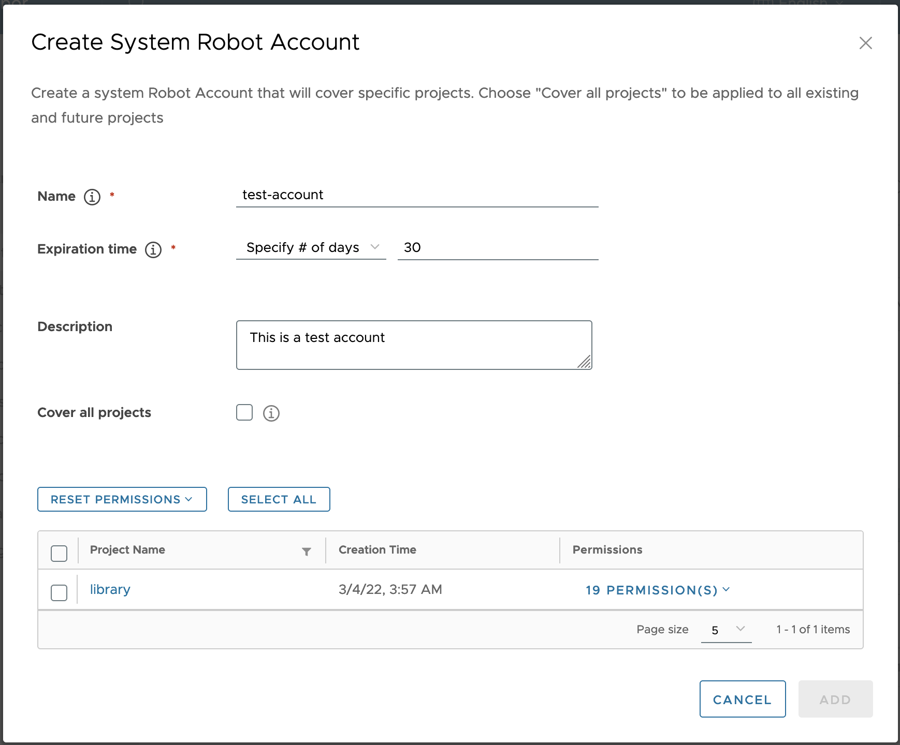
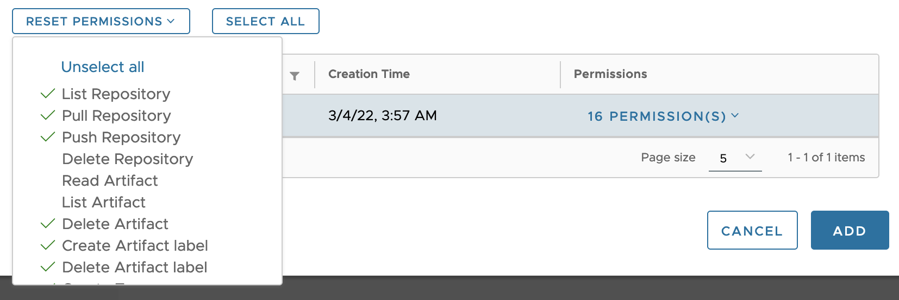

Harbor v2.2 introduces the capability for administrators to create system robot accounts you can use you run automated actions in your Harbor instances. System robot accounts allow you to use a robot account to perform maintenance or repeated tasks across all or a subset of projects in your Harbor instance.

For each system robot account you are able to assign the following permissions,

* Push artifacts
* Pull artifacts
* Delete artifacts
* Read Helm charts
* Create a Helm chart version
* Delete a Helm chart version
* Create a tag
* Delete a tag
* Create artifact labels
* Create a scan

Depending on your needs to can assign any combination of these permissions to a system robot account to perform your desired tasks through the OCI client or Harbor API. Robot Accounts cannot log in to the Harbor interface.

You are also able create project scope robot account that only have access to a single project. Read more about [project robot accounts](../../working-with-projects/project-configuration/create-robot-accounts/).

## View System Robot Accounts

1. Log into your harbor instance as an administrator.
1. Go to **Robot Accounts** item under **Administration**.


This page lists all available system robot accounts for your Harbor instance. The table lists the following information for each system robot account,

* The name of a system account. This is derived from robot account prefix configured for your Harbor instance and the name assigned to the account when it was created. A robot account name follows the format `<prefix><account_name>`. If you use the search function on this page, you only need to search for the account name without the prefix.
* Enabled status shows if an account is enabled or disabled.
* The number of projects an account is associated with. To see a full list of the projects an account is associated with, click on the **Project(s)** link.

    

* The created time shows when the robot account was created.
* The time until the account expires. Calculated based on the created time and the expiration time set when creating the robot account.
* The description of the system robot account.


## Add a System Robot Account

1. Log in to the Harbor interface with an account that has at least system administrator privileges.
1. Go to **Administration**, select a project, and select **Robot Accounts**.
1. Click **New Robot Account**.

    

1. Enter a name and an optional description for this robot account.
1. Set Expiration time for this robot account. By default the configured system default expiration time is used. You can also select **Never Expired** from the dropdown if you want to create a never expiring robot account.
1. Select **Cover all projects** if you want to use this system robot account across all projects. Using this option means that this system robot account will be able to access all existing and future projects in your Harbor instance. You can use the **Permissions(s)** dropdown to select which permission to grant to the robot account.   
    
1. If you want this robot account to only cover certain projects or be granted certain permissions, use the project table to select the projects and permissions you want to assign to the system robot account. This table shows the each project name, the project creation time, and a dropdown list of permissions to assign the system robot account for that project.

    

    Click the checkbox next to the project name to associate this robot account.

    By default the table shows all projects in your Harbor instance. You are able to filter for projects using the **filter icon** to the right of Project Name header. Note that the project table may be broken into pages and only display a subset of projects at one time depending on how many project you have in your Harbor instance and how many project match your filter criteria.

      

    Use the **Permissions** dropdown to choose which permissions to assign to a particular project. You are able to control which permissions to assign to an individual robot account by project, allowing you fine grained control over each robot account.

    

    Click the **Reset Permissions** dropdown to control which permissions are available for each project. Selecting or unselecting a permission will add or remove the permission for every project. Using this option will adjust permissions for all projects, not just the projects shown if you have filtered for a specific project name.

    

    Click **Select All** to associate the system robot account with all of the projects shown in the table. If you are filtering by project name, this option will only select the filtered projects.


1. Click **Add**.

1. In the confirmation window, click **Export to File** to download the secret as a JSON file, or click the clipboard icon to copy its contents to the clipboard.

   

   
   Harbor does not store robot account secrets, so you must either download the secret or copy and paste its contents into a text file. There is no way to get the secret from Harbor after you have created the robot account.
   

   The new robot account appears as `<prefix>account_name` in the list of robot accounts. Read more about [robot account prefixes](#configure-robot-account-prefix).

## Edit, Disable, or Delete a System Robot Account

You are able to edit, disable, or delete a system robot account.

1. From the administrator **Robot Account** page, select the checkbox next to the robot account you are updating.
1. Select **Action** and then **Edit**, **Disable**, or **Delete**.

  

## Refresh System Robot Account Secret

You can refresh a robot account's secret after its created in the event that you need a new one.

1. From the administrator **Robot Account** page, select the checkbox next to the robot account you are updating.
1. Select **Action** and then **Refresh Secret**.
1. By default Harbor will generate a new secret randomly, or you can choose to enable manually reseting the secret and entering the **New Secret** then **Confirm Secret**.

    

1. Click **Refresh**. If you created a secret randomly, download the secret JSON file or copy and paste its contents.

## Configure the Expiry Period of Robot Accounts

By default, robot accounts expire after 30 days. You can set a longer or shorter lifespan for robot accounts by modifying the expiry period for robot account tokens. The expiry period applies to all robot accounts in all projects.

1. Log in to the Harbor interface with an account that has Harbor system administrator privileges.
1. Go to **Configuration** and select **System Settings**.
1. In the **Robot Token Expiration (Days)** row, modify the number of days after which robot account tokens expire.

    

## Configure Robot Account Prefix

By default, robot account names use a prefix of `robot$`. Harbor uses this prefix to distinguish a robot account from a user account. The full name of a system robot account is the prefix and the name you provide when creating the robot account. For example if you create a new robot system account with the name `test`, the full name is  `robot$test`.

The same prefix is used for all robot accounts, including both system and project robot accounts. When you update this value, it will apply to all existing and future system and project robot accounts, except robot accounts created in Harbor v2.1 and earlier which will continue to use the prefix `robot$`.

1. Log in to the Harbor interface with an account that has Harbor system administrator privileges.
1. Go to **Configuration** and select **System Settings**.
1. In the **Robot Name Prefix** row, modify the prefix.

    

## Authenticate with a System Robot Account

To use a robot account in an automated process, for example a script, use `docker login` and provide the credentials of the robot account.

```
docker login <harbor_address<>
Username: <prefix><account_name>
Password: <secret>
```
