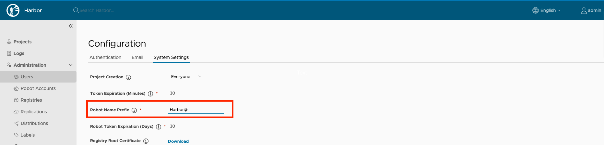

Harbor v2.2 introduces the capability for administrators to create system robot accounts you can use you run automated actions in your Harbor instances. System robot accounts allow you to use a robot account to perform maintenance or repeated tasks across all or a subset of projects in your Harbor instance.

For each system robot account you are able to assign the system permissions and specify the projects it covers. And for each of the specified projects you are able to assign the project permissions

You can refer to the [**Permission References**](#permission-references) to assign a combination of these permissions to a system robot account to perform your desired tasks through the OCI client or Harbor API. Robot Accounts cannot log in to the Harbor interface.

You are also able to create project scope robot account that only have access to a single project. Read more about [project robot accounts](../../working-with-projects/project-configuration/create-robot-accounts/).

## View System Robot Accounts

1. Log into your harbor instance as an administrator.
1. Go to **Robot Accounts** item under **Administration**.


This page lists all available system robot accounts for your Harbor instance. The table lists the following information for each system robot account,

* The name of a system account. This is derived from robot account prefix configured for your Harbor instance and the name assigned to the account when it was created. A robot account name follows the format `<prefix><account_name>`. If you use the search function on this page, you only need to search for the account name without the prefix.
* Enabled status shows if an account is enabled or deactivated.
* The number of system permissions an account is assigned to. To see a full set of the assigned system permissions, click on the **PERMISSIONS** link.

    
* The number of projects an account is associated with. To see a full list of the projects an account is associated with, click on the **PROJECT(S)** link.

    

* The created time shows when the robot account was created.
* The time until the account expires. Calculated based on the created time and the expiration time set when creating the robot account.
* The description of the system robot account.


## Add a System Robot Account

1. Log in to the Harbor interface with an account that has at least system administrator privileges.
1. Go to **Administration**, select a project, and select **Robot Accounts**.
1. Click **New Robot Account**.

    

1. Enter a name and an optional description for this robot account.
1. Set Expiration time for this robot account. By default the configured system default expiration time is used. You can also select **Never Expired** from the dropdown if you want to create a never expiring robot account.
1. Select the system permissions for this robot account.
1. Select **Cover all projects** if you want to use this system robot account across all projects. Using this option means that this system robot account will be able to access all existing and future projects in your Harbor instance. You can select which permission to grant to the robot account.   
    
1. If you want this robot account to only cover certain projects or be granted certain permissions, use the project table to select the projects and permissions you want to assign to the system robot account. This table shows the each project name, the project creation time, and a dropdown list of permissions to assign the system robot account for that project.

    

    Click the checkbox next to the project name to associate this robot account.

    By default the table shows all projects in your Harbor instance. You are able to filter for projects using the **filter icon** to the right of Project Name header. Note that the project table may be broken into pages and only display a subset of projects at one time depending on how many project you have in your Harbor instance and how many project match your filter criteria.

      

    Use the **Permissions** dropdown to choose which permissions to assign to a particular project. You are able to control which permissions to assign to an individual robot account by project, allowing you fine grained control over each robot account. You can select **Select All** or **Unselect All** to quickly add or remove all permissions from a robot account.

      The **Push Repository** permission must be assigned with the **Pull Repository** permission. You are not able to assign the Push Repository permission by itself.
      


    

    Click the **Reset All Project Permissions** dropdown to control which permissions are available for each project. Selecting or unselecting a permission will add or remove the permission for every project. Using this option will adjust permissions for all projects, not just the projects shown if you have filtered for a specific project name.

    

    Click **Select All Projects** to associate the system robot account with all of the projects shown in the table. If you are filtering by project name, this option will only select the filtered projects.


1. Click **FINISH**.

1. In the confirmation window, click **Export to File** to download the secret as a JSON file, or click the clipboard icon to copy its contents to the clipboard.

   

   
   Harbor does not store robot account secrets, so you must either download the secret or copy and paste its contents into a text file. There is no way to get the secret from Harbor after you have created the robot account.
   

   The new robot account appears as `<prefix>account_name` in the list of robot accounts. Read more about [robot account prefixes](#configure-robot-account-prefix).

## Edit, Deactivate, or Delete a System Robot Account

You are able to edit, deactivate, or delete a system robot account.

1. From the administrator **Robot Account** page, select the checkbox next to the robot account you are updating.
1. Select **Action** and then **Edit**, **Deactivate**, or **Delete**.

  

## Refresh System Robot Account Secret

You can refresh a robot account's secret after its created in the event that you need a new one.

1. From the administrator **Robot Account** page, select the checkbox next to the robot account you are updating.
1. Select **Action** and then **Refresh Secret**.
1. By default Harbor will generate a new secret randomly, or you can choose to enable manually reseting the secret and entering the **New Secret** then **Confirm Secret**. Optionally, you can view the secret by clicking the eye icon.

    

1. Click **Refresh**. If you created a secret randomly, download the secret JSON file or copy and paste its contents.

## Configure the Expiry Period of Robot Accounts

By default, robot accounts expire after 30 days. You can set a longer or shorter lifespan for robot accounts by modifying the expiry period for robot account tokens. The expiry period applies to all robot accounts in all projects.

1. Log in to the Harbor interface with an account that has Harbor system administrator privileges.
1. Go to **Configuration** and select **System Settings**.
1. In the **Robot Token Expiration (Days)** row, modify the number of days after which robot account tokens expire.

    

## Configure Robot Account Prefix

By default, robot account names use a prefix of `robot$`. Harbor uses this prefix to distinguish a robot account from a user account. The full name of a system robot account is the prefix and the name you provide when creating the robot account. For example if you create a new robot system account with the name `test`, the full name is  `robot$test`.

The same prefix is used for all robot accounts, including both system and project robot accounts. When you update this value, it will apply to all existing and future system and project robot accounts, except robot accounts created in Harbor v2.1 and earlier which will continue to use the prefix `robot$`.

1. Log in to the Harbor interface with an account that has Harbor system administrator privileges.
1. Go to **Configuration** and select **System Settings**.
1. In the **Robot Name Prefix** row, modify the prefix.

    

## Authenticate with a System Robot Account

To use a robot account in an automated process, for example a script, use `docker login` and provide the credentials of the robot account.

```
docker login <harbor_address<>
Username: <prefix><account_name>
Password: <secret>
```


##  Permission References <a name="permission-references"></a>

The below tables explain what a robot account can do with a specified permission.

#### System permissions

| Permission (an action + a resource)            | Abilities                                                                                                                                                                                                                                                                                                                                                                                                                                                                                                                                                                                                      |
|:-----------------------------------------------|:---------------------------------------------------------------------------------------------------------------------------------------------------------------------------------------------------------------------------------------------------------------------------------------------------------------------------------------------------------------------------------------------------------------------------------------------------------------------------------------------------------------------------------------------------------------------------------------------------------------|
| List Audit log (audit-log)                     | 1. GET [/audit-logs](https://github.com/goharbor/harbor/blob/323e11fefba181fd982b9773dacefa44b2ef0ca0/api/v2.0/swagger.yaml#L1611)                                                                                                                                                                                                                                                                                                                                                                                                                                                                             |
| Read Catalog (catalog)                         | 1. GET /v2/_catalog                                                                                                                                                                                                                                                                                                                                                                                                                                                                                                                                                                                            |
| Read Garbage Collection (garbage-collection)   | 1. GET [/system/gc/{gc_id}/log](https://github.com/goharbor/harbor/blob/323e11fefba181fd982b9773dacefa44b2ef0ca0/api/v2.0/swagger.yaml#L4216)<br/>2. GET [/system/gc/schedule](https://github.com/goharbor/harbor/blob/323e11fefba181fd982b9773dacefa44b2ef0ca0/api/v2.0/swagger.yaml#L4244)                                                                                                                                                                                                                                                                                                                   |
| List Garbage Collection (garbage-collection)   | 1. GET [/system/gc](https://github.com/goharbor/harbor/blob/323e11fefba181fd982b9773dacefa44b2ef0ca0/api/v2.0/swagger.yaml#L4141)                                                                                                                                                                                                                                                                                                                                                                                                                                                                              |
| Create Garbage Collection (garbage-collection) | 1. POST [/system/gc/schedule](https://github.com/goharbor/harbor/blob/323e11fefba181fd982b9773dacefa44b2ef0ca0/api/v2.0/swagger.yaml#L4263)                                                                                                                                                                                                                                                                                                                                                                                                                                                                    |
| Stop Garbage Collection (garbage-collection)   | 1. PUT [/system/gc/{gc_id}](https://github.com/goharbor/harbor/blob/323e11fefba181fd982b9773dacefa44b2ef0ca0/api/v2.0/swagger.yaml#L4196)                                                                                                                                                                                                                                                                                                                                                                                                                                                                      |
| Update Garbage Collection (garbage-collection) | 1. PUT [/system/gc/schedule](https://github.com/goharbor/harbor/blob/323e11fefba181fd982b9773dacefa44b2ef0ca0/api/v2.0/swagger.yaml#L4291)                                                                                                                                                                                                                                                                                                                                                                                                                                                                     |
| List Job Service Monitor (jobservice-monitor)  | 1. GET [/jobservice/pools](https://github.com/goharbor/harbor/blob/323e11fefba181fd982b9773dacefa44b2ef0ca0/api/v2.0/swagger.yaml#L4641)<br/>2. GET [/jobservice/pools/{pool_id}/workers](https://github.com/goharbor/harbor/blob/323e11fefba181fd982b9773dacefa44b2ef0ca0/api/v2.0/swagger.yaml#L466)<br/>3. GET [/jobservice/jobs/{job_id}/log](https://github.com/goharbor/harbor/blob/323e11fefba181fd982b9773dacefa44b2ef0ca0/api/v2.0/swagger.yaml#L4717) <br/>4. GET [/jobservice/queues](https://github.com/goharbor/harbor/blob/323e11fefba181fd982b9773dacefa44b2ef0ca0/api/v2.0/swagger.yaml#L4750) |
| Stop Job Service Monitor (jobservice-monitor)  | 1. PUT [/jobservice/jobs/{job_id}](https://github.com/goharbor/harbor/blob/323e11fefba181fd982b9773dacefa44b2ef0ca0/api/v2.0/swagger.yaml#L4692) <br/>2. PUT [/jobservice/queues/{job_type}](https://github.com/goharbor/harbor/blob/323e11fefba181fd982b9773dacefa44b2ef0ca0/api/v2.0/swagger.yaml#L4774)                                                                                                                                                                                                                                                                                                     |
| Read Label (label)                             | 1. GET [/labels/{global_label_id}](https://github.com/goharbor/harbor/blob/323e11fefba181fd982b9773dacefa44b2ef0ca0/api/v2.0/swagger.yaml#L5869)                                                                                                                                                                                                                                                                                                                                                                                                                                                               |
| Create Label (label)                           | 1. POST [/labels?scope=g](https://github.com/goharbor/harbor/blob/323e11fefba181fd982b9773dacefa44b2ef0ca0/api/v2.0/swagger.yaml#L5836)                                                                                                                                                                                                                                                                                                                                                                                                                                                                        |
| Update Label (label)                           | 1. PUT [/labels/{global_label_id}](https://github.com/goharbor/harbor/blob/323e11fefba181fd982b9773dacefa44b2ef0ca0/api/v2.0/swagger.yaml#L5890)                                                                                                                                                                                                                                                                                                                                                                                                                                                               |
| Delete Label (label)                           | 1. DELETE [/labels/{global_label_id}](https://github.com/goharbor/harbor/blob/323e11fefba181fd982b9773dacefa44b2ef0ca0/api/v2.0/swagger.yaml#L5919)                                                                                                                                                                                                                                                                                                                                                                                                                                                            |
| Read Preheat Instance (preheat-instance)       | 1. POST [/preheat/instances/ping](https://github.com/goharbor/harbor/blob/323e11fefba181fd982b9773dacefa44b2ef0ca0/api/v2.0/swagger.yaml#L1706)<br/>2. GET [/p2p/preheat/instances/{preheat_instance_name}](https://github.com/goharbor/harbor/blob/323e11fefba181fd982b9773dacefa44b2ef0ca0/api/v2.0/swagger.yaml#L1799)                                                                                                                                                                                                                                                                                      |
| List Preheat Instance (preheat-instance)       | 1. GET [/p2p/preheat/providers](https://github.com/goharbor/harbor/blob/323e11fefba181fd982b9773dacefa44b2ef0ca0/api/v2.0/swagger.yaml#L1680) <br/>2. GET [/p2p/preheat/instances](https://github.com/goharbor/harbor/blob/323e11fefba181fd982b9773dacefa44b2ef0ca0/api/v2.0/swagger.yaml#L1733)                                                                                                                                                                                                                                                                                                               |
| Create Preheat Instance (preheat-instance)     | 1. POST [/p2p/preheat/instances](https://github.com/goharbor/harbor/blob/323e11fefba181fd982b9773dacefa44b2ef0ca0/api/v2.0/swagger.yaml#L1769)                                                                                                                                                                                                                                                                                                                                                                                                                                                                 |
| Update Preheat Instance (preheat-instance)     | 1. PUT [/p2p/preheat/instances/{preheat_instance_name}](https://github.com/goharbor/harbor/blob/323e11fefba181fd982b9773dacefa44b2ef0ca0/api/v2.0/swagger.yaml#L1843)                                                                                                                                                                                                                                                                                                                                                                                                                                          |
| Delete Preheat Instance (preheat-instance)     | 1. DELETE [/p2p/preheat/instances/{preheat_instance_name}](https://github.com/goharbor/harbor/blob/323e11fefba181fd982b9773dacefa44b2ef0ca0/api/v2.0/swagger.yaml#L1823)                                                                                                                                                                                                                                                                                                                                                                                                                                       |
| List Project (project)                         | 1. GET [/projects](https://github.com/goharbor/harbor/blob/323e11fefba181fd982b9773dacefa44b2ef0ca0/api/v2.0/swagger.yaml#L272)                                                                                                                                                                                                                                                                                                                                                                                                                                                                                |
| Create Project (project)                       | 1. POST [/projects](https://github.com/goharbor/harbor/blob/323e11fefba181fd982b9773dacefa44b2ef0ca0/api/v2.0/swagger.yaml#L343)                                                                                                                                                                                                                                                                                                                                                                                                                                                                               |
| Read Purge Audit (purge-audit)                 | 1. GET [/system/purgeaudit/{purge_id}/log](https://github.com/goharbor/harbor/blob/323e11fefba181fd982b9773dacefa44b2ef0ca0/api/v2.0/swagger.yaml#L4394)<br/>2. GET [/system/purgeaudit/schedule](https://github.com/goharbor/harbor/blob/323e11fefba181fd982b9773dacefa44b2ef0ca0/api/v2.0/swagger.yaml#L4421)<br/>3. GET [/system/purgeaudit/{purge_id}](https://github.com/goharbor/harbor/blob/323e11fefba181fd982b9773dacefa44b2ef0ca0/api/v2.0/swagger.yaml#L4351)                                                                                                                                       |
| List Purge Audit (purge-audit)                 | 1. GET [/system/purgeaudit](https://github.com/goharbor/harbor/blob/323e11fefba181fd982b9773dacefa44b2ef0ca0/api/v2.0/swagger.yaml#L4318)                                                                                                                                                                                                                                                                                                                                                                                                                                                                      |
| Create Purge Audit (purge-audit)               | 1. POST [/system/purgeaudit/schedule](https://github.com/goharbor/harbor/blob/323e11fefba181fd982b9773dacefa44b2ef0ca0/api/v2.0/swagger.yaml#L4440)                                                                                                                                                                                                                                                                                                                                                                                                                                                            |
| Stop Purge Audit (purge-audit)                 | 1. PUT [/system/purgeaudit/{purge_id}](https://github.com/goharbor/harbor/blob/323e11fefba181fd982b9773dacefa44b2ef0ca0/api/v2.0/swagger.yaml#L4373)                                                                                                                                                                                                                                                                                                                                                                                                                                                           |
| Update Purge Audit (purge-audit)               | 1. PUT [system/purgeaudit/schedule](https://github.com/goharbor/harbor/blob/323e11fefba181fd982b9773dacefa44b2ef0ca0/api/v2.0/swagger.yaml#L4470)                                                                                                                                                                                                                                                                                                                                                                                                                                                              |
| Read Registry (registry)                       | 1. POST [/registries/ping](https://github.com/goharbor/harbor/blob/f99a619bc676ba614048c5a84cf0598adc79519f/api/v2.0/swagger.yaml#L3855)<br/> 2. GET [/registries/{id}](https://github.com/goharbor/harbor/blob/f99a619bc676ba614048c5a84cf0598adc79519f/api/v2.0/swagger.yaml#L3883) <br/>3. GET  [/registries/{id}/info](https://github.com/goharbor/harbor/blob/f99a619bc676ba614048c5a84cf0598adc79519f/api/v2.0/swagger.yaml#L3971)                                                                                                                                                                       |
| List Registry (registry)                       | 1. GET [/registries](https://github.com/goharbor/harbor/blob/f99a619bc676ba614048c5a84cf0598adc79519f/api/v2.0/swagger.yaml#L3817)                                                                                                                                                                                                                                                                                                                                                                                                                                                                             |
| Create Registry (registry)                     | 1. POST [/registries](https://github.com/goharbor/harbor/blob/f99a619bc676ba614048c5a84cf0598adc79519f/api/v2.0/swagger.yaml#L3790)                                                                                                                                                                                                                                                                                                                                                                                                                                                                            |
| Update Registry (registry)                     | 1. PUT [/registries/{id}](https://github.com/goharbor/harbor/blob/f99a619bc676ba614048c5a84cf0598adc79519f/api/v2.0/swagger.yaml#L3937)                                                                                                                                                                                                                                                                                                                                                                                                                                                                        |
| Delete Registry (registry)                     | 1. DELETE [/registries/{id}](https://github.com/goharbor/harbor/blob/f99a619bc676ba614048c5a84cf0598adc79519f/api/v2.0/swagger.yaml#L3910)                                                                                                                                                                                                                                                                                                                                                                                                                                                                     |
| Read Replication (replication)                 | 1. GET  [/replication/executions/{id}](https://github.com/goharbor/harbor/blob/f99a619bc676ba614048c5a84cf0598adc79519f/api/v2.0/swagger.yaml#L3605) <br/> 2. GET [/replication/executions/{id}/tasks/{task_id}/log](https://github.com/goharbor/harbor/blob/f99a619bc676ba614048c5a84cf0598adc79519f/api/v2.0/swagger.yaml#L3706)                                                                                                                                                                                                                                                                             |
| List Replication (replication)                 | 1. GET [/replication/executions](https://github.com/goharbor/harbor/blob/f99a619bc676ba614048c5a84cf0598adc79519f/api/v2.0/swagger.yaml#L3533) <br/>2. GET  [/replication/executions/{id}/tasks](https://github.com/goharbor/harbor/blob/f99a619bc676ba614048c5a84cf0598adc79519f/api/v2.0/swagger.yaml#L3658)                                                                                                                                                                                                                                                                                                 |
| Create Replication (replication)               | 1. POST [/replication/executions](https://github.com/goharbor/harbor/blob/f99a619bc676ba614048c5a84cf0598adc79519f/api/v2.0/swagger.yaml#L3579)<br/>2. PUT  [/replication/executions/{id}](https://github.com/goharbor/harbor/blob/f99a619bc676ba614048c5a84cf0598adc79519f/api/v2.0/swagger.yaml#L3632)                                                                                                                                                                                                                                                                                                       |
| List Replication Adapter (replication-adapter) | 1. GET  [/replication/adapters](https://github.com/goharbor/harbor/blob/f99a619bc676ba614048c5a84cf0598adc79519f/api/v2.0/swagger.yaml#L3746)<br/>2. GET [/replication/adapterinfos](https://github.com/goharbor/harbor/blob/f99a619bc676ba614048c5a84cf0598adc79519f/api/v2.0/swagger.yaml#L3768)                                                                                                                                                                                                                                                                                                             |
| Read Replication Policy (replication-policy)   | 1. GET [/replication/policies/{id}](https://github.com/goharbor/harbor/blob/f99a619bc676ba614048c5a84cf0598adc79519f/api/v2.0/swagger.yaml#L3447)                                                                                                                                                                                                                                                                                                                                                                                                                                                              |
| List Replication Policy (replication-policy)   | 1. GET  [/replication/policies](https://github.com/goharbor/harbor/blob/f99a619bc676ba614048c5a84cf0598adc79519f/api/v2.0/swagger.yaml#L3382)                                                                                                                                                                                                                                                                                                                                                                                                                                                                  |
| Create Replication Policy (replication-policy) | 1. POST [/replication/policies](https://github.com/goharbor/harbor/blob/f99a619bc676ba614048c5a84cf0598adc79519f/api/v2.0/swagger.yaml#L3419)                                                                                                                                                                                                                                                                                                                                                                                                                                                                  |
| Update Replication Policy (replication-policy) | 1. PUT   [/replication/policies/{id}](https://github.com/goharbor/harbor/blob/f99a619bc676ba614048c5a84cf0598adc79519f/api/v2.0/swagger.yaml#L3499)                                                                                                                                                                                                                                                                                                                                                                                                                                                            |
| Delete Replication Policy (replication-policy) | 1. DELETE [/replication/policies/{id}](https://github.com/goharbor/harbor/blob/f99a619bc676ba614048c5a84cf0598adc79519f/api/v2.0/swagger.yaml#L3472)                                                                                                                                                                                                                                                                                                                                                                                                                                                           |
| Read Scan All (scan-all)                       | 1. GET [/scans/all/metrics](https://github.com/goharbor/harbor/blob/f99a619bc676ba614048c5a84cf0598adc79519f/api/v2.0/swagger.yaml#L3999) <br/>2. GET [/scans/schedule/metrics](https://github.com/goharbor/harbor/blob/f99a619bc676ba614048c5a84cf0598adc79519f/api/v2.0/swagger.yaml#L4021)                                                                                                                                                                                                                                                                                                                  |
| Create Scan All (scan-all)                     | 1. POST [/system/scanAll/schedule](https://github.com/goharbor/harbor/blob/f99a619bc676ba614048c5a84cf0598adc79519f/api/v2.0/swagger.yaml#L4591)                                                                                                                                                                                                                                                                                                                                                                                                                                                               |
| Stop Scan All (scan-all)                       | 1. POST [/system/scanAll/stop](https://github.com/goharbor/harbor/blob/f99a619bc676ba614048c5a84cf0598adc79519f/api/v2.0/swagger.yaml#L4621)                                                                                                                                                                                                                                                                                                                                                                                                                                                                   |
| Update Scan All (scan-all)                     | 1. PUT [/system/scanAll/schedule](https://github.com/goharbor/harbor/blob/f99a619bc676ba614048c5a84cf0598adc79519f/api/v2.0/swagger.yaml#L4564)                                                                                                                                                                                                                                                                                                                                                                                                                                                                |
| Read Scanner (scanner)                         | 1. POST [/scanners/ping](https://github.com/goharbor/harbor/blob/f99a619bc676ba614048c5a84cf0598adc79519f/api/v2.0/swagger.yaml#L5295) <br/>2. GET [/scanners/{registration_id}](https://github.com/goharbor/harbor/blob/f99a619bc676ba614048c5a84cf0598adc79519f/api/v2.0/swagger.yaml#L5322) <br/>3. GET [/scanners/{registration_id}/metadata](https://github.com/goharbor/harbor/blob/f99a619bc676ba614048c5a84cf0598adc79519f/api/v2.0/swagger.yaml#L5436)                                                                                                                                                |
| List Scanner (scanner)                         | 1. GET [/scanners](https://github.com/goharbor/harbor/blob/f99a619bc676ba614048c5a84cf0598adc79519f/api/v2.0/swagger.yaml#L5229)                                                                                                                                                                                                                                                                                                                                                                                                                                                                               |
| Create Scanner (scanner)                       | 1. POST [/scanners](https://github.com/goharbor/harbor/blob/f99a619bc676ba614048c5a84cf0598adc79519f/api/v2.0/swagger.yaml#L5264)                                                                                                                                                                                                                                                                                                                                                                                                                                                                              |
| Update Scanner (scanner)                       | 1. PUT  [/scanners/{registration_id}](https://github.com/goharbor/harbor/blob/f99a619bc676ba614048c5a84cf0598adc79519f/api/v2.0/swagger.yaml#L5349)                                                                                                                                                                                                                                                                                                                                                                                                                                                            |
| Delete Scanner (scanner)                       | 1. DELETE  [/scanners/{registration_id}](https://github.com/goharbor/harbor/blob/f99a619bc676ba614048c5a84cf0598adc79519f/api/v2.0/swagger.yaml#L5380)                                                                                                                                                                                                                                                                                                                                                                                                                                                         |
| Read Security Hub (security-hub)               | 1. GET [/security/summary](https://github.com/goharbor/harbor/blob/f99a619bc676ba614048c5a84cf0598adc79519f/api/v2.0/swagger.yaml#L6056)                                                                                                                                                                                                                                                                                                                                                                                                                                                                       |
| List Security Hub (security-hub)               | 1. GET [/security/vul](https://github.com/goharbor/harbor/blob/f99a619bc676ba614048c5a84cf0598adc79519f/api/v2.0/swagger.yaml#L6091)                                                                                                                                                                                                                                                                                                                                                                                                                                                                           |
| Read System Volumes (system-volumes)           | 1. GET [/systeminfo/volumes](https://github.com/goharbor/harbor/blob/f99a619bc676ba614048c5a84cf0598adc79519f/api/v2.0/swagger.yaml#L4061)                                                                                                                                                                                                                                                                                                                                                                                                                                                                     |


#### Project permissions

| Permission (an action + a resource)              | Abilities                                                                                                                                                                                                                                                                                                                                                                                                                                                                                                                                                                                                                                                                                                                                                                                                                                                                                                                                                                                                                                                                                                                                                                                                                                     |
|:-------------------------------------------------|:----------------------------------------------------------------------------------------------------------------------------------------------------------------------------------------------------------------------------------------------------------------------------------------------------------------------------------------------------------------------------------------------------------------------------------------------------------------------------------------------------------------------------------------------------------------------------------------------------------------------------------------------------------------------------------------------------------------------------------------------------------------------------------------------------------------------------------------------------------------------------------------------------------------------------------------------------------------------------------------------------------------------------------------------------------------------------------------------------------------------------------------------------------------------------------------------------------------------------------------------|
| List Accessory (accessory)                       | 1. GET [/projects/{project_name}/repositories/{repository_name}/artifacts/{reference}/accessories](https://github.com/goharbor/harbor/blob/f99a619bc676ba614048c5a84cf0598adc79519f/api/v2.0/swagger.yaml#L1348)                                                                                                                                                                                                                                                                                                                                                                                                                                                                                                                                                                                                                                                                                                                                                                                                                                                                                                                                                                                                                              |
| Read Artifact (artifact)                         | 1. GET [/projects/{project_name}/repositories/{repository_name}/artifacts/{reference}](https://github.com/goharbor/harbor/blob/f99a619bc676ba614048c5a84cf0598adc79519f/api/v2.0/swagger.yaml#L1067)                                                                                                                                                                                                                                                                                                                                                                                                                                                                                                                                                                                                                                                                                                                                                                                                                                                                                                                                                                                                                                          |
| List Artifact (artifact)                         | 1. GET [/projects/{project_name}/repositories/{repository_name}/artifacts](https://github.com/goharbor/harbor/blob/f99a619bc676ba614048c5a84cf0598adc79519f/api/v2.0/swagger.yaml#L961)                                                                                                                                                                                                                                                                                                                                                                                                                                                                                                                                                                                                                                                                                                                                                                                                                                                                                                                                                                                                                                                       |
| Create Artifact (artifact)                       | 1. POST [/projects/{project_name}/repositories/{repository_name}/artifacts](https://github.com/goharbor/harbor/blob/f99a619bc676ba614048c5a84cf0598adc79519f/api/v2.0/swagger.yaml#L1036)                                                                                                                                                                                                                                                                                                                                                                                                                                                                                                                                                                                                                                                                                                                                                                                                                                                                                                                                                                                                                                                     |
| Delete Artifact (artifact)                       | 1. DELETE [/projects/{project_name}/repositories/{repository_name}/artifacts/{reference}](https://github.com/goharbor/harbor/blob/f99a619bc676ba614048c5a84cf0598adc79519f/api/v2.0/swagger.yaml#L1133)                                                                                                                                                                                                                                                                                                                                                                                                                                                                                                                                                                                                                                                                                                                                                                                                                                                                                                                                                                                                                                       |
| Read Artifact Addition (artifact-addition)       | 1. GET [/projects/{project_name}/repositories/{repository_name}/artifacts/{reference}/additions/vulnerabilities](https://github.com/goharbor/harbor/blob/f99a619bc676ba614048c5a84cf0598adc79519f/api/v2.0/swagger.yaml#L1388) <br/>2. GET [/projects/{project_name}/repositories/{repository_name}/artifacts/{reference}/additions/{addition}](https://github.com/goharbor/harbor/blob/f99a619bc676ba614048c5a84cf0598adc79519f/api/v2.0/swagger.yaml#L1420)                                                                                                                                                                                                                                                                                                                                                                                                                                                                                                                                                                                                                                                                                                                                                                                 |
| Create Artifact Label (artifact-label)           | 1. POST [/projects/{project_name}/repositories/{repository_name}/artifacts/{reference}/labels](https://github.com/goharbor/harbor/blob/f99a619bc676ba614048c5a84cf0598adc79519f/api/v2.0/swagger.yaml#L1457)                                                                                                                                                                                                                                                                                                                                                                                                                                                                                                                                                                                                                                                                                                                                                                                                                                                                                                                                                                                                                                  |
| Delete Artifact Label (artifact-label)           | 1. DELETE [/projects/{project_name}/repositories/{repository_name}/artifacts/{reference}/labels/{label_id}](https://github.com/goharbor/harbor/blob/f99a619bc676ba614048c5a84cf0598adc79519f/api/v2.0/swagger.yaml#L1490)                                                                                                                                                                                                                                                                                                                                                                                                                                                                                                                                                                                                                                                                                                                                                                                                                                                                                                                                                                                                                     |
| List Immutable Tag (immutable-tag)               | 1. GET [/projects/{project_name_or_id}/immutabletagrules](https://github.com/goharbor/harbor/blob/f99a619bc676ba614048c5a84cf0598adc79519f/api/v2.0/swagger.yaml#L2396)                                                                                                                                                                                                                                                                                                                                                                                                                                                                                                                                                                                                                                                                                                                                                                                                                                                                                                                                                                                                                                                                       |
| Create Immutable Tag (immutable-tag)             | 1. POST [/projects/{project_name_or_id}/immutabletagrules](https://github.com/goharbor/harbor/blob/f99a619bc676ba614048c5a84cf0598adc79519f/api/v2.0/swagger.yaml#L2433)                                                                                                                                                                                                                                                                                                                                                                                                                                                                                                                                                                                                                                                                                                                                                                                                                                                                                                                                                                                                                                                                      |
| Update Immutable Tag (immutable-tag)             | 1. PUT [/projects/{project_name_or_id}/immutabletagrules/{immutable_rule_id}](https://github.com/goharbor/harbor/blob/f99a619bc676ba614048c5a84cf0598adc79519f/api/v2.0/swagger.yaml#L2463)                                                                                                                                                                                                                                                                                                                                                                                                                                                                                                                                                                                                                                                                                                                                                                                                                                                                                                                                                                                                                                                   |
| Delete Immutable Tag (immutable-tag)             | 1. DELETE [/projects/{project_name_or_id}/immutabletagrules/{immutable_rule_id}](https://github.com/goharbor/harbor/blob/f99a619bc676ba614048c5a84cf0598adc79519f/api/v2.0/swagger.yaml#L2489)                                                                                                                                                                                                                                                                                                                                                                                                                                                                                                                                                                                                                                                                                                                                                                                                                                                                                                                                                                                                                                                |
| Read Label (label)                               | 1. GET [/labels/{project_label_id}](https://github.com/goharbor/harbor/blob/f99a619bc676ba614048c5a84cf0598adc79519f/api/v2.0/swagger.yaml#L5869)                                                                                                                                                                                                                                                                                                                                                                                                                                                                                                                                                                                                                                                                                                                                                                                                                                                                                                                                                                                                                                                                                             |
| List Label (label)                               | 1. GET [/labels?scope=p&project_id={project_id}](https://github.com/goharbor/harbor/blob/f99a619bc676ba614048c5a84cf0598adc79519f/api/v2.0/swagger.yaml#L5787)                                                                                                                                                                                                                                                                                                                                                                                                                                                                                                                                                                                                                                                                                                                                                                                                                                                                                                                                                                                                                                                                                |
| Create Label (label)                             | 1. POST [/labels?scope=p&project_id={project_id}](https://github.com/goharbor/harbor/blob/f99a619bc676ba614048c5a84cf0598adc79519f/api/v2.0/swagger.yaml#L5836)                                                                                                                                                                                                                                                                                                                                                                                                                                                                                                                                                                                                                                                                                                                                                                                                                                                                                                                                                                                                                                                                               |
| Update Label (label)                             | 1. PUT [/labels/{project_label_id}](https://github.com/goharbor/harbor/blob/f99a619bc676ba614048c5a84cf0598adc79519f/api/v2.0/swagger.yaml#L5890)                                                                                                                                                                                                                                                                                                                                                                                                                                                                                                                                                                                                                                                                                                                                                                                                                                                                                                                                                                                                                                                                                             |
| Delete Label (label)                             | 1. DELETE [/labels/{project_label_id}](https://github.com/goharbor/harbor/blob/f99a619bc676ba614048c5a84cf0598adc79519f/api/v2.0/swagger.yaml#L5919)                                                                                                                                                                                                                                                                                                                                                                                                                                                                                                                                                                                                                                                                                                                                                                                                                                                                                                                                                                                                                                                                                          |
| List Log (log)                                   | 1. GET [/projects/{project_name}/logs](https://github.com/goharbor/harbor/blob/2984c2e04b3b3194cabb44470d0e37acc4b1d5c9/api/v2.0/swagger.yaml#L1646)                                                                                                                                                                                                                                                                                                                                                                                                                                                                                                                                                                                                                                                                                                                                                                                                                                                                                                                                                                                                                                                                                          |
| Read Project Metadata (metadata)                 | 1. GET [/projects/{project_name_or_id}/metadatas/{meta_name}](https://github.com/goharbor/harbor/blob/2984c2e04b3b3194cabb44470d0e37acc4b1d5c9/api/v2.0/swagger.yaml#L715)                                                                                                                                                                                                                                                                                                                                                                                                                                                                                                                                                                                                                                                                                                                                                                                                                                                                                                                                                                                                                                                                    |
| List Project Metadata (metadata)                 | 1. GET [/projects/{project_name_or_id}/metadatas](https://github.com/goharbor/harbor/blob/2984c2e04b3b3194cabb44470d0e37acc4b1d5c9/api/v2.0/swagger.yaml#L656)                                                                                                                                                                                                                                                                                                                                                                                                                                                                                                                                                                                                                                                                                                                                                                                                                                                                                                                                                                                                                                                                                |
| Create Project Metadata (metadata)               | 1. POST [/projects/{project_name_or_id}/metadatas](https://github.com/goharbor/harbor/blob/2984c2e04b3b3194cabb44470d0e37acc4b1d5c9/api/v2.0/swagger.yaml#L683)                                                                                                                                                                                                                                                                                                                                                                                                                                                                                                                                                                                                                                                                                                                                                                                                                                                                                                                                                                                                                                                                               |
| Update Project Metadata (metadata)               | 1. PUT [/projects/{project_name_or_id}/metadatas/{meta_name}](https://github.com/goharbor/harbor/blob/2984c2e04b3b3194cabb44470d0e37acc4b1d5c9/api/v2.0/swagger.yaml#L747)                                                                                                                                                                                                                                                                                                                                                                                                                                                                                                                                                                                                                                                                                                                                                                                                                                                                                                                                                                                                                                                                    |
| Delete Project Metadata (metadata)               | 1. DELETE [/projects/{project_name_or_id}/metadatas/{meta_name}](https://github.com/goharbor/harbor/blob/2984c2e04b3b3194cabb44470d0e37acc4b1d5c9/api/v2.0/swagger.yaml#L783)                                                                                                                                                                                                                                                                                                                                                                                                                                                                                                                                                                                                                                                                                                                                                                                                                                                                                                                                                                                                                                                                 |
| Read Notification Policy (notification-policy)   | 1. GET [/projects/{project_name_or_id}/webhook/policies/{webhook_policy_id}](https://github.com/goharbor/harbor/blob/2984c2e04b3b3194cabb44470d0e37acc4b1d5c9/api/v2.0/swagger.yaml#L2584) <br/>2. GET [/projects/{project_name_or_id}/webhook/lasttrigger](https://github.com/goharbor/harbor/blob/2984c2e04b3b3194cabb44470d0e37acc4b1d5c9/api/v2.0/swagger.yaml#L2787) <br/>3. GET [/projects/{project_name_or_id}/webhook/events](https://github.com/goharbor/harbor/blob/2984c2e04b3b3194cabb44470d0e37acc4b1d5c9/api/v2.0/swagger.yaml#L2867)  <br/>4. GET [/projects/{project_name_or_id}/webhook/policies/{webhook_policy_id}/executions](https://github.com/goharbor/harbor/blob/2984c2e04b3b3194cabb44470d0e37acc4b1d5c9/api/v2.0/swagger.yaml#L2668) <br/>5. GET [/projects/{project_name_or_id}/webhook/policies/{webhook_policy_id}/executions/{execution_id}/tasks](https://github.com/goharbor/harbor/blob/2984c2e04b3b3194cabb44470d0e37acc4b1d5c9/api/v2.0/swagger.yaml#L2709) <br/>6. GET [/projects/{project_name_or_id}/webhook/policies/{webhook_policy_id}/executions/{execution_id}/tasks/{task_id}/log](https://github.com/goharbor/harbor/blob/2984c2e04b3b3194cabb44470d0e37acc4b1d5c9/api/v2.0/swagger.yaml#L2750) |
| List Notification Policy (notification-policy)   | 1. GET [/projects/{project_name_or_id}/webhook/policies](https://github.com/goharbor/harbor/blob/2984c2e04b3b3194cabb44470d0e37acc4b1d5c9/api/v2.0/swagger.yaml#L2511) <br/>2. GET [/projects/{project_name_or_id}/webhook/jobs](https://github.com/goharbor/harbor/blob/2984c2e04b3b3194cabb44470d0e37acc4b1d5c9/api/v2.0/swagger.yaml#L2815)                                                                                                                                                                                                                                                                                                                                                                                                                                                                                                                                                                                                                                                                                                                                                                                                                                                                                                |
| Create Notification Policy (notification-policy) | 1. POST [/projects/{project_name_or_id}/webhook/policies](https://github.com/goharbor/harbor/blob/2984c2e04b3b3194cabb44470d0e37acc4b1d5c9/api/v2.0/swagger.yaml#L2548)                                                                                                                                                                                                                                                                                                                                                                                                                                                                                                                                                                                                                                                                                                                                                                                                                                                                                                                                                                                                                                                                       |
| Update Notification Policy (notification-policy) | 1. PUT [/projects/{project_name_or_id}/webhook/policies/{webhook_policy_id}](https://github.com/goharbor/harbor/blob/2984c2e04b3b3194cabb44470d0e37acc4b1d5c9/api/v2.0/swagger.yaml#L2611)                                                                                                                                                                                                                                                                                                                                                                                                                                                                                                                                                                                                                                                                                                                                                                                                                                                                                                                                                                                                                                                    |
| Delete Notification Policy (notification-policy) | 1. DELETE [/projects/{project_name_or_id}/webhook/policies/{webhook_policy_id}](https://github.com/goharbor/harbor/blob/2984c2e04b3b3194cabb44470d0e37acc4b1d5c9/api/v2.0/swagger.yaml#L2642)                                                                                                                                                                                                                                                                                                                                                                                                                                                                                                                                                                                                                                                                                                                                                                                                                                                                                                                                                                                                                                                 |
| Read Preheat Policy (preheat-policy)             | 1. GET [/projects/{project_name}/preheat/policies/{preheat_policy_name}](https://github.com/goharbor/harbor/blob/2984c2e04b3b3194cabb44470d0e37acc4b1d5c9/api/v2.0/swagger.yaml#L1936) <br/>2. POST [/projects/{project_name}/preheat/policies/{preheat_policy_name}](https://github.com/goharbor/harbor/blob/2984c2e04b3b3194cabb44470d0e37acc4b1d5c9/api/v2.0/swagger.yaml#L1992) <br/>3. GET [/projects/{project_name}/preheat/policies/{preheat_policy_name}/executions/{execution_id}](https://github.com/goharbor/harbor/blob/2984c2e04b3b3194cabb44470d0e37acc4b1d5c9/api/v2.0/swagger.yaml#L2084) <br/>4. GET [/projects/{project_name}/preheat/policies/{preheat_policy_name}/executions/{execution_id}/tasks/{task_id}/logs](https://github.com/goharbor/harbor/blob/2984c2e04b3b3194cabb44470d0e37acc4b1d5c9/api/v2.0/swagger.yaml#L2181)                                                                                                                                                                                                                                                                                                                                                                                          |
| List Preheat Policy (preheat-policy)             | 1. GET [/projects/{project_name}/preheat/policies](https://github.com/goharbor/harbor/blob/2984c2e04b3b3194cabb44470d0e37acc4b1d5c9/api/v2.0/swagger.yaml#L1900) <br/>2. GET [/projects/{project_name}/preheat/providers](https://github.com/goharbor/harbor/blob/2984c2e04b3b3194cabb44470d0e37acc4b1d5c9/api/v2.0/swagger.yaml#L2215)                                                                                                                                                                                                                                                                                                                                                                                                                                                                                                                                                                                                                                                                                                                                                                                                                                                                                                       |
| Create Preheat Policy (preheat-policy)           | 1. POST [/projects/{project_name}/preheat/policies](https://github.com/goharbor/harbor/blob/2984c2e04b3b3194cabb44470d0e37acc4b1d5c9/api/v2.0/swagger.yaml#L1872)                                                                                                                                                                                                                                                                                                                                                                                                                                                                                                                                                                                                                                                                                                                                                                                                                                                                                                                                                                                                                                                                             |
| Update Preheat Policy (preheat-policy)           | 1. PUT [/projects/{project_name}/preheat/policies/{preheat_policy_name}](https://github.com/goharbor/harbor/blob/2984c2e04b3b3194cabb44470d0e37acc4b1d5c9/api/v2.0/swagger.yaml#L1961) <br/>2. PATCH [/projects/{project_name}/preheat/policies/{preheat_policy_name}/executions/{execution_id}](https://github.com/goharbor/harbor/blob/2984c2e04b3b3194cabb44470d0e37acc4b1d5c9/api/v2.0/swagger.yaml#L2110)                                                                                                                                                                                                                                                                                                                                                                                                                                                                                                                                                                                                                                                                                                                                                                                                                                |
| Delete Preheat Policy (preheat-policy)           | 1. DELETE [/projects/{project_name}/preheat/policies/{preheat_policy_name}](https://github.com/goharbor/harbor/blob/2984c2e04b3b3194cabb44470d0e37acc4b1d5c9/api/v2.0/swagger.yaml#L2021)                                                                                                                                                                                                                                                                                                                                                                                                                                                                                                                                                                                                                                                                                                                                                                                                                                                                                                                                                                                                                                                     |
| Read Project (project)                           | 1. GET [/projects/{project_name_or_id}](https://github.com/goharbor/harbor/blob/2984c2e04b3b3194cabb44470d0e37acc4b1d5c9/api/v2.0/swagger.yaml#L370)                                                                                                                                                                                                                                                                                                                                                                                                                                                                                                                                                                                                                                                                                                                                                                                                                                                                                                                                                                                                                                                                                          |
| Update Project (project)                         | 1. PUT [/projects/{project_name_or_id}](https://github.com/goharbor/harbor/blob/2984c2e04b3b3194cabb44470d0e37acc4b1d5c9/api/v2.0/swagger.yaml#L389)                                                                                                                                                                                                                                                                                                                                                                                                                                                                                                                                                                                                                                                                                                                                                                                                                                                                                                                                                                                                                                                                                          |
| Delete Project (project)                         | 1. DELETE [/projects/{project_name_or_id}](https://github.com/goharbor/harbor/blob/2984c2e04b3b3194cabb44470d0e37acc4b1d5c9/api/v2.0/swagger.yaml#L418) <br/>2. GET [/projects/{project_name_or_id}/_deletable](https://github.com/goharbor/harbor/blob/2984c2e04b3b3194cabb44470d0e37acc4b1d5c9/api/v2.0/swagger.yaml#L442)                                                                                                                                                                                                                                                                                                                                                                                                                                                                                                                                                                                                                                                                                                                                                                                                                                                                                                                  |
| Read Repository (repository)                     | 1. GET [/projects/{project_name}/repositories/{repository_name}](https://github.com/goharbor/harbor/blob/2984c2e04b3b3194cabb44470d0e37acc4b1d5c9/api/v2.0/swagger.yaml#L883)                                                                                                                                                                                                                                                                                                                                                                                                                                                                                                                                                                                                                                                                                                                                                                                                                                                                                                                                                                                                                                                                 |
| List Repository (repository)                     | 1. GET [/projects/{project_name}/repositories](https://github.com/goharbor/harbor/blob/2984c2e04b3b3194cabb44470d0e37acc4b1d5c9/api/v2.0/swagger.yaml#L845)                                                                                                                                                                                                                                                                                                                                                                                                                                                                                                                                                                                                                                                                                                                                                                                                                                                                                                                                                                                                                                                                                   |
| Update Repository (repository)                   | 1. PUT [/projects/{project_name}/repositories/{repository_name}](https://github.com/goharbor/harbor/blob/2984c2e04b3b3194cabb44470d0e37acc4b1d5c9/api/v2.0/swagger.yaml#L908)                                                                                                                                                                                                                                                                                                                                                                                                                                                                                                                                                                                                                                                                                                                                                                                                                                                                                                                                                                                                                                                                 |
| Delete Repository (repository)                   | 1. DELETE [/projects/{project_name}/repositories/{repository_name}](https://github.com/goharbor/harbor/blob/2984c2e04b3b3194cabb44470d0e37acc4b1d5c9/api/v2.0/swagger.yaml#L937)                                                                                                                                                                                                                                                                                                                                                                                                                                                                                                                                                                                                                                                                                                                                                                                                                                                                                                                                                                                                                                                              |
| Pull Repository (repository)                     | 1. Pull artifacts from the project                                                                                                                                                                                                                                                                                                                                                                                                                                                                                                                                                                                                                                                                                                                                                                                                                                                                                                                                                                                                                                                                                                                                                                                                            |
| Push Repository (repository)                     | 1. Push artifacts to the project                                                                                                                                                                                                                                                                                                                                                                                                                                                                                                                                                                                                                                                                                                                                                                                                                                                                                                                                                                                                                                                                                                                                                                                                              |
| Read Scan (scan)                                 | 1. GET [/projects/{project_name}/repositories/{repository_name}/artifacts/{reference}/scan/{report_id}/log](https://github.com/goharbor/harbor/blob/2984c2e04b3b3194cabb44470d0e37acc4b1d5c9/api/v2.0/swagger.yaml#L1206)                                                                                                                                                                                                                                                                                                                                                                                                                                                                                                                                                                                                                                                                                                                                                                                                                                                                                                                                                                                                                     |
| Create Scan (scan)                               | 1. POST [/projects/{project_name}/repositories/{repository_name}/artifacts/{reference}/scan](https://github.com/goharbor/harbor/blob/2984c2e04b3b3194cabb44470d0e37acc4b1d5c9/api/v2.0/swagger.yaml#L1156)                                                                                                                                                                                                                                                                                                                                                                                                                                                                                                                                                                                                                                                                                                                                                                                                                                                                                                                                                                                                                                    |
| Stop Scan (scan)                                 | 1. POST [/projects/{project_name}/repositories/{repository_name}/artifacts/{reference}/scan/stop](https://github.com/goharbor/harbor/blob/2984c2e04b3b3194cabb44470d0e37acc4b1d5c9/api/v2.0/swagger.yaml#L1181)                                                                                                                                                                                                                                                                                                                                                                                                                                                                                                                                                                                                                                                                                                                                                                                                                                                                                                                                                                                                                               |
| Read Scanner (scanner)                           | 1. GET [/projects/{project_name_or_id}/scanner](https://github.com/goharbor/harbor/blob/2984c2e04b3b3194cabb44470d0e37acc4b1d5c9/api/v2.0/swagger.yaml#L1521)                                                                                                                                                                                                                                                                                                                                                                                                                                                                                                                                                                                                                                                                                                                                                                                                                                                                                                                                                                                                                                                                                 |
| Create Scanner (scanner)                         | 1. PUT [/projects/{project_name_or_id}/scanner](https://github.com/goharbor/harbor/blob/2984c2e04b3b3194cabb44470d0e37acc4b1d5c9/api/v2.0/swagger.yaml#L1546) <br/>2. GET [/projects/{project_name_or_id}/scanner/candidates](https://github.com/goharbor/harbor/blob/2984c2e04b3b3194cabb44470d0e37acc4b1d5c9/api/v2.0/swagger.yaml#L1575)                                                                                                                                                                                                                                                                                                                                                                                                                                                                                                                                                                                                                                                                                                                                                                                                                                                                                                   |
| List Tag (tag)                                   | 1. GET [/projects/{project_name}/repositories/{repository_name}/artifacts/{reference}/tags](https://github.com/goharbor/harbor/blob/2984c2e04b3b3194cabb44470d0e37acc4b1d5c9/api/v2.0/swagger.yaml#L1272)                                                                                                                                                                                                                                                                                                                                                                                                                                                                                                                                                                                                                                                                                                                                                                                                                                                                                                                                                                                                                                     |
| Create Tag (tag)                                 | 1. POST [/projects/{project_name}/repositories/{repository_name}/artifacts/{reference}/tags](https://github.com/goharbor/harbor/blob/2984c2e04b3b3194cabb44470d0e37acc4b1d5c9/api/v2.0/swagger.yaml#L1238)                                                                                                                                                                                                                                                                                                                                                                                                                                                                                                                                                                                                                                                                                                                                                                                                                                                                                                                                                                                                                                    |
| Delete Tag (tag)                                 | 1. DELETE [/projects/{project_name}/repositories/{repository_name}/artifacts/{reference}/tags/{tag_name}](https://github.com/goharbor/harbor/blob/2984c2e04b3b3194cabb44470d0e37acc4b1d5c9/api/v2.0/swagger.yaml#L1324)                                                                                                                                                                                                                                                                                                                                                                                                                                                                                                                                                                                                                                                                                                                                                                                                                                                                                                                                                                                                                       |
| Read Tag Retention (tag-retention)               | 1. GET [/retentions/{id}](https://github.com/goharbor/harbor/blob/2984c2e04b3b3194cabb44470d0e37acc4b1d5c9/api/v2.0/swagger.yaml#L4925) <br/>2. GET [/retentions/{id}/executions/{eid}/tasks/{tid}](https://github.com/goharbor/harbor/blob/2984c2e04b3b3194cabb44470d0e37acc4b1d5c9/api/v2.0/swagger.yaml#L5188)                                                                                                                                                                                                                                                                                                                                                                                                                                                                                                                                                                                                                                                                                                                                                                                                                                                                                                                             |
| List Tag Retention (tag-retention)               | 1. GET [/retentions/{id}/executions](https://github.com/goharbor/harbor/blob/2984c2e04b3b3194cabb44470d0e37acc4b1d5c9/api/v2.0/swagger.yaml#L5044) <br/>2. GET [/retentions/{id}/executions/{eid}/tasks](https://github.com/goharbor/harbor/blob/2984c2e04b3b3194cabb44470d0e37acc4b1d5c9/api/v2.0/swagger.yaml#L5133)                                                                                                                                                                                                                                                                                                                                                                                                                                                                                                                                                                                                                                                                                                                                                                                                                                                                                                                        |
| Create Tag Retention (tag-retention)             | 1. POST [/retentions](https://github.com/goharbor/harbor/blob/2984c2e04b3b3194cabb44470d0e37acc4b1d5c9/api/v2.0/swagger.yaml#L4895)                                                                                                                                                                                                                                                                                                                                                                                                                                                                                                                                                                                                                                                                                                                                                                                                                                                                                                                                                                                                                                                                                                           |
| Update Tag Retention (tag-retention)             | 1. PUT [/retentions/{id}](https://github.com/goharbor/harbor/blob/2984c2e04b3b3194cabb44470d0e37acc4b1d5c9/api/v2.0/swagger.yaml#L4950) <br/>2. POST [/retentions/{id}/executions](https://github.com/goharbor/harbor/blob/2984c2e04b3b3194cabb44470d0e37acc4b1d5c9/api/v2.0/swagger.yaml#L5009) <br/>3 PATCH [/retentions/{id}/executions/{eid}](https://github.com/goharbor/harbor/blob/2984c2e04b3b3194cabb44470d0e37acc4b1d5c9/api/v2.0/swagger.yaml#L5093)                                                                                                                                                                                                                                                                                                                                                                                                                                                                                                                                                                                                                                                                                                                                                                               |
| Delete Tag Retention (tag-retention)             | 1. DELETE [/retentions/{id}](https://github.com/goharbor/harbor/blob/2984c2e04b3b3194cabb44470d0e37acc4b1d5c9/api/v2.0/swagger.yaml#L4981)                                                                                                                                                                                                                                                                                                                                                                                                                                                                                                                                                                                                                                                                                                                                                                                                                                                                                                                                                                                                                                                                                                    |



Public APIs are not included in the tables above because they can be accessed by any robot account

