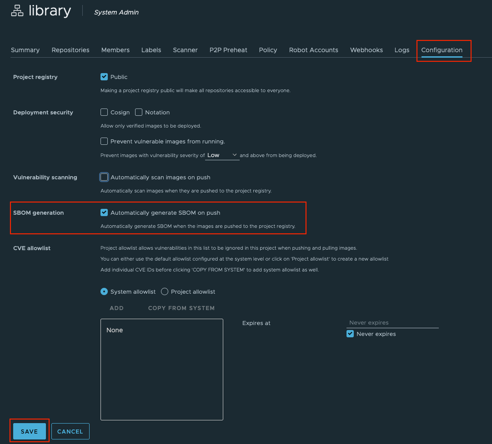
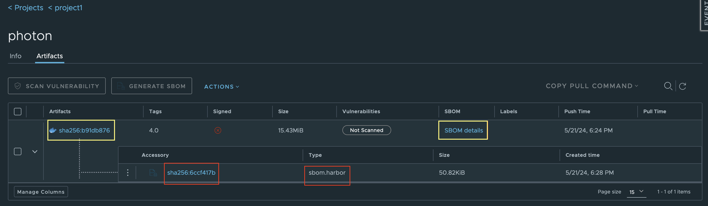
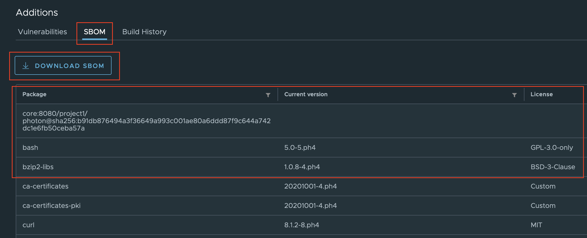
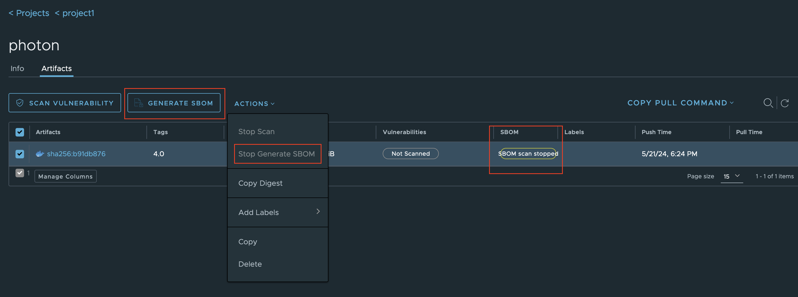
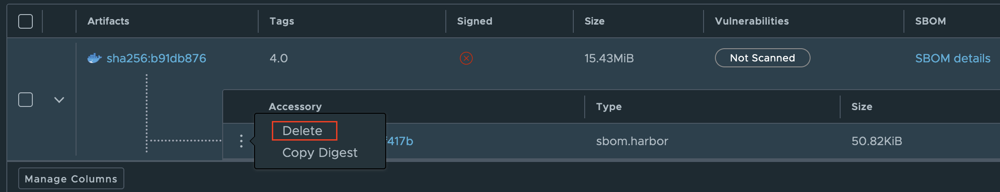
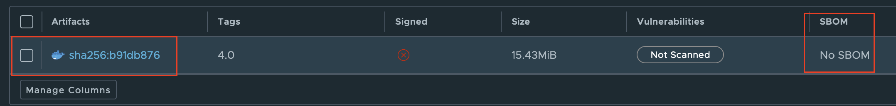
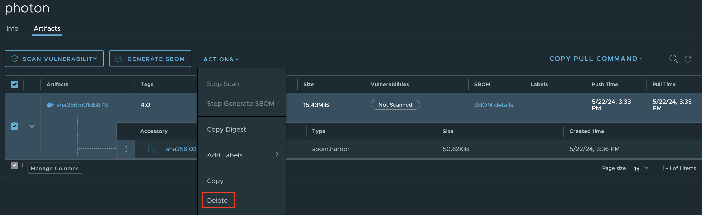

La distinta materiali del software (SBOM) funge da elenco di inventario, documentando tutti i componenti utilizzati in un progetto software.
Fornisce trasparenza elencando le dipendenze, le relative versioni e le licenze associate che presentano il software o l'immagine del contenitore.
Questa visibilità aiuta gli ingegneri e i sistemi software a monitorare e gestire in modo efficace potenziali problemi di sicurezza.

Dalla versione 2.11 Harbor supporta ora la generazione automatica di SBOM in combinazione con il suo scanner predefinito: Trivy.
Inoltre, gli utenti possono anche fare clic sul pulsante `GENERATE SBOM` per generare manualmente un SBOM di un determinato artefatto.

## Generazione automatica di SBOM durante il push delle immagini

Per generare automaticamente un SBOM per le immagini inviate a Harbor,
gli utenti devono accedere alla scheda `Configuration` di
il progetto in cui è stata inviata un'immagine.
Quindi selezionare la casella di controllo `SBOM generation` e successivamente fare clic sul pulsante `SAVE`.

Dopo la modifica della configurazione,
gli artefatti appena inseriti `docker push ...` in questo progetto attiveranno automaticamente il processo di generazione SBOM
utilizzando lo scanner assegnato definito nella sezione Scanner.

Nella pagina degli artefatti del progetto,
gli utenti possono vedere il collegamento dei dettagli SBOM come mostrato nell'immagine sopra.
Cliccando su "Dettagli SBOM" (All'interno del rettangolo giallo),
gli utenti verranno reindirizzati alla pagina dei dettagli SBOM.

Una tabella con il nome del pacchetto, la sua versione corrente,
e la licenza del pacchetto diventerà visibile,
incluso un collegamento per il download `DOWNLOAD SBOM`
per scaricare il file contenente i dettagli completi di SBOM in formato SPDX.

## Generazione manuale di SBOM per immagini di contenitori con Harbor

Nel caso in cui la generazione automatica SBOM non sia abilitata o desiderata,
Gli utenti possono generare selettivamente SBOM per le immagini del contenitore.
Passare alla pagina dell'artefatto
e selezionare le immagini per le quali deve essere generato il SBOM.
Dopo aver selezionato una o più immagini,
il pulsante `GENERATE SBOM` diventerà disponibile.
È anche possibile
per interrompere la generazione SBOM nel menu a discesa `ACTIONS`.

## Come eliminare un SBOM

Un accessorio SBOM può essere eliminato individualmente come mostrato di seguito facendo clic sull'icona dei tre punti verticali 
accanto all'accessorio SBOM che si desidera eliminare e quindi fare clic sull'opzione `Delete`.

Dopo la cancellazione,
l'accessorio SBOM verrà rimosso dal manufatto e quindi non più visibile nello UI.

L'eliminazione definitiva e fisica di SBOM verrà eseguita durante il processo di garbage collection.

È anche possibile eliminare un SBOM insieme al relativo artefatto soggetto, come mostrato di seguito.

## SBOM Replica

Gli utenti possono creare una regola di replica basata su pull o push
per replicare una serie di artefatti insieme ai corrispondenti SBOM da una sorgente Harbor registry a una destinazione Harbor registry.

