In today's software development landscape,
supply chain security has emerged as a critical concern. 
As Dev, Ops or Sec engineers, we must recognize its significance 
and adopt effective practices to safeguard our projects.

One crucial tool for managing software dependencies is the Software Bill of Materials (SBOM). 
An SBOM acts as an inventory list,
documenting all components used in a software project.
It provides transparency by listing dependencies, their versions,
and associated licenses present it the software or container image.
This visibility helps engineers as well as software systems track and manage potential security issues effectively.

Moreover, SBOMs play a vital role in compliance and audits. 
Regulatory requirements and industry standards demand robust supply chain practices.
By maintaining an accurate SBOM, organizations can ensure transparency, 
making audits easier and helping them meet legal obligations.

Since version 2.11 Harbor supports now automatic generation of SBOMs in combination with a third-party vulnerability scanner extension.
The currently primary supported Harbor vulnerability extension that supports SBOM generation is Trivy.

## Automatic Generation of SBOMs during Image Push

To automatically generate an SBOM for images pushed to Harbor, 
users need to navigate to the `Configuration` tab of
the project where an image was pushed. 
Then select the checkbox of `SBOM generation` and click `SAVE` button afterward.

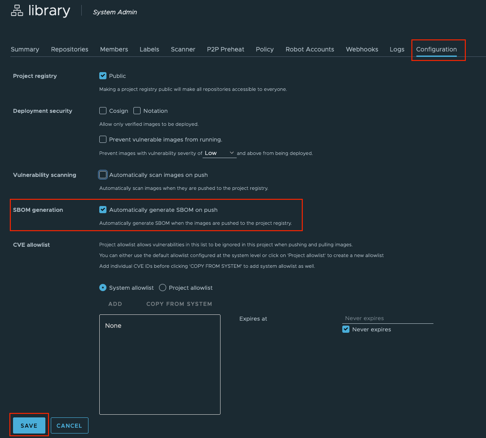

After the configuration change, 
newly pushed images `docker push ...` to this project will be automatically trigger the SBOM generation process
using the assigned scanner defined in the Scanner section.

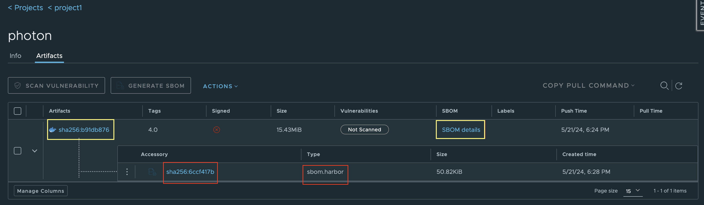

In the project artifact page,
users can see the SBOM details link as shown in the above image.
By clicking on the "SBOM Details" (Inside the yellow rectangle), 
users will be redirected to the SBOM details page.

A table with package name, its current version, 
and package license will become visible,
including a download link `DOWNLOAD SBOM`
to download the file containing full SBOM details in SPDX format. 

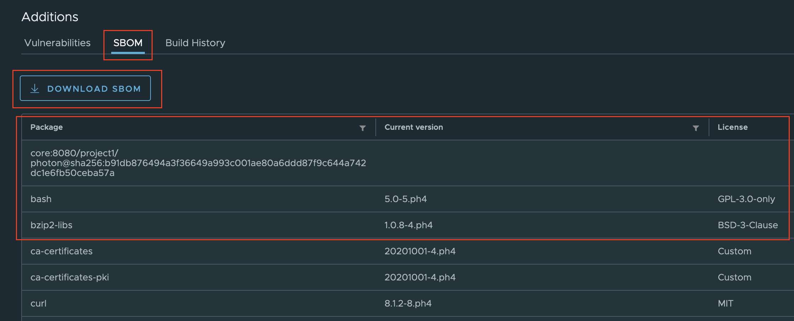

## Manual SBOM Generation for Container Images With Harbor

In case the automatic SBOM generation is not enabled or desired, 
Users can selectively generate SBOMs for container images.
Navigate to the artifact page 
and select the images for which the SBOM should be generated.
After one or more images are selected,
the Button `GENERATE SBOM` will become available. 
It is also possible
to abort the SBOM generation inside the `ACTIONS` drop-down menu.

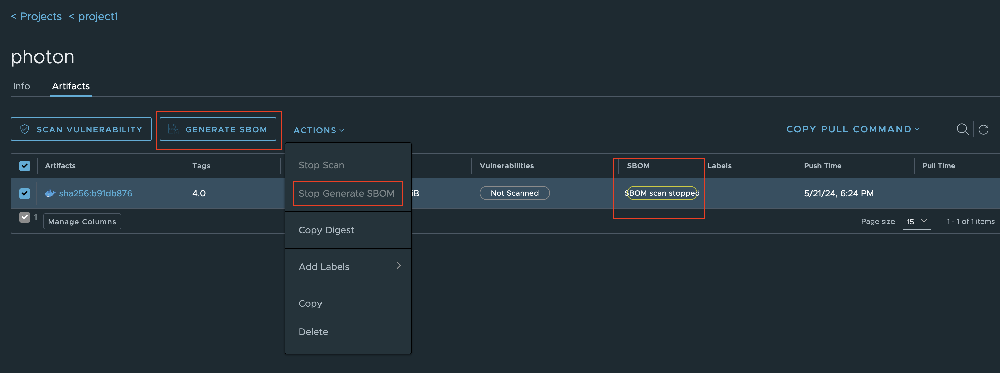

## How to delete an SBOM

An SBOM accessory can be deleted individually as shown below.

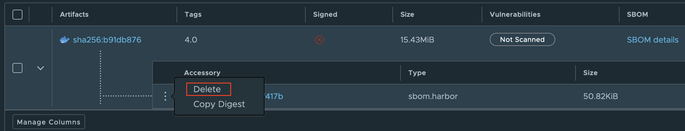

After the deletion,
the SBOM accessory will be removed from the artifact and hence not visible in the UI anymore.

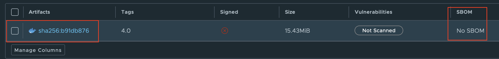

The final and physical deletion of the SBOM will be performed during the garbage collection process.

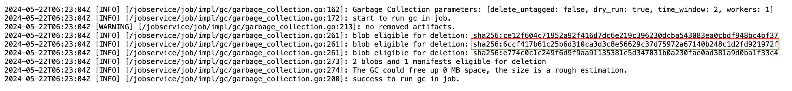

Multiple SBOMs can be deleted with its subject artifact, as shown below.

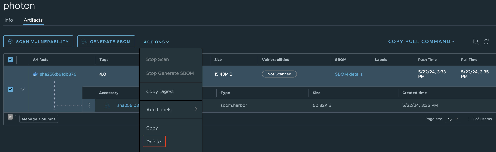

Finally,
SBOMs can be deleted together with its subject artifact through tag retention policies. 

In the example below, we have pushed photon:4.0, and then photon:2.0.
A manual SBOM generation was executed for photon:4.0.
After that,
we created a tag retention rule to keep the most recently pushed "1" artifact.

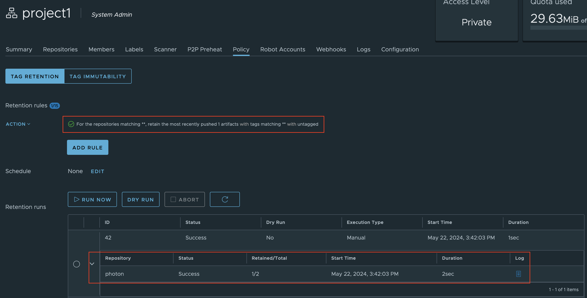

In the tag retention log shown below,
it is indicated that photon:4.0 was deleted, together with its SBOM accessory.

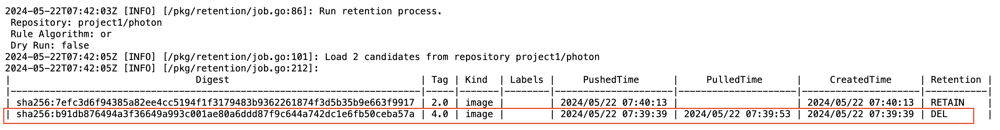

To verify the result we can see in the Harbor portal,
that photon:4.0 is gone together with its SBOM.

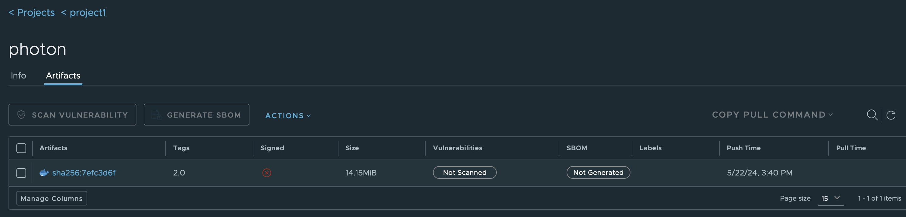

## SBOM Replication 

SBOM can be replicated to other registries as part of their subject artifact.

Users can create a replication rule
to replicate a set of artifacts together with their corresponding SBOM from a source Harbor registry to a destination Harbor registry.
