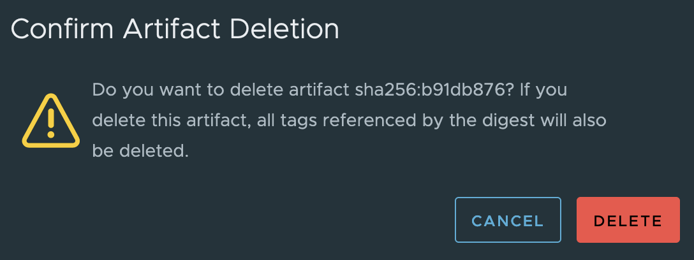

With the increasing requirements of regulation enforcement from government, stakeholders and engineers in the software
industry start paying more attention to the supply chain security using Software Bill of Materials - SBOM. Currently, 
Harbor has already supported SBOM as an accessory manually uploaded to an Harbor registry through third-party tool like `trivy` and
`oras`. Starting from Harbor v2.11.0, an SBOM can be generated automatically with Harbor default scanner - Trivy. In 
addition to that, users can also click on the `GENERATE SBOM` button on Harbor portal to manually generate an SBOM without
third-party CLI clients.

## How to automatically generate an SBOM on image pushed to Harbor?

To automatically generate an SBOM upon images pushed to Harbor, users need to navigate to the `Configuration` tab of
the project where an image is pushed. Then select the checkbox of `SBOM generation` and click `SAVE` button afterwards.

Then users can `docker push` an image to this project as configured above. An SBOM will be generated automatically after 
the image is pushed successfully.

By clicking the yellow rectangle as shown in the above image, users will be redirected to the SBOM details page as shown
below. A table of package name, package current version, and package license are available within the Harbor portal UI and 
a download link `DOWNLOAD SBOM` is also available for users to download the file containing full SBOM contents. 

## How to manually generate an SBOM against an image

Users can navigate to the artifact page and select an image upon which to generate an SBOM. And stopping generating SBOM
is also available after clicking the `ACTIONS` drop-down menu.

## How to delete an SBOM

An SBOM accessory can be deleted individually as shown below.

Then click the `DELETE` button in the prompt window.

Then we can see there is no SBOM accessory associated to the subject artifact anymore.

Next, we can see the SBOM accessory will be garbage collected when we run GC.

On the other hand, an SBOM can be deleted together with its subject artifact, as shown below.

Then users just need to confirm this deletion activity.

Thirdly, SBOM can be deleted together with its subject artifact through tag retention. We have photon:4.0 pushed up first,
and then we pushed photon:2.0. An SBOM manual generation is triggered for photon:4.0. After that, we create an tag retention
rule like below - keep the most recent pushed 1 artifact.

In the tag retention log shown below, photon:4.0 is deleted.

Double check it on the Harbor portal, we can see that photon:4.0 is gone together with its SBOM accessory.

## SBOM can be replicated to the destination Harbor together with its subject artifact

Users can create a replication rule to replicate a set of artifacts together with their corresponding SBOM from a source
Harbor registry to a destination Harbor registry.