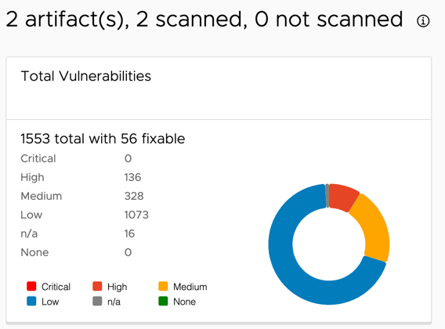
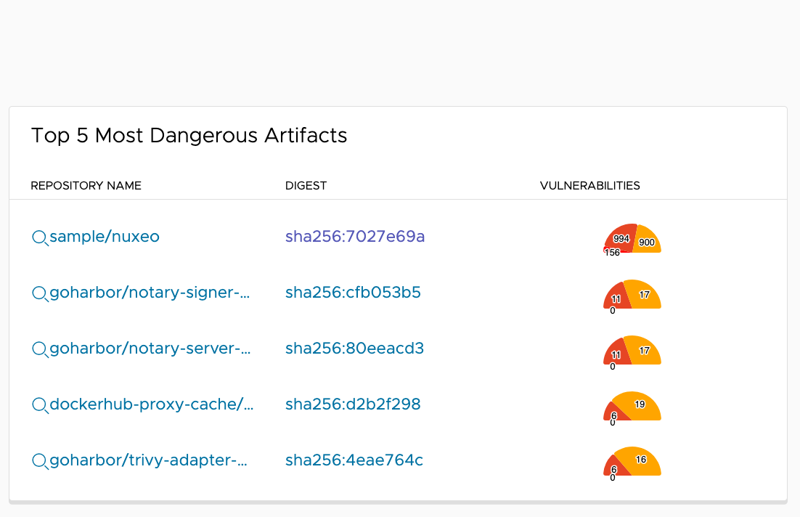
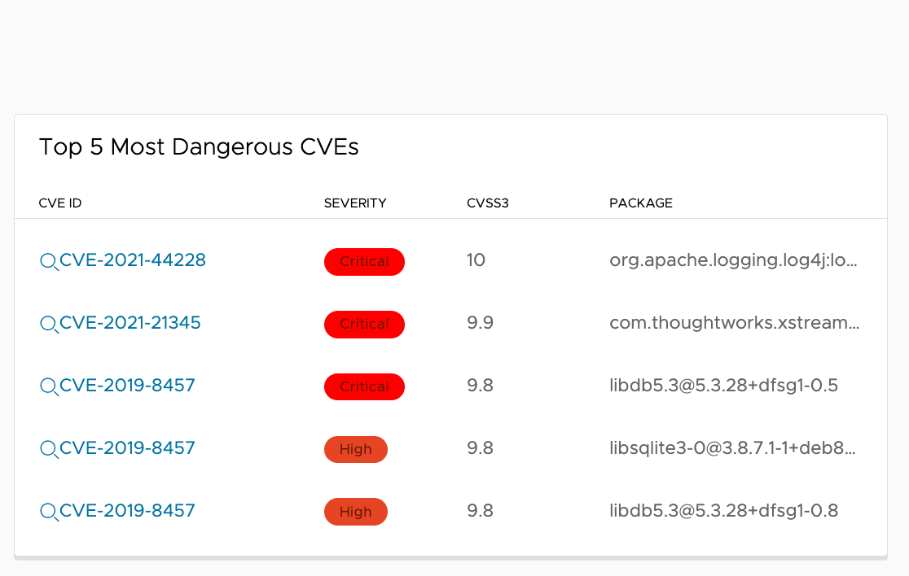
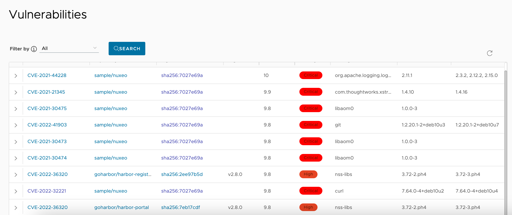

Il Security Hub fornisce agli amministratori una panoramica completa e centralizzata dell'attuale stato di sicurezza degli artefatti archiviati in Harbor registry. A differenza della visualizzazione delle vulnerabilità incentrata sugli artefatti, Security Hub fornisce una visione olistica di tutte le vulnerabilità su registry e su tutti gli artefatti.

È possibile accedere a Security Hub tramite la navigazione Harbor UI o l'URL diretto:

1. Metodo 1: accesso a Security Hub tramite navigazione UI

   - Accedi a Harbor come utente con autorizzazioni di amministratore, individua e fai clic sull'opzione "Amministrazione" in Harbor UI.

   - All'interno della sezione Amministrazione, trova e fai clic sulla sezione "Servizio interrogatori".

   - La scheda Security Hub è disponibile nella pagina delle impostazioni "Servizio di interrogazione". Fare clic su di esso.

2. Metodo 2: accesso a Security Hub tramite URL diretto:

   - Apri il browser web e inserisci il seguente URL nella barra degli indirizzi: `https://<harbor-domain>/harbor/interrogation-services/security-hub`.
 
   Nota: sostituisci <harbor-domain> con il dominio o l'indirizzo IP appropriato della tua istanza Harbor

Il titolo della pagina visualizza il conteggio totale di artefatti e artefatti scansionati.

## Vulnerabilità totali

La prima scheda mostra il numero totale di vulnerabilità riscontrate nelle immagini scansionate. Il numero totale è suddiviso in gruppi di gravità con i rispettivi eventi.

## I 5 manufatti più pericolosi

La seconda scheda mostra i primi 5 artefatti più pericolosi trovati negli artefatti scansionati. Classifica gli artefatti gravi in ​​base al numero di vulnerabilità e ai relativi livelli di gravità. Cliccando su un artefatto, la tabella delle vulnerabilità interrogherà tutte le vulnerabilità trovate nell'artefatto selezionato.

## I 5 CVE più pericolosi

La terza scheda mostra i primi 5 CVE più pericolosi trovati negli artefatti scansionati. ordina i CVE pericolosi in base al numero di artefatti e ai livelli di gravità riscontrati negli artefatti. Quando si fa clic sul CVE, la tabella delle vulnerabilità di ricerca visualizza tutte le vulnerabilità trovate negli artefatti.

## Vulnerabilità della ricerca

Il pannello delle vulnerabilità di ricerca consente di cercare le vulnerabilità in base all'ID CVE, alla gravità, al progetto, al repository, al digest o al tag ecc. Il risultato della ricerca verrà mostrato nella tabella seguente.

Campi di ricerca supportati:

| Condizione della query | Descrizione |
| ------------- |-------------------------------------------------------------------------------------------------------------------------------------------------------------|
| ID CVE | Cerca informazioni sulla vulnerabilità in base all'ID CVE, per considerazioni sulle prestazioni, è richiesta la condizione cve_id per interrogare le informazioni sulla vulnerabilità, supporta la corrispondenza esatta |
| Gravità | Cerca informazioni sulla vulnerabilità in base al livello di gravità, supporta la corrispondenza esatta |
| CVSS3 | Cerca informazioni sulla vulnerabilità in base all'intervallo di punteggio cvss v3 |
| Nome del progetto | Cerca informazioni sulla vulnerabilità in base al nome del progetto, supporta la corrispondenza esatta |
| Digerire | Cerca informazioni sulla vulnerabilità in base al digest degli artefatti, supporta la corrispondenza esatta |
| Nome del repository | Cerca informazioni sulla vulnerabilità in base al nome del repository, supporta la corrispondenza esatta |
| Pacchetto | Cerca informazioni sulla vulnerabilità in base al nome del pacchetto, supporta la corrispondenza esatta |
| Etichetta | Cerca informazioni sulla vulnerabilità in base al nome del tag, supporta la corrispondenza esatta |
