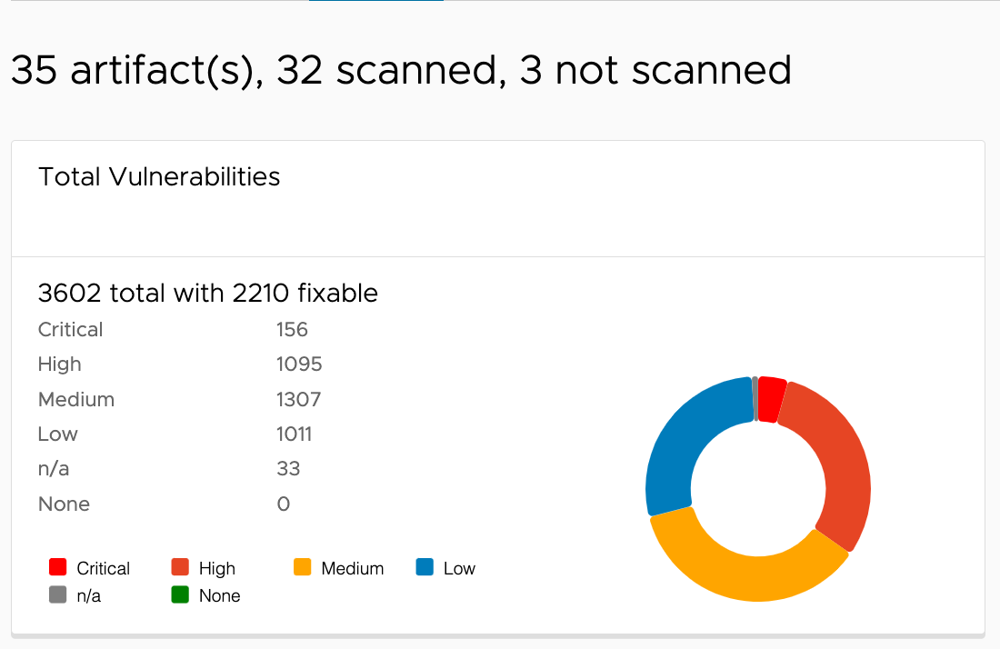

The Security Hub is a feature provide a holistic view of the current security status of the artifact in the Harbor. It provides a dashboard for the administrator to view the security status of the scanned images and the vulnerabilities found in the images. you can access the Security Hub feature via the Harbor UI, After login to Harbor, go to the "Administration" and check the "Interrogation Service", then click the "Security Hub" tab, or access it via URL: `https://<harbor-domain>/harbor/interrogation-services/security-hub`.

## Total Vulnerabilities

The first cardbox shows the total number of vulnerabilities found in the scanned images. The number are grouped by the severity of the vulnerabilities.

## Top 5 Most Dangerous Artifacts

The second cardbox shows the top 5 most dangerous artifacts found in the scanned images. it sort the dangerous artifacts by the number of vulnerabilities and serverity levels found in the artifacts.

## Top 5 Most Dangerous CVEs

The third cardbox shows the top 5 most dangerous CVEs found in the scanned images. it sort the dangerous CVEs by the number of artifacts and their serverity levels found in the artifacts.

## Search Vulnerabilities

The search vulnerablities pannel allows you to search the vulnerabilities by the CVE ID, severity, project, repository, digest or tag etc, the search result will be shown in the table below.

Supported search fields:

| Query condition  | Description |
| ------------- | ------------- |
| cve_id  | Search vulnerability information by CVE ID, for performance consideration, cve_id condition is required to query the vulnerability info,support exact match |
| severity        | Search vulnerability information by severity level  |
| cvss_v3_score        | Search vulnerability information by cvss v3 score  |
| project_id  | Search vulnerability information by project name  |
| digest     | Search vulnerability information by artifact digest, support exact match |
| repository | Search vulnerability information by repository name, support exact match  |
| package | Search vulnerability information by package name, support exact match |
| tag | Search vulnerability information by tag name, support exact match |
