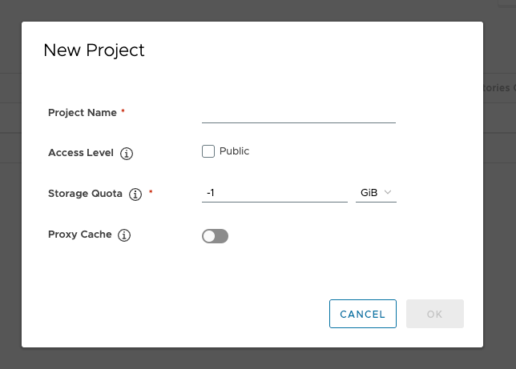
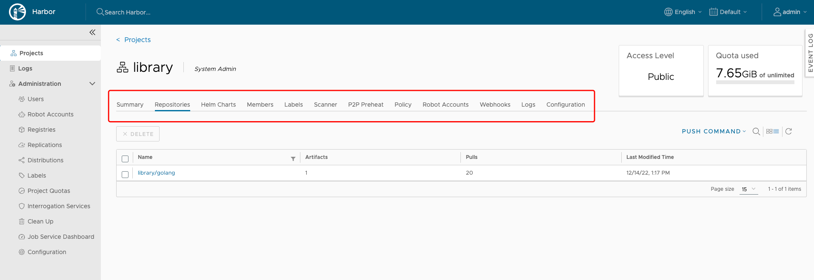
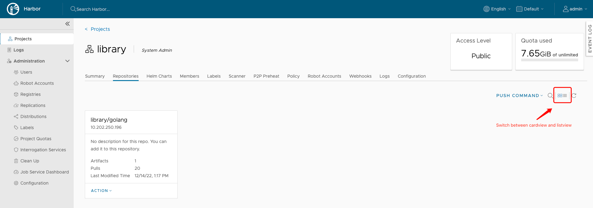

Un progetto in Harbor contiene tutti i repository di un'applicazione. Non è possibile inviare immagini a Harbor prima della creazione di un progetto. Ai progetti viene applicato il controllo degli accessi basato sui ruoli (RBAC), in modo che solo gli utenti con i ruoli appropriati possano eseguire determinate operazioni.

Esistono due tipi di progetto in Harbor:

* **Pubblico**: qualsiasi utente può estrarre immagini da questo progetto. Questo è un modo conveniente per condividere i repository con altri.
* **Privato**: solo gli utenti membri del progetto possono estrarre le immagini


Un amministratore di sistema Harbor può anche creare un progetto di cache proxy. Scopri di più su come realizzare il progetto [Configura una cache proxy](../../administration/configure-proxy-cache/).


Crei diversi progetti a cui assegni gli utenti in modo che possano eseguire il push e il pull dei repository di immagini. Inoltre si configurano le impostazioni specifiche del progetto. Quando distribuisci Harbor per la prima volta, viene creato un progetto pubblico predefinito denominato `library`.

## Prerequisiti

Accedi a Harbor con un account amministratore Harbor o amministratore del progetto.

## Procedura

1. Vai su **Progetti** e fai clic su **Nuovo progetto**.
1. Fornire un nome per il progetto.
1. (Facoltativo) Selezionare la casella di controllo **Pubblico** per rendere pubblico il progetto.

    Se imposti il ​​progetto su **Pubblico**, qualsiasi utente può estrarre immagini da questo progetto. Se lasci il progetto impostato su **Privato**, solo gli utenti membri del progetto potranno estrarre le immagini. Puoi alternare i progetti da pubblico a privato o viceversa in qualsiasi momento dopo aver creato il progetto.

    

5. Fare clic su **OK**.

Dopo aver creato il progetto, puoi sfogliare riepilogo, repository, grafici timone, membri, etichette, scanner, preriscaldamento p2p, policy, account robot, log e configurazione utilizzando la scheda di navigazione.

Sono disponibili due visualizzazioni per mostrare i repository, visualizzazione elenco e visualizzazione schede, puoi passare dall'una all'altra facendo clic sull'icona corrispondente.

Le proprietà del progetto possono essere modificate facendo clic su "Configurazione".

* Per rendere accessibili a tutti tutti i repository del progetto, seleziona la casella di controllo `Public`.

* Per evitare che le immagini non firmate nel progetto vengano estratte, seleziona la casella di controllo `Prevent vulnerable images from running`. Per ulteriori informazioni sull'attendibilità del contenuto, vedere [Implementazione della fiducia nei contenuti](../project-configuration/implementing-content-trust.md).

## Ricerca di progetti, repository e grafici Helm
Inserendo una parola chiave nel campo di ricerca in alto vengono elencati tutti i progetti, i repository e i grafici timone corrispondenti. Il risultato della ricerca include sia i repository pubblici che quelli privati ​​a cui hai accesso.

## Cosa fare dopo

[Assegnare utenti a un progetto](add-users.md)
