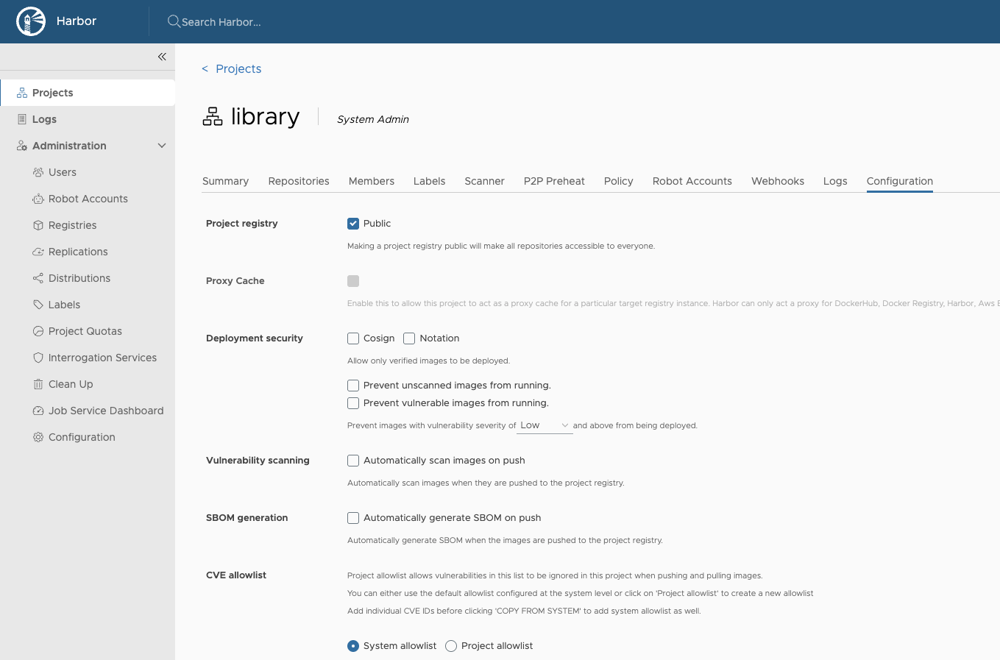
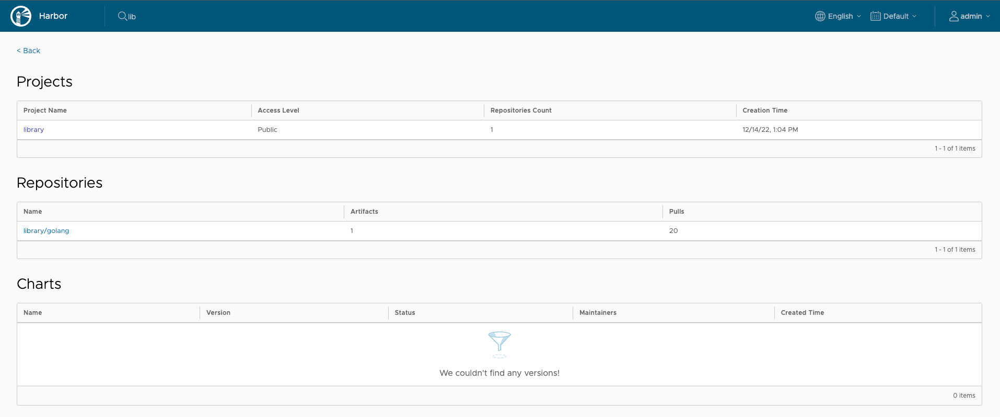
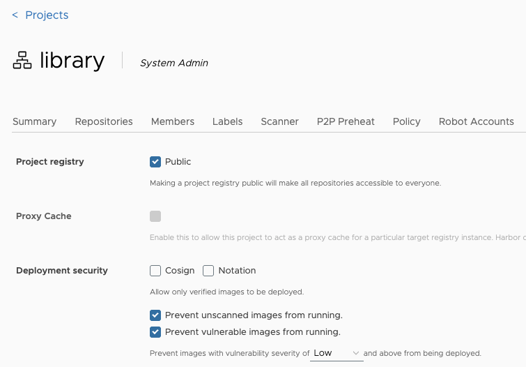
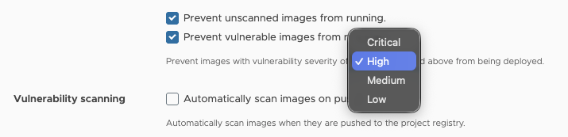
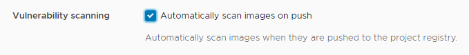
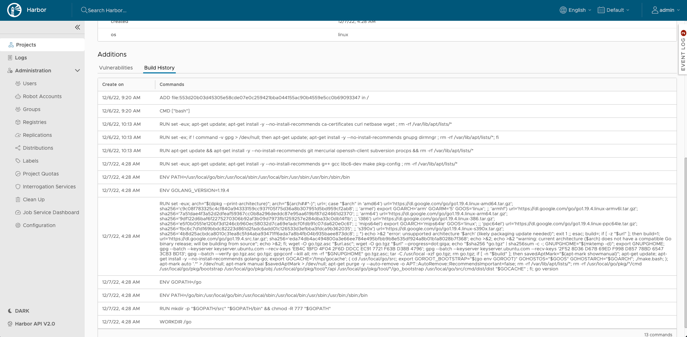

Dopo la creazione iniziale di un progetto, puoi configurare o riconfigurare le sue proprietà nella scheda **Configurazione** per quel progetto.

1. Accedi all'interfaccia Harbor con un account che disponga almeno dei privilegi di amministratore del progetto.
1. Vai su **Progetti** e seleziona un progetto.
1. Seleziona la scheda **Configurazione**.
1. Per rendere tutti i repository del progetto accessibili a tutti, seleziona la casella di controllo `Public` oppure deseleziona questa casella di controllo per rendere il progetto privato.
1. Per evitare che le immagini non firmate nel progetto vengano estratte, seleziona la casella di controllo `Prevent vulnerable images from running`.

## Ricerca di progetti e repository

Inserisci una parola chiave nel campo di ricerca in alto per elencare tutti i progetti e i repository corrispondenti. Il risultato della ricerca include sia i repository pubblici che quelli privati ​​a cui hai accesso.  

## Configura le impostazioni di vulnerabilità nei progetti

È possibile configurare i progetti in modo che le immagini con vulnerabilità non possano essere eseguite e per scansionare automaticamente le immagini non appena vengono inserite nel progetto.

1. Accedi all'interfaccia Harbor con un account che disponga almeno dei privilegi di amministratore del progetto.
1. Vai su **Progetti** e seleziona un progetto.
1. Seleziona la scheda **Configurazione**.
1. Per impedire che le immagini vulnerabili del progetto vengano estratte, seleziona la casella di controllo **Impedisci l'esecuzione delle immagini vulnerabili**.

   

1. Selezionare il livello di gravità delle vulnerabilità per impedire l'esecuzione delle immagini.

   

   Non è possibile estrarre le immagini se il loro livello è uguale o superiore al livello di gravità selezionato. Harbor non impedisce l'esecuzione di immagini con un livello di vulnerabilità pari a `negligible`.
1. Per attivare una scansione di vulnerabilità immediata sulle nuove immagini inviate al progetto, selezionare la casella di controllo **Scansiona automaticamente le immagini al momento del push**.

   

Harbor supporta anche opzioni di sicurezza di distribuzione aggiuntive, consentendoti di eseguire [implementare la fiducia nei contenuti](../../working-with-projects/project-configuration/implementing-content-trust/) sulla tua istanza Harbor.

## Costruisci la storia

La cronologia delle build semplifica la visualizzazione del contenuto di un'immagine del contenitore, la ricerca del codice che crea un'immagine o l'individuazione dell'immagine per un repository di origine.

Nel portale Harbor, inserisci il tuo progetto, seleziona il repository, fai clic sul collegamento dell'artefatto di cui desideri vedere la cronologia di creazione, verrà aperta la pagina dei dettagli. Quindi passa alla scheda `Build History`, puoi vedere le informazioni sulla cronologia della build.

