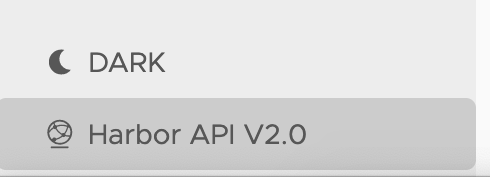

You can view and test the Harbor REST API from your Harbor interface using the Swagger UI. This means that you can invoke all APIs through the Harbor interface. You can navigate to the REST API through the Harbor portal, or by navigate to the Swagger UI using your Harbor instance IP.

## Access Harbor REST API thorough the interface

 1. Log in to Harbor and click the **Harbor API** button located at the bottom of the left side navigation menu in the Harbor interface. All APIs will be invoked with the current user's authorization.                         

## Access Harbor REST API directly

1. Navigate to the Swagger page by using the IP address of your Harbor instance, `https://<harbor_ip>/devcenter`. For example: https://10.192.111.118/devcenter.
1. Then click the **Authorize** button to give basic authentication to all APIs. All APIs will be invoked with the current user's authorization.

