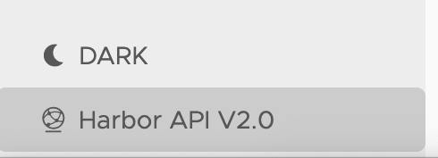
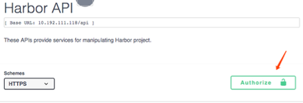

È possibile visualizzare e testare Harbor REST API dall'interfaccia Harbor utilizzando Swagger UI. Ciò significa che puoi richiamare tutte le API tramite l'interfaccia Harbor. È possibile accedere a REST API tramite il portale Harbor oppure accedere a Swagger UI utilizzando l'IP dell'istanza Harbor.

## Accedi a Harbor REST API tramite l'interfaccia

 1. Accedi a Harbor e fai clic sul pulsante **Harbor API** situato nella parte inferiore del menu di navigazione a sinistra nell'interfaccia Harbor. Tutte le API verranno richiamate con l'autorizzazione dell'utente corrente.                         

## Accedi direttamente a Harbor REST API

1. Passare alla pagina Swagger utilizzando l'indirizzo IP dell'istanza Harbor, `https://<harbor_ip>/devcenter-api-2.0`. Ad esempio: https://10.192.111.118/devcenter-api-2.0.
1. Quindi fare clic sul pulsante **Autorizza** per fornire l'autenticazione di base a tutte le API. Tutte le API verranno richiamate con l'autorizzazione dell'utente corrente.

